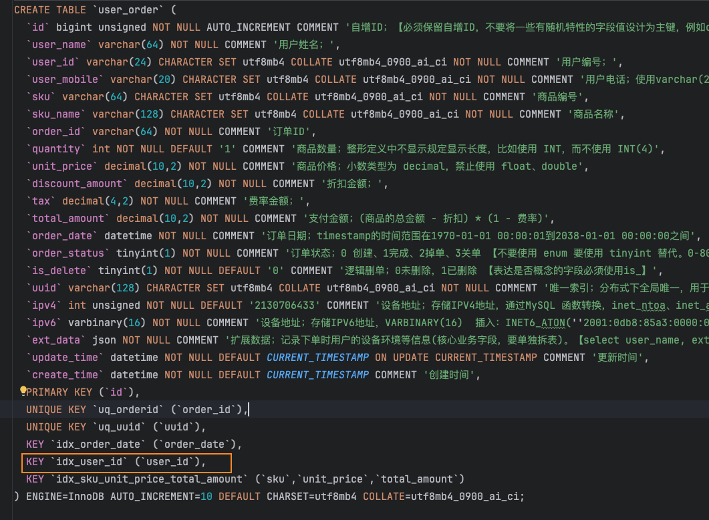
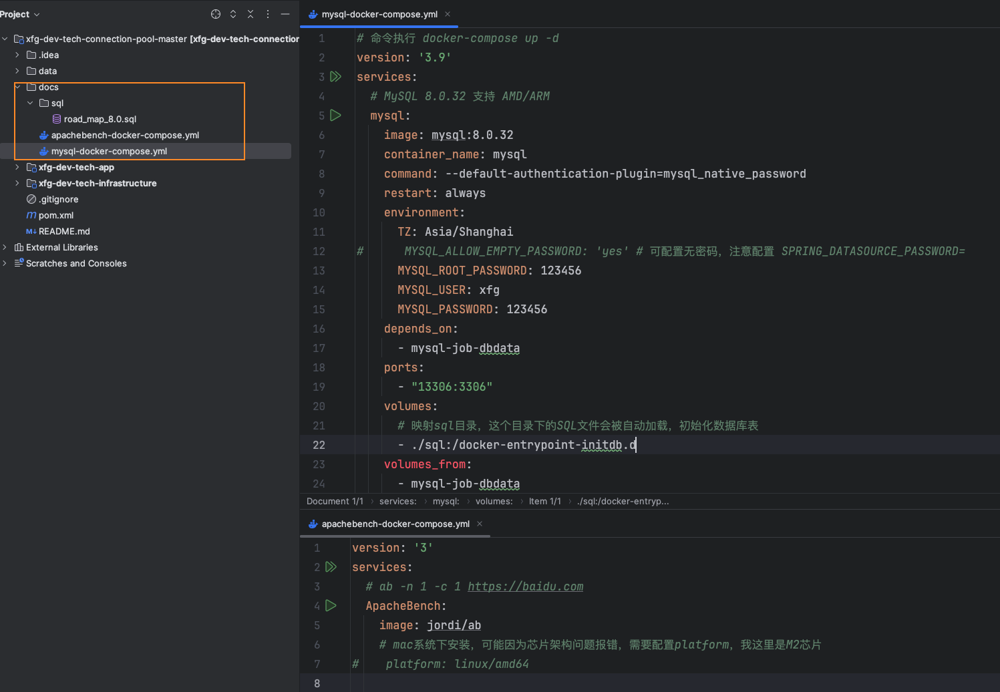
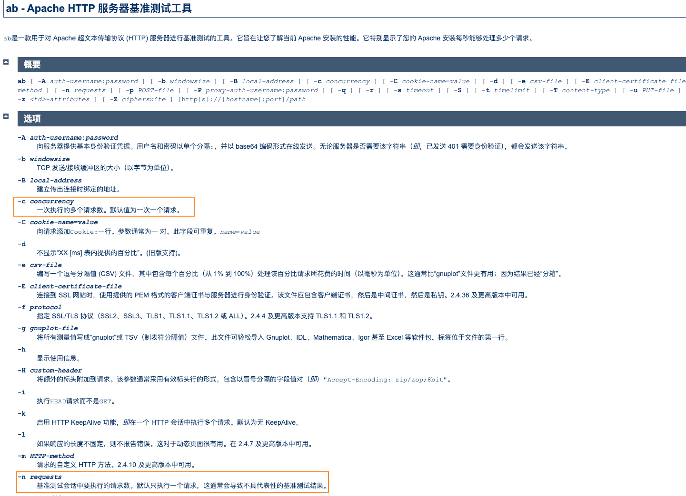
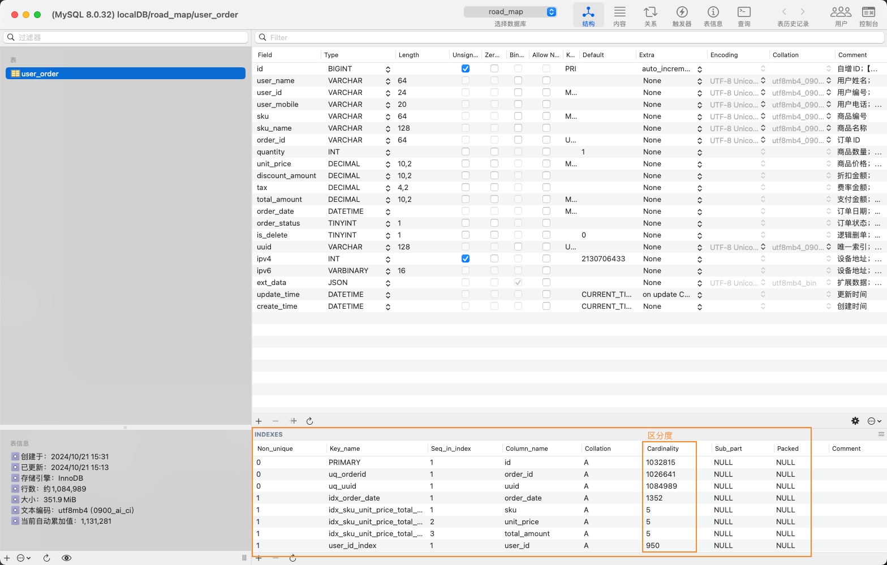

# MySQL 连接池 c3p0、dbcp、druid、hikari

> 本文是对文章[MySQL 连接池 c3p0、dbcp、druid、hikari](https://bugstack.cn/md/road-map/connection-pool.html#_1-%E8%BF%9E%E6%8E%A5%E6%B1%A0%E6%AF%94%E5%AF%B9) 实操后的记录，总耗时大概一个下午

本文涉及的工程：

- xfg-dev-tech-connection-pool：[https://gitcode.net/KnowledgePlanet/road-map/xfg-dev-tech-connection-pool (opens new window)](https://gitcode.net/KnowledgePlanet/road-map/xfg-dev-tech-connection-pool)- 工程内含有环境的安装脚本；`mysql-docker-compose.yml`、`apachebench-docker-compose.yml`、`road_map_8.0.sql`


## 一、案例背景

在 MySQL 数据量为 100W 的条件下，测试不使用`连接池`和使用不同的连接池(c3p0、dbcp、druid、hikari)做查询和新增操作的性能。

##  二、环境配置

首先拉取项目

**⚠️注意**

原作者小傅哥提交的 `road_map_8.0.sql` 中没有给 `user_id` 建索引，后面会基于这个索引测试，需要手动修改一下建表语句。



找到 docker-compose.yml 文件，分别安装 MySQL 和 Apache Bench。



- 在 IntelliJ IDEA 打开 xfg-dev-tech-connection-pool 分别点开 mysql-docker-compose、apachebench-docker-compose，之后点击安装即可。
- 执行完脚本，你可以得到一份安装好的 MySQL 8.0 并安装了数据库表。另外一份是用于压测使用的 [ApacheBench](https://httpd.apache.org/docs/2.4/programs/ab.html)

### 如果遇到问题看这

mysql-docker-compose.yml 中 volumes_from 已经失效，可以定义一个卷名来共享卷。

```yaml
# 命令执行 docker-compose up -d
version: '3.9'
services:
  
  # MySQL 8.0.32 支持 AMD/ARM
  mysql:
    image: mysql:8.0.32
    container_name: mysql
    command: --default-authentication-plugin=mysql_native_password
    restart: always
    environment:
      TZ: Asia/Shanghai
#      MYSQL_ALLOW_EMPTY_PASSWORD: 'yes' # 可配置无密码，注意配置 SPRING_DATASOURCE_PASSWORD=
      MYSQL_ROOT_PASSWORD: 123456
      MYSQL_USER: xfg
      MYSQL_PASSWORD: 123456
    depends_on:
      - mysql-job-dbdata
    ports:
      - "13306:3306"
    volumes:
      # 映射sql目录，这个目录下的SQL文件会被自动加载，初始化数据库表
      - ./sql:/docker-entrypoint-initdb.d
      - mysql_data:/var/lib/mysql
  
  # 自动加载数据
  mysql-job-dbdata:
    image: alpine:3.18.2
    container_name: mysql-job-dbdata
    volumes:
      - mysql_data:/var/lib/mysql
  
volumes:
  mysql_data:  # 定义命名卷
```


在mac上安装 ApacheBench 失败了，配置一下 platform 就好：

```yaml
version: '3'
services:
  # ab -n 1 -c 1 https://baidu.com
  ApacheBench:
    image: jordi/ab
    # mac系统下安装，可能因为芯片架构问题报错，需要配置platform，我这里是M2芯片
    platform: linux/amd64
```


**容器创建好以后，请用root账号访问数据库，否则你可能找不到 `road_map` 这个数据库。**


## 三、工程说明

在 xfg-dev-tech-connection-pool 工程中提供了不同连接池的配置和一些非常常用的 SQL 操作，以及提供了对应的接口进行压测使用；

| 序号 | 接口                                                         | 说明                                               |
| ---- | ------------------------------------------------------------ | -------------------------------------------------- |
| 1    | http://127.0.0.1:8091/api/mysql/cacheData                    | 用于缓存数据的接口，拿缓存好的数据压测更新、查询   |
| 2    | http://127.0.0.1:8091/api/mysql/insert                       | 插入数据接口                                       |
| 3    | http://127.0.0.1:8091/api/mysql/updateOrderStatusByUserId    | 使用索引字段 userId 更新订单状态                   |
| 4    | http://127.0.0.1:8091/api/mysql/updateOrderStatusByUserMobile | 使用无索引字段 userMobile 更新订单状态             |
| 5    | http://127.0.0.1:8091/api/mysql/updateOrderStatusByOrderId   | 使用索引字段 orderId 更新订单状态                  |
| 6    | http://127.0.0.1:8091/api/mysql/selectByUserId               | 使用索引字段 userId 查询订单                       |
| 7    | http://127.0.0.1:8091/api/mysql/selectByUserMobile           | 使用无索引字段 userMobile 查询订单，测试中添加索引 |
| 8    | http://127.0.0.1:8091/api/mysql/selectByOrderId              | 使用有索引字段 orderId 查询订单                    |
| 9    | http://127.0.0.1:8091/api/mysql/selectByOrderIdAndUserId     | 区分度高的索引字段在前，区分度低的索引字段在后     |
| 10   | http://127.0.0.1:8091/api/mysql/selectByUserIdAndOrderId     | 区分度低的索引字段在前，区分度高的索引字段在后     |

- 具体代码实现可以直接对照工程来看，以及按需添加SQL语句进行性能压测验证。


## 四、压测指令

ApacheBench 官网教程：https://httpd.apache.org/docs/2.4/programs/ab.html



常用的如：`ab -c 20 -n 1000 http://127.0.0.1:8091/hi` - 20个并发1000次


## 五、模拟百万数据

SQL：`xfg-dev-tech-connection-pool/docs/sql/road_map_8.0.sql`

正式测试前，你大概需要花费几十分钟来初始化100万数据。执行脚本；`ab -c 20 -n 1000000 http://127.0.0.1:8091/api/mysql/insert`

> 我使用的 C3P0 连接池，并发数为 5，花费半小时创建完成。大家可自行根据服务器配置调整并发数




## 六、压测验证

###  1. 连接池比对

**条件**；

1. 插入1万条数据
2. 连接池配置 initialPoolSize=5、minPoolSize=5、maxPoolSize=20
3. 此时数据库已经有100万数据，分别用几个链接方式插入数据。hikari 放到最后，它是 SpringBoot 的默认连接池。
4. 脚本；`ab -c 5 -n 10000 http://127.0.0.1:8091/api/mysql/insert`

|                  |    no-pool     |     c3p0      |     dbcp      |     druid     |    hikari     |
| :--------------: | :------------: | :-----------: | :-----------: | :-----------: | :-----------: |
|       耗时       | 38.645 seconds | 7.295 seconds | 8.751 seconds | 7.306 seconds | 7.190 seconds |
|       50%        |      9ms       |      5ms      |      4ms      |      3ms      |      3ms      |
|       80%        |      11ms      |      4ms      |      5ms      |      4ms      |      4ms      |
|       90%        |      12ms      |      5ms      |      6ms      |      5ms      |      5ms      |
| 每秒处理请求(个) |     258.76     |    1370.73    |    1142.66    |    1368.68    |    1390.87    |

- 通过对比可以发现，如果不使用连接池，会比使用连接池，要占用更多的时间连接数据库使用数据库。
- c3p0、hikari 、druid的耗时和处理请求数都很接近，三者之间hikari性能稍强一些。dbcp 相对前三者是弱一些的。所以这可以给你在使用连接池时有一个参考。也可以结合你的机器再次进行压测验证。

### 2. 更新对比

**条件**；

1. 使用接口，向内存加入600条数据。每个测试方式，分别消耗200条。`ab -c 5 -n 600 http://127.0.0.1:8091/api/mysql/cacheData`
2. 之后使用无索引字段、有索引但区分度不高的字段以及使用有索引区分度非常好的字段来更新。
3. 脚本；
   1. `ab -c 5 -n 200 http://127.0.0.1:8091/api/mysql/updateOrderStatusByUserMobile` (无索引)
   2. `ab -c 5 -n 200 http://127.0.0.1:8091/api/mysql/updateOrderStatusByUserId` （有索引但区分度不高）
   3. `ab -c 5 -n 200 http://127.0.0.1:8091/api/mysql/updateOrderStatusByOrderId` （有索引且区分度高）

|      |     无索引      | 有索引-区分度不高 | 有索引-区分度很高 |
| :--: | :-------------: | :---------------: | :---------------: |
| 耗时 | 209.672 seconds |  92.807 seconds   |   0.214 seconds   |
| 50%  |     5130ms      |      2226ms       |        4ms        |
| 80%  |     5572ms      |      2665ms       |        6ms        |
| 90%  |     5878ms      |      3745ms       |        8ms        |

- 无索引的时候；会把整个表的这个记录，全部锁上。那么越执行越慢，最后拖垮数据库。甚至可能1天都执行不完。
- 有索引-区分度不高；几乎是一样的，如果你批量的对一个用户的所有数据都更新，也会锁很多记录。
- 有索引-区分度很高；只要你锁的是自己的一条记录，就与别人没有影响。效率也会非常高。

###  3. 查询对比

**条件**；

1. 查询100万加的数据库表记录，每次缓存记录5000条数据id；`ab -c 10 -n 5000 http://127.0.0.1:8091/api/mysql/cacheData`
2. userId 有索引、orderId 有索引、userMobie 无索引。
3. 每次查询的时候，都要关闭服务重启，避免有缓存干扰结果。
4. 脚本：
   1. `ab -c 5 -n 5000 http://127.0.0.1:8091/api/mysql/selectByUserMobile`（无索引）
   2. `ab -c 5 -n 5000 http://127.0.0.1:8091/api/mysql/selectByUserId`（有索引-区分度不高）
   3. `ab -c 5 -n 5000 http://127.0.0.1:8091/api/mysql/selectByOrderId`（有索引区分度高）
   4. `ab -c 5 -n 5000 http://127.0.0.1:8091/api/mysql/selectByOrderIdAndUserId`（高在前）
   5. `ab -c 5 -n 5000 http://127.0.0.1:8091/api/mysql/selectByUserIdAndOrderId`（低在前）

|      |     无索引      | 有索引-区分度不高 | 有索引区分度高 |    高在前     |    低在前     |
| ---- | :-------------: | :---------------: | :------------: | :-----------: | :-----------: |
| 耗时 | 961.973 seconds |   0.902 seconds   | 0.984 seconds  | 0.661 seconds | 1.364 seconds |
| 50%  |      935ms      |        1ms        |      1ms       |      0ms      |      1ms      |
| 80%  |      966ms      |        1ms        |      1ms       |      1ms      |      1ms      |
| 90%  |     1020ms      |        1ms        |      2ms       |      1ms      |      2ms      |

- 无索引，还是查询字段的。非常危险。
- 不要在一些区分度不高的字段建索引。当然本案例中，userId 最多也就1000来个用户所产生的1百万数据，这样的情况更适合分库分表。
- 把高区分度的索引字段放在前面，更有利于查询。


## 总结

不同服务器配置，压测参数都会影响压测的结果。

用我的压测结果对比小傅哥的压测结果，因为我的数据库在本地，所以耗时也相对较短，但是不同连接池的性能对比结果是一致的。
