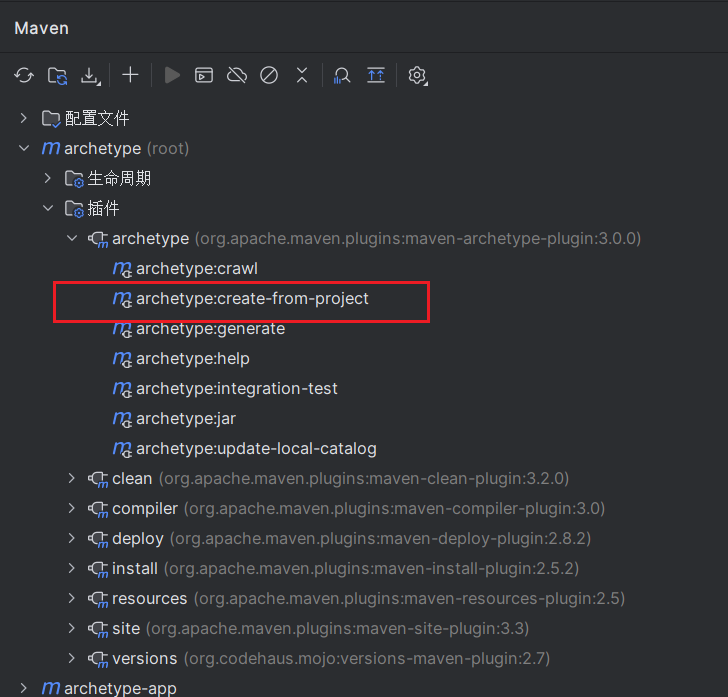
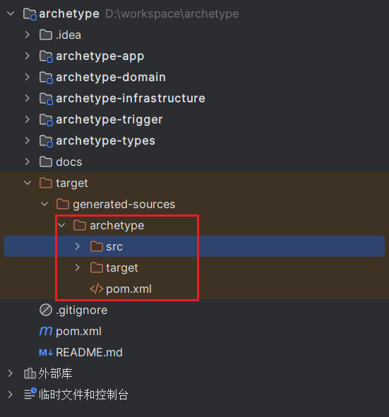
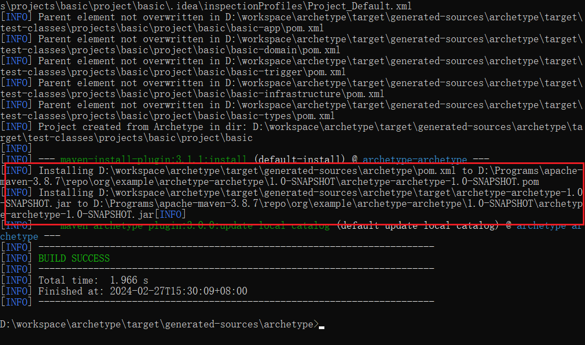
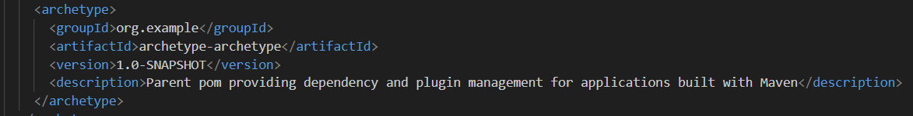
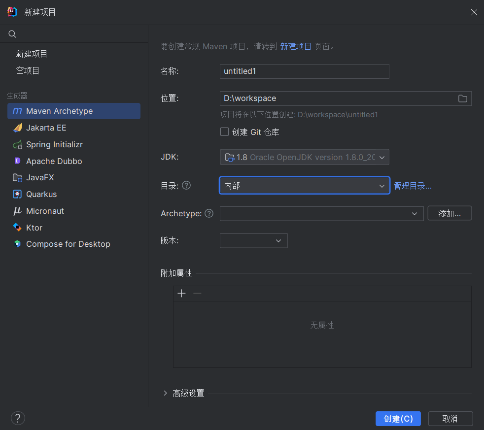
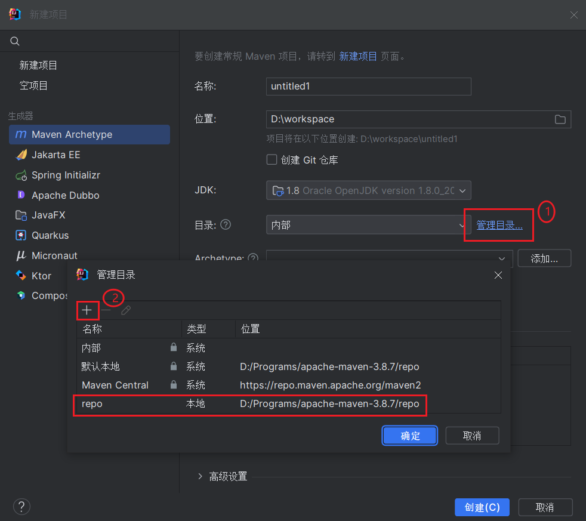
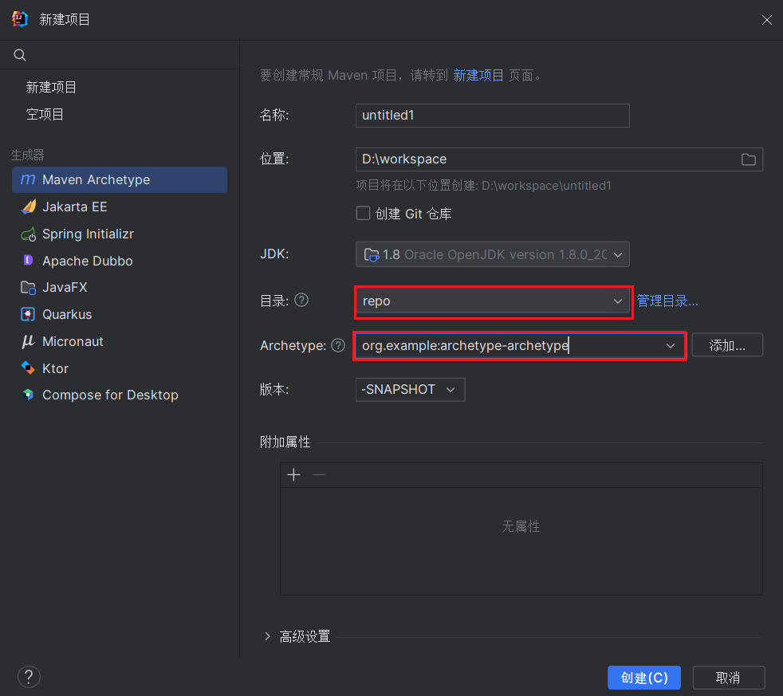

# 自定义maven archetype

## 添加插件

在根目录 pom 文件添加插件

~~~
<plugin>
    <groupId>org.apache.maven.plugins</groupId>
    <artifactId>maven-archetype-plugin</artifactId>
    <version>3.0.0</version>
</plugin>
~~~

## 创建脚手架

在项目根目录执行命令

```
mvn archetype:create-from-project
```

或者在 IDEA 中执行插件操作



Build 成功后会生成一个 archetype 文件夹



## 安装脚手架到本地仓库

进入 archetype 目录执行命令

```
mvn clean install
```

执行成功后，可以通过日志看到脚手架已经安装到了本地仓库



另外在 maven仓库的`archetype-catalog.xml`也能看到新增的 archetype



## 使用脚手架创建工程

1. 打开`新建项目`窗口，选择使用`Maven Archetype`创建



2. 添加本地仓库



3. 选择自定义的 archetype



4. 创建项目