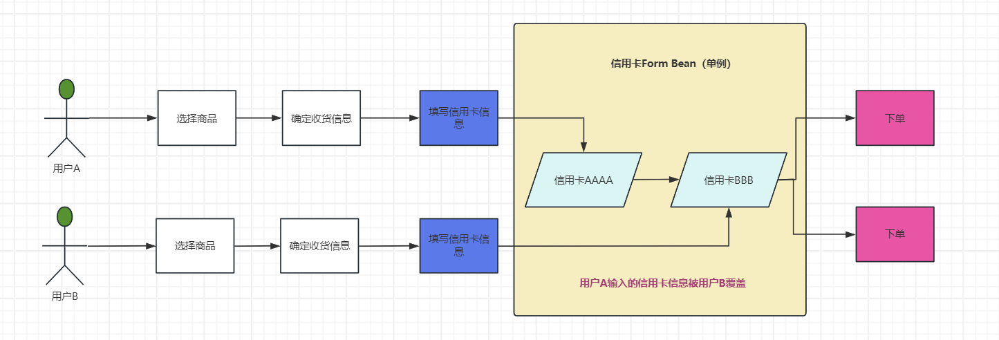

## 背景介绍

我们项目是一个小型的隐形眼镜电商网站，运行时间有十几年了。


项目技术采用的Struts1 + Hibernate + Oracle，由于Struts1版本存在漏洞风险，所以需要**升级到Struts2**。


## 线上问题

我们收到客户的邮件说，他的信用卡有两笔支付记录，但是他只下过一单。


## 排查过程

我们在数据库查了他的信用卡支付记录，确实有两笔支付记录，并且下单用户不同，购买的商品不同，收货地址距离不同并且相距很远。于是排除了重复扣款的可能。可以确认就是两个用户的订单，使用了同一张信用卡支付。


> 我们下面将没有花钱就买到了商品的用户成为**用户A**，而这位被多刷信用卡的用户成为**用户B**


我们一开始对于这个问题毫无头绪，就猜测是不是用户信用卡被盗了（哈哈哈哈，我们的代码怎么可能有问题），但迫于客户的压力，我们还是调查一下代码。


我逐行排查信用卡下单的代码，还真有所发现，有一处代码，大概长这样：

> 此处代码的主要作用是保存用户输入的信用卡数据

```java
private PaymentForm paymentForm = new PaymentForm();
....省略N行代码
    
cartService = ServiceLocator.getInstance().getCartService();

// 从购物车表查询商品数据
CartDTO cartDTO = cartService.findCartDtoByConsumerId(sessionData.getConsumerProfileDTO().getConsumerID());

// 前端传进来的数据都在paymentForm中，将这些信息放入cartDTO对象
cartDTO.setCcExpMonth(paymentForm.getExpirationMonth());
cartDTO.setCcExpYear(paymentForm.getExpirationYear());
cartDTO.setCcToken(paymentForm.getCcToken());
cartDTO.setCcType(paymentForm.getCardType());
cartDTO.setCcHolder(paymentForm.getNameOnCard());

// 更新用户的信用卡数据
cartService.updateConsumerCart(sessionData.getConsumerProfileDTO().getConsumerID(), cartDTO);
```


在并发情况下，这里我假设用户B的请求却拿到了用户A的 session，那么 session 中存储的用户ID也就拿错了，用户B的信用卡数据就有可能保存到用户A的账号上。


然后我再去查了查 session 的底层原理，发现我错了，session 有自己的管理机制，不会发生“串台”的情况，并且在集群情况下，就算没有做session同步处理，那最多也只是程序拿不到session数据，于此我的假设被推翻。


另一个同事问Form数据会不会“串台”呢，我第一反应是：不会，但还是去看了下 Form 类。前面还提到了项目需要从 struts1 升级到2，这个问题也是升级到 struts2 后出现的，我顺便去看了一下这次升级做了哪些修改。


## 问题原因

> struts 框架有 Action 和 Form 的概念，Action 相当于 Spring 中的 controller，Form 相当于 Spring 中封装请求数据的 RequestDTO 对象


Struts1 是这么写的

```xml
<form-beans>
    <form-bean name="paymentForm" type="com.test.web.forms.PaymentForm" />
</form-beans>

<action path="/checkout/submitPayment" type="com.test.web.actions.CheckoutAction" parameter="paymentPreAuth" name="paymentForm" >
	<forward name="error" path="/error.html" />
</action>
```


Struts2 升级后，引入了 Spring 来管理 Bean，这么写的

```xml
<beans>
	<bean id="paymentForm" class="com.test.web.forms.PaymentForm"/>
</beans>
```


看起来没什么毛病，但是有一个重要的点被忽视了，那就是 Spring Bean 的默认 scope。

~~~xml
<xsd:attribute name="scope" type="xsd:string">
    <xsd:annotation>
        <xsd:documentation><![CDATA[
        The scope of this bean: typically "singleton" (one shared instance,
        which will be returned by all calls to getBean with the given id), or
        "prototype" (independent instance resulting from each call to getBean).

        By default, a bean will be a singleton, unless the bean has a parent
        bean definition in which case it will inherit the parent's scope.

        Singletons are most commonly used, and are ideal for multi-threaded
        service objects. Further scopes, such as "request" or "session", might
        be supported by extended bean factories (e.g. in a web environment).

        Inner bean definitions inherit the scope of their containing bean
        definition, unless explicitly specified: The inner bean will be a
        singleton if the containing bean is a singleton, and a prototype if
        the containing bean is a prototype, etc.
        ]]></xsd:documentation>
    </xsd:annotation>
</xsd:attribute>
~~~


Spring Bean 默认是 singleton，而 Struts1 中 Form 的 scope 默认是 session。


那么全局只有一个 PaymentForm， 在并发情况下，就会出现不同用户提交的 PaymentForm 数据被重写，最后保存表单数据到数据库时是使用的最后提


交的那个用户的数据，我们通过一个流程图来看看这次事故发生的流程。

### 流程图



两个用户几乎同时提交了信用卡信息，但是用户B的数据存入 paymentForm 的时机稍微晚一点。两个用户都保存了用户B的信用卡信息，最后下单支付都用了用户B（倒霉蛋）的卡。

## 修复方案

PaymentForm Bean 添加 scope 为 session。

```xml
<beans>
	<bean id="paymentForm" class="com.test.web.forms.PaymentForm" scope="session" />
</beans>
```

