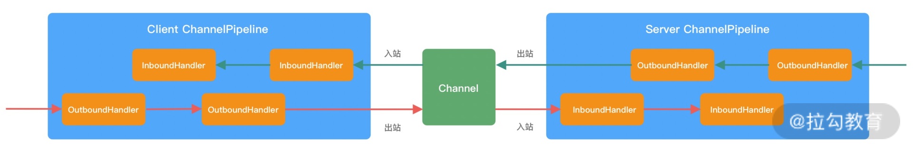
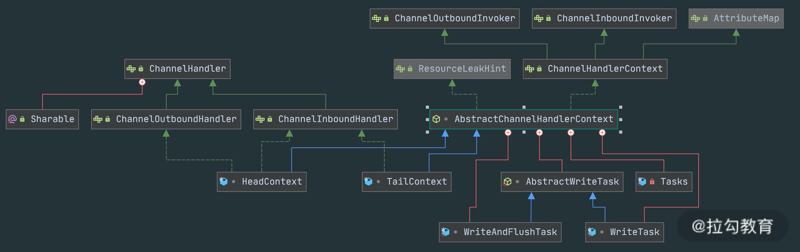
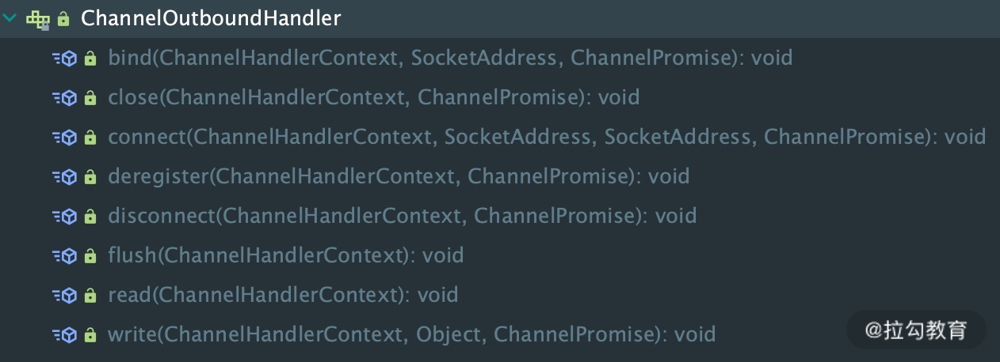
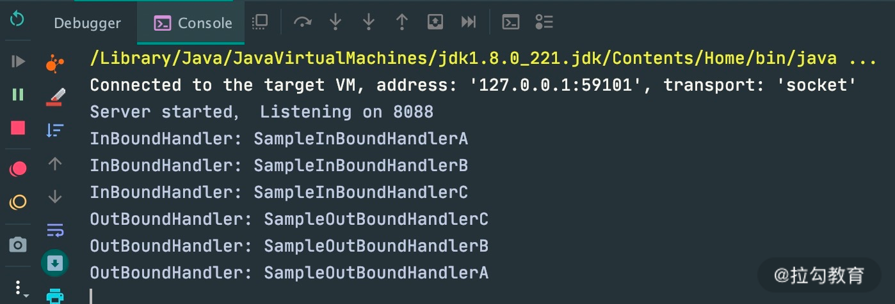
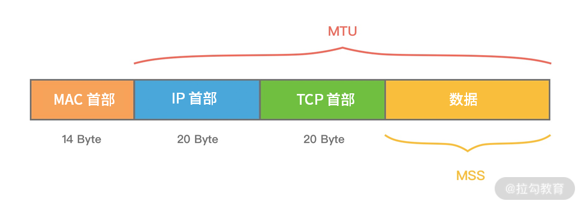
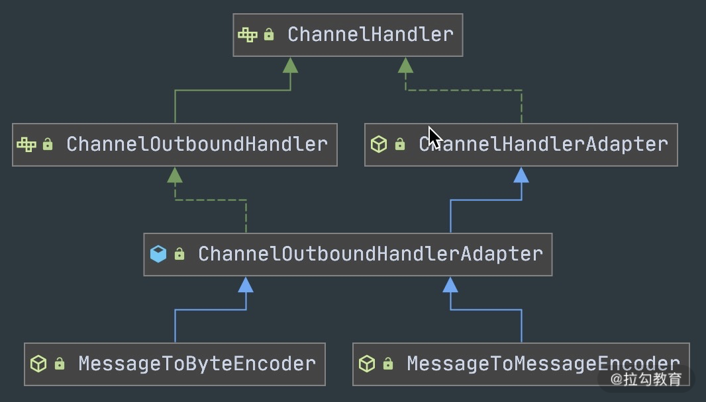

> 极客时间《Netty核心原理剖析与RPC实践》笔记

## 00 学好 Netty，是你修炼 Java 内功的必经之路

**为什么学习netty？**

- 掌握底层原理，一定会成为你求职面试的加分项
- 锻炼你的编程思维，对 Java 其他的知识体系起到融会贯通的作用
- Netty 的易用性和可靠性也极大程度上降低了开发者的心智负担
- 正是因为有 Netty 的存在，网络编程领域 Java 才得以与 C++ 并肩而立

**思维导图**


## 01 初识 Netty：为什么 Netty 这么流行？

### 为什么选择 Netty？

Netty 是一款用于高效开发网络应用的 NIO 网络框架，它大大简化了网络应用的开发过程

既然 Netty 是网络应用框架，那我们永远绕不开以下几个核心关注点：

- **I/O 模型、线程模型和事件处理机制；**
- **易用性 API 接口；**
- **对数据协议、序列化的支持。**

我们之所以会最终选择 Netty，是因为 Netty 围绕这些核心要点可以做到尽善尽美，其健壮性、性能、可扩展性在同领域的框架中都首屈一指。下面我们从以下三个方面一起来看看，Netty 到底有多厉害

#### 高性能，低延迟

 I/O 多路复用


多路复用实现了**一个线程处理多个 I/O 句柄的操作**。多路指的是多个**数据通道**，复用指的是使用一个或多个固定线程来处理每一个 Socket。select、poll、epoll 都是 I/O 多路复用的具体实现，线程一次 select 调用可以获取内核态中多个数据通道的数据状态。多路复用解决了同步阻塞 I/O 和同步非阻塞 I/O 的问题，是一种非常高效的 I/O 模型。

Netty 的 I/O 模型是基于非阻塞 I/O 实现的，底层依赖的是 JDK NIO 框架的多路复用器 Selector。一个多路复用器 Selector 可以同时轮询多个 Channel，采用 epoll 模式后，只需要一个线程负责 Selector 的轮询，就可以接入成千上万的客户端。

在 I/O 多路复用的场景下，当有数据处于就绪状态后，需要一个事件分发器（Event Dispather），它负责将读写事件分发给对应的读写事件处理器（Event Handler）。事件分发器有两种设计模式：Reactor 和 Proactor，**Reactor 采用同步 I/O， Proactor 采用异步 I/O**。


上图所描述的便是 Netty 所采用的主从 Reactor 多线程模型，所有的 I/O 事件都注册到一个 I/O 多路复用器上，当有 I/O 事件准备就绪后，I/O 多路复用器会将该 I/O 事件通过事件分发器分发到对应的事件处理器中。该线程模型避免了同步问题以及多线程切换带来的资源开销，真正做到高性能、低延迟

#### 完美弥补 Java NIO 的缺陷

Netty 相比 JDK NIO 有哪些突出的优势：

- **易用性。** Netty 在 NIO 基础上进行了更高层次的封装，屏蔽了 NIO 的复杂性；Netty 封装了更加人性化的 API，统一的 API（阻塞/非阻塞） 大大降低了开发者的上手难度；与此同时，Netty 提供了很多开箱即用的工具，例如常用的行解码器、长度域解码器等，而这些在 JDK NIO 中都需要你自己实现。
- **稳定性。** Netty 更加可靠稳定，修复和完善了 JDK NIO 较多已知问题，例如臭名昭著的 select 空转导致 CPU 消耗 100%，TCP 断线重连，keep-alive 检测等问题。
- **可扩展性。** Netty 的可扩展性在很多地方都有体现，这里我主要列举其中的两点：一个是可定制化的线程模型，用户可以通过启动的配置参数选择 Reactor 线程模型；另一个是可扩展的事件驱动模型，将框架层和业务层的关注点分离。大部分情况下，开发者只需要关注 ChannelHandler 的业务逻辑实现。

#### 更低的资源消耗

作为网络通信框架，需要处理海量的网络数据，那么必然面临有大量的网络对象需要创建和销毁的问题，对于 JVM GC 并不友好。为了降低 JVM 垃圾回收的压力，Netty 主要采用了两种优化手段：

- **对象池复用技术。** Netty 通过复用对象，避免频繁创建和销毁带来的开销。
- **零拷贝技术。** 除了操作系统级别的零拷贝技术外，Netty 提供了更多面向用户态的零拷贝技术，例如 Netty 在 I/O 读写时直接使用 DirectBuffer，从而避免了数据在堆内存和堆外内存之间的拷贝。

### 谁在使用 Netty？

Netty 经过很多出名产品在线上的大规模验证，其健壮性和稳定性都被业界认可，其中典型的产品有一下几个。

- 服务治理：Apache Dubbo、gRPC。
- 大数据：Hbase、Spark、Flink、Storm。
- 搜索引擎：Elasticsearch。
- 消息队列：RocketMQ、ActiveMQ。

## 02 纵览全局：把握 Netty 整体架构脉络

### Netty 整体结构


#### 1. Core 核心层

Core 核心层是 Netty 最精华的内容，它提供了底层网络通信的通用抽象和实现，包括可扩展的事件模型、通用的通信 API、支持零拷贝的 ByteBuf 等。

#### 2. Protocol Support 协议支持层

协议支持层基本上覆盖了主流协议的编解码实现，如 HTTP、SSL、Protobuf、压缩、大文件传输、WebSocket、文本、二进制等主流协议，此外 Netty 还支持自定义应用层协议。Netty 丰富的协议支持降低了用户的开发成本，基于 Netty 我们可以快速开发 HTTP、WebSocket 等服务。

#### 3. Transport Service 传输服务层

传输服务层提供了网络传输能力的定义和实现方法。它支持 Socket、HTTP 隧道、虚拟机管道等传输方式。Netty 对 TCP、UDP 等数据传输做了抽象和封装，用户可以更聚焦在业务逻辑实现上，而不必关系底层数据传输的细节。

Netty 的模块设计具备较高的**通用性和可扩展性**，它不仅是一个优秀的网络框架，还可以作为网络编程的工具箱。Netty 的设计理念非常优雅，值得我们学习借鉴。

### Netty 逻辑架构

Netty 的逻辑处理架构为典型网络分层架构设计，共分为网络通信层、事件调度层、服务编排层，每一层各司其职。


#### 网络通信层

网络通信层的职责是执行网络 I/O 的操作。它支持多种网络协议和 I/O 模型的连接操作。当网络数据读取到内核缓冲区后，会触发各种网络事件，这些网络事件会分发给事件调度层进行处理。

网络通信层的**核心组件**包含**BootStrap、ServerBootStrap、Channel**三个组件。

##### **BootStrap & ServerBootStrap**

Bootstrap 是“引导”的意思，它主要负责整个 Netty 程序的启动、初始化、服务器连接等过程，它相当于一条主线，串联了 Netty 的其他核心组件。

如下图所示，Netty 中的引导器共分为两种类型：一个为**用于客户端引导的 Bootstrap**，另一个为**用于服务端引导的 ServerBootStrap**，它们都继承自抽象类 AbstractBootstrap。


Bootstrap 和 ServerBootStrap两者非常重要的区别:

- Bootstrap 可用于连接远端服务器，只绑定一个 EventLoopGroup。
- ServerBootStrap 则用于服务端启动绑定本地端口，会绑定两个 EventLoopGroup，这两个 EventLoopGroup 通常称为 Boss 和 Worker。

ServerBootStrap 中的 Boss 和 Worker 是什么角色呢？它们之间又是什么关系？这里的 Boss 和 Worker **可以理解为“老板”和“员工”的关系**。每个服务器中都会有一个 Boss，也会有一群做事情的 Worker。Boss 会不停地接收新的连接，然后将连接分配给一个个 Worker 处理连接。

有了 Bootstrap 组件，我们可以更加方便地配置和启动 Netty 应用程序，它是整个 Netty 的入口，串接了 Netty 所有核心组件的初始化工作。

##### **Channel**

Channel 的字面意思是“通道”，它是网络通信的载体。Channel提供了基本的 API 用于网络 I/O 操作，如 register、bind、connect、read、write、flush 等。

下图是 Channel 家族的图谱。AbstractChannel 是整个家族的基类，派生出 AbstractNioChannel、AbstractOioChannel、AbstractEpollChannel 等子类，每一种都代表了不同的 I/O 模型和协议类型。常用的 Channel 实现类有：


- NioServerSocketChannel 异步 TCP 服务端。
- NioSocketChannel 异步 TCP 客户端。
- OioServerSocketChannel 同步 TCP 服务端。
- OioSocketChannel 同步 TCP 客户端。
- NioDatagramChannel 异步 UDP 连接。
- OioDatagramChannel 同步 UDP 连接。

当然 Channel 会有多种状态，如**连接建立、连接注册、数据读写、连接销毁**等。随着状态的变化，Channel 处于不同的生命周期，每一种状态都会绑定相应的事件回调，下面的表格我列举了 Channel 最常见的状态所对应的事件回调。

| 事件                | 说明                                          |
| :------------------ | :-------------------------------------------- |
| channelRegistered   | Channel 创建后被注册到 EventLoop 上           |
| channelUnregistered | Channel 创建后未注册或者从 EventLoop 取消注册 |
| channelActive       | Channel 处于就绪状态，可以被读写              |
| channelInactive     | Channel 处于非就绪状态                        |
| channelRead         | Channel 可以从远端读取到数据                  |
| channelReadComplete | Channel 读取数据完成                          |

有关网络通信层我就先介绍到这里，简单地总结一下。BootStrap 和 ServerBootStrap 分别负责客户端和服务端的启动，它们是非常强大的辅助工具类；Channel 是网络通信的载体，提供了与底层 Socket 交互的能力。那么 **Channel 生命周期内的事件都是如何被处理的呢？那就是 Netty 事件调度层的工作职责**了。

#### 事件调度层

事件调度层的职责是通过 Reactor 线程模型对各类事件进行聚合处理，通过 Selector 主循环线程集成多种事件（ I/O 事件、信号事件、定时事件等），实际的业务处理逻辑是交由服务编排层中相关的 Handler 完成。

EventLoopGroup 本质是一个线程池，主要负责接收 I/O 请求，并分配线程执行处理请求


从上图中，我们可以总结出 EventLoopGroup、EventLoop、Channel 的几点关系。

1. 一个 EventLoopGroup 往往包含一个或者多个 EventLoop。EventLoop 用于处理 Channel 生命周期内的所有 I/O 事件，如 accept、connect、read、write 等 I/O 事件。
2. EventLoop 同一时间会与一个线程绑定，每个 EventLoop 负责处理多个 Channel。
3. 每新建一个 Channel，EventLoopGroup 会选择一个 EventLoop 与其绑定。该 Channel 在生命周期内都可以对 EventLoop 进行多次绑定和解绑。

下图是 EventLoopGroup 的家族图谱。可以看出 Netty 提供了 EventLoopGroup 的多种实现，而且 EventLoop 则是 EventLoopGroup 的子接口，所以也可以把 EventLoop 理解为 EventLoopGroup，但是它只包含一个 EventLoop 。


EventLoopGroup 的实现类是 NioEventLoopGroup，NioEventLoopGroup 也是 Netty 中最被推荐使用的线程模型。NioEventLoopGroup 继承于 MultithreadEventLoopGroup，是基于 NIO 模型开发的，可以把 NioEventLoopGroup 理解为一个线程池，每个线程负责处理多个 Channel，而同一个 Channel 只会对应一个线程。

Netty 通过创建不同的 EventLoopGroup 参数配置，可以支持 Reactor 的三种线程模型：

1. **单线程模型**：EventLoopGroup 只包含一个 EventLoop，Boss 和 Worker 使用同一个EventLoopGroup；
2. **多线程模型**：EventLoopGroup 包含多个 EventLoop，Boss 和 Worker 使用同一个EventLoopGroup；
3. **主从多线程模型**：EventLoopGroup 包含多个 EventLoop，Boss 是主 Reactor，Worker 是从 Reactor，它们分别使用不同的 EventLoopGroup，主 Reactor 负责新的网络连接 Channel 创建，然后把 Channel 注册到从 Reactor

#### 服务编排层

服务编排层的职责是负责组装各类服务，它是 Netty 的核心处理链，用以实现网络事件的动态编排和有序传播。

服务编排层的**核心组件**包括 **ChannelPipeline**、**ChannelHandler、ChannelHandlerContext**。

ChannelPipeline 是 Netty 的核心编排组件，**负责组装各种 ChannelHandler**，实际数据的编解码以及加工处理操作都是由 ChannelHandler 完成的。ChannelPipeline 可以理解为**ChannelHandler 的实例列表**——内部通过双向链表将不同的 ChannelHandler 链接在一起


每创建一个 Channel 都会绑定一个新的 ChannelPipeline，ChannelPipeline 中每加入一个 ChannelHandler 都会绑定一个 ChannelHandlerContext。

ChannelHandlerContext 用于保存 ChannelHandler 上下文·


### 组件关系梳理

当你了解每个 Netty 核心组件的概念后。你会好奇这些组件之间如何协作？结合客户端和服务端的交互流程，我画了一张图，为你完整地梳理一遍 Netty 内部逻辑的流转。


- 服务端启动初始化时有 Boss EventLoopGroup 和 Worker EventLoopGroup 两个组件，其中 Boss 负责监听网络连接事件。当有新的网络连接事件到达时，则将 Channel 注册到 Worker EventLoopGroup。
- Worker EventLoopGroup 会被分配一个 EventLoop 负责处理该 Channel 的读写事件。每个 EventLoop 都是单线程的，通过 Selector 进行事件循环。
- 当客户端发起 I/O 读写事件时，服务端 EventLoop 会进行数据的读取，然后通过 Pipeline 触发各种监听器进行数据的加工处理。
- 客户端数据会被传递到 ChannelPipeline 的第一个 ChannelInboundHandler 中，数据处理完成后，将加工完成的数据传递给下一个 ChannelInboundHandler。
- 当数据写回客户端时，会将处理结果在 ChannelPipeline 的 ChannelOutboundHandler 中传播，最后到达客户端。

### Netty 源码结构

Netty 源码分为多个模块，模块之间职责划分非常清楚。如同上文整体功能模块一样，Netty 源码模块的划分也是基本契合的。


我们不仅可以使用 Netty all-in-one 的 Jar 包，也可以单独使用其中某些工具包。下面我根据 Netty 的分层结构以及实际的业务场景具体介绍 Netty 中常用的工具包。

#### Core 核心层模块

**netty-common**模块是 Netty 的核心基础包，提供了丰富的工具类，其他模块都需要依赖它。在 common 模块中，常用的包括**通用工具类**和**自定义并发包**。

- 通用工具类：比如定时器工具 TimerTask、时间轮 HashedWheelTimer 等。
- 自定义并发包：比如异步模型Future & Promise、相比 JDK 增强的 FastThreadLocal 等。

在**netty-buffer 模块中**Netty自己实现了的一个更加完备的**ByteBuf 工具类**，用于网络通信中的数据载体。由于人性化的 Buffer API 设计，它已经成为 Java ByteBuffer 的完美替代品。ByteBuf 的动态性设计不仅解决了 ByteBuffer 长度固定造成的内存浪费问题，而且更安全地更改了 Buffer 的容量。此外 Netty 针对 ByteBuf 做了很多优化，例如缓存池化、减少数据拷贝的 CompositeByteBuf 等。

**netty-resover**模块主要提供了一些有关**基础设施**的解析工具，包括 IP Address、Hostname、DNS 等。

#### Protocol Support 协议支持层模块

**netty-codec**模块主要负责编解码工作，通过编解码实现原始字节数据与业务实体对象之间的相互转化。如下图所示，Netty 支持了大多数业界主流协议的编解码器，如 HTTP、HTTP2、Redis、XML 等，为开发者节省了大量的精力。此外该模块提供了抽象的编解码类 ByteToMessageDecoder 和 MessageToByteEncoder，通过继承这两个类我们可以轻松实现自定义的编解码逻辑。

**netty-handler**模块主要负责数据处理工作。Netty 中关于数据处理的部分，本质上是一串有序 handler 的集合。netty-handler 模块提供了开箱即用的 ChannelHandler 实现类，例如日志、IP 过滤、流量整形等，如果你需要这些功能，仅需在 pipeline 中加入相应的 ChannelHandler 即可。

#### Transport Service 传输服务层模块

netty-transport 模块可以说是 Netty 提供数据**处理和传输的核心模块**。该模块提供了很多非常重要的接口，如 Bootstrap、Channel、ChannelHandler、EventLoop、EventLoopGroup、ChannelPipeline 等。其中 Bootstrap 负责客户端或服务端的启动工作，包括创建、初始化 Channel 等；EventLoop 负责向注册的 Channel 发起 I/O 读写操作；ChannelPipeline 负责 ChannelHandler 的有序编排，这些组件在介绍 Netty 逻辑架构的时候都有所涉及。

## 03 引导器作用：客户端和服务端启动都要做些什么？

#### 服务端启动类

所有 Netty 服务端的启动类都可以采用如下代码结构进行开发。简单梳理一下流程：首先创建引导器；然后配置线程模型，通过引导器绑定业务逻辑处理器，并配置一些网络参数；最后绑定端口，就可以完成服务器的启动了。

```java
public class HttpServer {

    public void start(int port) throws Exception {

        EventLoopGroup bossGroup = new NioEventLoopGroup();

        EventLoopGroup workerGroup = new NioEventLoopGroup();

        try {

            ServerBootstrap b = new ServerBootstrap();

            b.group(bossGroup, workerGroup)

                    .channel(NioServerSocketChannel.class)

                    .localAddress(new InetSocketAddress(port))

                    .childHandler(new ChannelInitializer<SocketChannel>() {

                        @Override

                        public void initChannel(SocketChannel ch) {

                            ch.pipeline()

                                    .addLast("codec", new HttpServerCodec())                  // HTTP 编解码

                                    .addLast("compressor", new HttpContentCompressor())       // HttpContent 压缩

                                    .addLast("aggregator", new HttpObjectAggregator(65536))   // HTTP 消息聚合

                                    .addLast("handler", new HttpServerHandler());             // 自定义业务逻辑处理器

                        }

                    })

                    .childOption(ChannelOption.SO_KEEPALIVE, true);

            ChannelFuture f = b.bind().sync();

            System.out.println("Http Server started， Listening on " + port);

            f.channel().closeFuture().sync();

        } finally {

            workerGroup.shutdownGracefully();

            bossGroup.shutdownGracefully();

        }

    }

    public static void main(String[] args) throws Exception {

        new HttpServer().start(8088);

    }

}
```

### 引导器实践指南

Netty 服务端的启动过程大致分为三个步骤：

1. **配置线程池；**
2. **Channel 初始化；**
3. **端口绑定。**

#### 配置线程池

Netty 是采用 Reactor 模型进行开发的，可以非常容易切换三种 Reactor 模式：**单线程模式**、**多线程模式**、**主从多线程模式**。

#### **单线程模式**

Reactor 单线程模型所有 I/O 操作都由一个线程完成，所以只需要启动一个 EventLoopGroup 即可。

```csharp
EventLoopGroup group = new NioEventLoopGroup(1);

ServerBootstrap b = new ServerBootstrap();

b.group(group)
```

#### **多线程模式**

Reactor 单线程模型有非常严重的性能瓶颈，因此 Reactor 多线程模型出现了。在 Netty 中使用 Reactor 多线程模型与单线程模型非常相似，区别是 NioEventLoopGroup 可以不需要任何参数，它默认会启动 2 倍 CPU 核数的线程。当然，你也可以自己手动设置固定的线程数。

```csharp
EventLoopGroup group = new NioEventLoopGroup();

ServerBootstrap b = new ServerBootstrap();

b.group(group)
```

#### **主从多线程模式**

在大多数场景下，我们采用的都是**主从多线程 Reactor 模型**。Boss 是主 Reactor，Worker 是从 Reactor。它们分别使用不同的 NioEventLoopGroup，主 Reactor 负责处理 Accept，然后把 Channel 注册到从 Reactor 上，从 Reactor 主要负责 Channel 生命周期内的所有 I/O 事件。

```java
EventLoopGroup bossGroup = new NioEventLoopGroup();

EventLoopGroup workerGroup = new NioEventLoopGroup();

ServerBootstrap b = new ServerBootstrap();

b.group(bossGroup, workerGroup)
```

### Channel 初始化

#### 设置 Channel 类型

推荐 Netty 服务端采用 NioServerSocketChannel 作为 Channel 的类型，客户端采用 NioSocketChannel。设置方式如下：

```cpp
 b.channel(NioServerSocketChannel.class);
```

#### 设置 Channel 参数

ServerBootstrap 设置 Channel 属性有**option**和**childOption**两个方法，option 主要负责设置 Boss 线程组，而 childOption 对应的是 Worker 线程组。

这里我列举了经常使用的参数含义，你可以结合业务场景，按需设置。

| 参数                   | 含义                                                         |
| :--------------------- | :----------------------------------------------------------- |
| SO_KEEPALIVE           | 设置为 true 代表启用了 TCP SO_KEEPALIVE 属性，TCP 会主动探测连接状态，即连接保活 |
| SO_BACKLOG             | 已完成三次握手的请求队列最大长度，同一时刻服务端可能会处理多个连接，在高并发海量连接的场景下，该参数应适当调大 |
| TCP_NODELAY            | Netty 默认是 true，表示立即发送数据。如果设置为 false 表示启用 Nagle 算法，该算法会将 TCP 网络数据包累积到一定量才会发送，虽然可以减少报文发送的数量，但是会造成一定的数据延迟。Netty 为了最小化数据传输的延迟，默认禁用了 Nagle 算法 |
| SO_SNDBUF              | TCP 数据发送缓冲区大小                                       |
| SO_RCVBUF              | TCP数据接收缓冲区大小，TCP数据接收缓冲区大小                 |
| SO_LINGER              | 设置延迟关闭的时间，等待缓冲区中的数据发送完成               |
| CONNECT_TIMEOUT_MILLIS | 建立连接的超时时间                                           |

#### 端口绑定

在完成上述 Netty 的配置之后，bind() 方法会真正触发启动，sync() 方法则会阻塞，直至整个启动过程完成.

## 04 事件调度层：为什么 EventLoop 是 Netty 的精髓？

Reactor 线程模型运行机制的四个步骤，分别为**连接注册**、**事件轮询**、**事件分发**、**任务处理**


- 连接注册：Channel 建立后，注册至 Reactor 线程中的 Selector 选择器。
- 事件轮询：轮询 Selector 选择器中已注册的所有 Channel 的 I/O 事件。
- 事件分发：为准备就绪的 I/O 事件分配相应的处理线程。
- 任务处理：Reactor 线程还负责任务队列中的非 I/O 任务，每个 Worker 线程从各自维护的任务队列中取出任务异步执行

### Netty EventLoop 实现原理

#### EventLoop 是什么

EventLoop 这个概念其实并不是 Netty 独有的，它是一种**事件等待和处理的程序模型**，可以解决多线程资源消耗高的问题

下图展示了 EventLoop 通用的运行模式。每当事件发生时，应用程序都会将产生的事件放入事件队列当中，然后 EventLoop 会轮询从队列中取出事件执行或者将事件分发给相应的事件监听者执行。事件执行的方式通常分为**立即执行、延后执行、定期执行**几种。


### Netty 如何实现 EventLoop

在 Netty 中 EventLoop 可以理解为 Reactor 线程模型的事件处理引擎，每个 EventLoop 线程都维护一个 Selector 选择器和任务队列 taskQueue。它主要负责处理 I/O 事件、普通任务和定时任务。

Netty 中推荐使用 NioEventLoop 作为实现类

#### 事件处理机制


结合 Netty 的整体架构，我们一起看下 EventLoop 的事件流转图，以便更好地理解 Netty EventLoop 的设计原理。NioEventLoop 的事件处理机制采用的是**无锁串行化的设计思路**。

- **BossEventLoopGroup** 和 **WorkerEventLoopGroup** 包含一个或者多个 NioEventLoop。BossEventLoopGroup 负责监听客户端的 Accept 事件，当事件触发时，将事件注册至 WorkerEventLoopGroup 中的一个 NioEventLoop 上。每新建一个 Channel， 只选择一个 NioEventLoop 与其绑定。所以说 Channel 生命周期的所有事件处理都是**线程独立**的，不同的 NioEventLoop 线程之间不会发生任何交集。
- NioEventLoop 完成数据读取后，会调用绑定的 ChannelPipeline 进行事件传播，ChannelPipeline 也是**线程安全**的，数据会被传递到 ChannelPipeline 的第一个 ChannelHandler 中。数据处理完成后，将加工完成的数据再传递给下一个 ChannelHandler，整个过程是**串行化**执行，不会发生线程上下文切换的问题。

####  Netty 是如何解决 epoll 空轮询的 Bug

```lua
long time = System.nanoTime();

if (time - TimeUnit.MILLISECONDS.toNanos(timeoutMillis) >= currentTimeNanos) {

    selectCnt = 1;

} else if (SELECTOR_AUTO_REBUILD_THRESHOLD > 0 &&

        selectCnt >= SELECTOR_AUTO_REBUILD_THRESHOLD) {

    selector = selectRebuildSelector(selectCnt);

    selectCnt = 1;

    break;

}
```

Netty 提供了一种检测机制判断线程是否可能陷入空轮询，具体的实现方式如下：

1. 每次执行 Select 操作之前记录当前时间 currentTimeNanos。
2. time - TimeUnit.MILLISECONDS.toNanos(timeoutMillis) >= currentTimeNanos，如果事件轮询的持续时间大于等于 timeoutMillis，那么说明是正常的，否则表明阻塞时间并未达到预期，可能触发了空轮询的 Bug。
3. Netty 引入了计数变量 selectCnt。在正常情况下，selectCnt 会重置，否则会对 selectCnt 自增计数。当 selectCnt 达到 SELECTOR_AUTO_REBUILD_THRESHOLD（默认512） 阈值时，会触发重建 Selector 对象。

Netty 采用这种方法巧妙地规避了 JDK Bug。异常的 Selector 中所有的 SelectionKey 会重新注册到新建的 Selector 上，重建完成之后异常的 Selector 就可以废弃了。

#### 任务处理机制

NioEventLoop 不仅负责处理 I/O 事件，还要兼顾执行任务队列中的任务。任务队列遵循 FIFO 规则，可以保证任务执行的公平性。NioEventLoop 处理的任务类型基本可以分为三类。

1. **普通任务**：通过 NioEventLoop 的 execute() 方法向任务队列 taskQueue 中添加任务。例如 Netty 在写数据时会封装 WriteAndFlushTask 提交给 taskQueue。taskQueue 的实现类是多生产者单消费者队列 MpscChunkedArrayQueue，在多线程并发添加任务时，可以保证线程安全。
2. **定时任务**：通过调用 NioEventLoop 的 schedule() 方法向定时任务队列 scheduledTaskQueue 添加一个定时任务，用于周期性执行该任务。例如，心跳消息发送等。定时任务队列 scheduledTaskQueue 采用优先队列 PriorityQueue 实现。
3. **尾部队列**：tailTasks 相比于普通任务队列优先级较低，在每次执行完 taskQueue 中任务后会去获取尾部队列中任务执行。尾部任务并不常用，主要用于做一些收尾工作，例如统计事件循环的执行时间、监控信息上报等。

### EventLoop 最佳实践

在日常开发中用好 EventLoop 至关重要，这里结合实际工作中的经验给出一些 EventLoop 的最佳实践方案。

1. 网络连接建立过程中三次握手、安全认证的过程会消耗不少时间。这里建议采用 Boss 和 Worker 两个 EventLoopGroup，有助于分担 Reactor 线程的压力。
2. 由于 Reactor 线程模式适合处理耗时短的任务场景，对于耗时较长的 ChannelHandler 可以考虑维护一个业务线程池，将编解码后的数据封装成 Task 进行异步处理，避免 ChannelHandler 阻塞而造成 EventLoop 不可用。
3. 如果业务逻辑执行时间较短，建议直接在 ChannelHandler 中执行。例如编解码操作，这样可以避免过度设计而造成架构的复杂性。
4. 不宜设计过多的 ChannelHandler。对于系统性能和可维护性都会存在问题，在设计业务架构的时候，需要明确业务分层和 Netty 分层之间的界限。不要一味地将业务逻辑都添加到 ChannelHandler 中。

## 05 服务编排层：Pipeline 如何协调各类 Handler ？

### ChannelPipeline 概述

原始的网络字节流经过 Pipeline ，被一步步加工包装，最后得到加工后的成品。

初步的印象：它是 Netty 的核心处理链，用以实现网络事件的动态编排和有序传播。

### ChannelPipeline 内部结构


每个 Channel 会绑定一个 ChannelPipeline，每一个 ChannelPipeline 都包含多个 hannelHandlerContext，所有 ChannelHandlerContext 之间组成了双向链表

>  为什么这里会多一层 ChannelHandlerContext 的封装呢？

ChannelHandlerContext 用于保存 ChannelHandler 上下文；ChannelHandlerContext 则包含了 ChannelHandler 生命周期的所有事件，如 connect、bind、read、flush、write、close 等。可以试想一下，如果没有 ChannelHandlerContext 的这层封装，那么我们在做 ChannelHandler 之间传递的时候，前置后置的通用逻辑就要在每个 ChannelHandler 里都实现一份。这样虽然能解决问题，但是代码结构的耦合，会非常不优雅


出站入站：





ChannelPipeline 的双向链表分别维护了 HeadContext 和 TailContext 的头尾节点



HeadContext 既是 Inbound 处理器，也是 Outbound 处理器。

HeadContext 作为 Pipeline 的头结点负责读取数据并开始传递 InBound 事件，当数据处理完成后，数据会反方向经过 Outbound 处理器，最终传递到 HeadContext，所以 HeadContext 又是处理 Outbound 事件的最后一站。

TailContext 只实现了 ChannelInboundHandler 接口。它会在 ChannelInboundHandler 调用链路的最后一步执行，主要用于终止 Inbound 事件传播，例如释放 Message 数据资源等

### ChannelHandler 接口设计

整个 ChannelHandler 是围绕 I/O 事件的生命周期所设计的，例如建立连接、读数据、写数据、连接销毁等。ChannelHandler 有两个重要的**子接口**：**ChannelInboundHandler**和**ChannelOutboundHandler**，分别拦截**入站和出站的各种 I/O 事件**。

**1. ChannelInboundHandler 的事件回调方法与触发时机。**

| 事件回调方法              | 触发时机                                           |
| :------------------------ | :------------------------------------------------- |
| channelRegistered         | Channel 被注册到 EventLoop                         |
| channelUnregistered       | Channel 从 EventLoop 中取消注册                    |
| channelActive             | Channel 处于就绪状态，可以被读写                   |
| channelInactive           | Channel 处于非就绪状态Channel 可以从远端读取到数据 |
| channelRead               | Channel 可以从远端读取到数据                       |
| channelReadComplete       | Channel 读取数据完成                               |
| userEventTriggered        | 用户事件触发时                                     |
| channelWritabilityChanged | Channel 的写状态发生变化                           |

**2. ChannelOutboundHandler 的事件回调方法与触发时机。**

ChannelOutboundHandler 的事件回调方法非常清晰，直接通过 ChannelOutboundHandler 的接口列表可以看到每种操作所对应的回调方法，如下图所示。这里每个回调方法都是在相应操作执行之前触发，在此就不多做赘述了。此外 ChannelOutboundHandler 中绝大部分接口都包含ChannelPromise 参数，以便于在操作完成时能够及时获得通知。



### 事件传播机制

```java
serverBootstrap.childHandler(new ChannelInitializer<SocketChannel>() {

    @Override

    public void initChannel(SocketChannel ch) {

        ch.pipeline()

                .addLast(new SampleInBoundHandler("SampleInBoundHandlerA", false))

                .addLast(new SampleInBoundHandler("SampleInBoundHandlerB", false))

                .addLast(new SampleInBoundHandler("SampleInBoundHandlerC", true));

        ch.pipeline()

                .addLast(new SampleOutBoundHandler("SampleOutBoundHandlerA"))

                .addLast(new SampleOutBoundHandler("SampleOutBoundHandlerB"))

                .addLast(new SampleOutBoundHandler("SampleOutBoundHandlerC"));
    }

}
```




Inbound 事件和 Outbound 事件的传播方向是不一样的。Inbound 事件的传播方向为 Head -> Tail，而 Outbound 事件传播方向是 Tail -> Head，两者恰恰相反。

### 异常传播机制

在 inboundHandler 中发生异常，如果用户没有对异常进行拦截处理，最后将由 Tail 节点统一处理

### 异常处理的最佳实践

在 ChannelPipeline 自定义处理器的末端添加统一的异常处理器


### 总结

- ChannelPipeline 是双向链表结构，包含 ChannelInboundHandler 和 ChannelOutboundHandler 两种处理器。
- ChannelHandlerContext 是对 ChannelHandler 的封装，每个 ChannelHandler 都对应一个 ChannelHandlerContext，实际上 ChannelPipeline 维护的是与 ChannelHandlerContext 的关系。
- Inbound 事件和 Outbound 事件的传播方向相反，Inbound 事件的传播方向为 Head -> Tail，而 Outbound 事件传播方向是 Tail -> Head。
- 异常事件的处理顺序与 ChannelHandler 的添加顺序相同，会依次向后传播，与 Inbound 事件和 Outbound 事件无关。


## 06 粘包拆包问题：如何获取一个完整的网络包？

### 为什么有拆包/粘包

TCP 传输协议是面向流的，没有数据包界限。

为什么会出现拆包/粘包现象呢？在网络通信的过程中，每次可以发送的数据包大小是受多种因素限制的，如 MTU 传输单元大小、MSS 最大分段大小、滑动窗口等。

#### MTU 最大传输单元和 MSS 最大分段大小

**MTU（Maxitum Transmission Unit）** 是链路层一次最大传输数据的大小。MTU 一般来说大小为 1500 byte。**MSS（Maximum Segement Size）** 是指 TCP 最大报文段长度，它是传输层一次发送最大数据的大小。如下图所示，MTU 和 MSS 一般的计算关系为：MSS = MTU - IP 首部 - TCP首部，如果 MSS + TCP 首部 + IP 首部 > MTU，那么数据包将会被拆分为多个发送。这就是拆包现象。



#### 滑动窗口

**滑动窗口**是 TCP 传输层用于流量控制的一种有效措施，也被称为**通告窗口**。滑动窗口是数据接收方设置的窗口大小，随后接收方会把窗口大小告诉发送方，以此限制发送方每次发送数据的大小，从而达到流量控制的目的。这样数据发送方不需要每发送一组数据就阻塞等待接收方确认，允许发送方同时发送多个数据分组，每次发送的数据都会被限制在窗口大小内。由此可见，滑动窗口可以大幅度提升网络吞吐量。

那么 TCP 报文是怎么确保数据包按次序到达且不丢数据呢？首先，所有的数据帧都是有编号的，TCP 并不会为每个报文段都回复 ACK 响应，它会对多个报文段回复一次 ACK。假设有三个报文段 A、B、C，发送方先发送了B、C，接收方则必须等待 A 报文段到达，如果一定时间内仍未等到 A 报文段，那么 B、C 也会被丢弃，发送方会发起重试。如果已接收到 A 报文段，那么将会回复发送方一次 ACK 确认。

#### Nagle 算法

**Nagle 算法**定义为 TCP/IP 拥塞控制方法。它主要用于解决频繁发送小数据包而带来的网络拥塞问题。试想如果每次需要发送的数据只有 1 字节，加上 20 个字节 IP Header 和 20 个字节 TCP Header，每次发送的数据包大小为 41 字节，但是只有 1 字节是有效信息，这就造成了非常大的浪费。Nagle 算法可以理解为**批量发送**。

Linux 在默认情况下是开启 Nagle 算法的。因为 Nagle 算法会有一定的数据延迟，Netty 中为了使数据传输延迟最小化，就默认禁用了 Nagle 算法。

### 拆包/粘包的解决方案

#### 消息长度固定

```
+------+------+------+------+

| ABCD | EFGH | IJKL | M000 |

+------+------+------+------+
```


每个数据报文都需要一个固定的长度。

消息定长法使用非常简单，但是缺点也非常明显，无法很好设定固定长度的值，如果长度太大会造成字节浪费，长度太小又会影响消息传输，所以在一般情况下消息定长法不会被采用

#### 特定分隔符

```
+-------------------------+

| AB\nCDEF\nGHIJ\nK\nLM\n |

+-------------------------+
```

对于分隔符的选择一定要避免和消息体中字符相同，以免冲突

#### 消息长度 + 消息内容

```
消息头     消息体

+--------+----------+

| Length |  Content |

+--------+----------+
```

接收方在解析数据时, 首先读取消息头的长度字段 Len，然后紧接着读取长度为 Len 的字节数据，该数据即判定为一个完整的数据报文


## 07 接头暗语：如何利用 Netty 实现自定义协议通信？

### 通信协议设计

所谓协议，就是通信双方事先商量好的接口暗语，是**双方能够正常通信的基础**。

目前市面上已经有不少通用的协议，例如 HTTP、HTTPS、JSON-RPC、FTP、IMAP、Protobuf 等。**通用协议**兼容性好，易于维护，各种异构系统之间可以实现无缝对接。如果在满足业务场景以及性能需求的前提下，推荐采用通用协议的方案。相比通用协议，自定义协议主要有以下优点。

- **极致性能**：通用的通信协议考虑了很多兼容性的因素，必然在性能方面有所损失。
- **扩展性**：自定义的协议相比通用协议更好扩展，可以更好地满足自己的业务需求。
- **安全性**：通用协议是公开的，很多漏洞已经很多被黑客攻破。自定义协议更加**安全**，因为黑客需要先破解你的协议内容。

一个完备的网络协议需要具备哪些基本要素。

#### 1. 魔数

魔数是通信双方协商的一个暗号，通常采用固定的几个字节表示。魔数的作用是**防止任何人随便向服务器的端口上发送数据**。服务端在接收到数据时会解析出前几个固定字节的魔数，然后做正确性比对。如果和约定的魔数不匹配，则认为是非法数据，可以直接关闭连接或者采取其他措施以增强系统的安全防护。魔数的思想在压缩算法、Java Class 文件等场景中都有所体现，例如 Class 文件开头就存储了魔数 0xCAFEBABE，在加载 Class 文件时首先会验证魔数的正确性。

#### 2. 协议版本号

随着业务需求的变化，协议可能需要对结构或字段进行改动，不同版本的协议对应的解析方法也是不同的。所以在生产级项目中强烈建议预留**协议版本号**这个字段。

#### 3. 序列化算法

序列化算法字段表示数据发送方应该采用何种方法将请求的对象转化为二进制，以及如何再将二进制转化为对象，如 JSON、Hessian、Java 自带序列化等。

#### 4. 报文类型

在不同的业务场景中，报文可能存在不同的类型。例如在 RPC 框架中有请求、响应、心跳等类型的报文，在 IM 即时通信的场景中有登陆、创建群聊、发送消息、接收消息、退出群聊等类型的报文。

#### 5. 长度域字段

长度域字段代表**请求数据**的长度，接收方根据长度域字段获取一个完整的报文。

#### 6. 请求数据

请求数据通常为序列化之后得到的**二进制流**，每种请求数据的内容是不一样的。

#### 7. 状态

状态字段用于标识**请求是否正常**。一般由被调用方设置。例如一次 RPC 调用失败，状态字段可被服务提供方设置为异常状态。

#### 8. 保留字段

保留字段是可选项，为了应对协议升级的可能性，可以预留若干字节的保留字段，以备不时之需。

通过以上协议基本要素的学习，我们可以得到一个较为通用的协议示例：

```lua
+---------------------------------------------------------------+

| 魔数 2byte | 协议版本号 1byte | 序列化算法 1byte | 报文类型 1byte  |

+---------------------------------------------------------------+

| 状态 1byte |        保留字段 4byte     |      数据长度 4byte     | 

+---------------------------------------------------------------+

|                   数据内容 （长度不定）                          |

+---------------------------------------------------------------+
```

### Netty 如何实现自定义通信协议

**Netty 常用编码器类型：**

- MessageToByteEncoder 对象编码成字节流；
- MessageToMessageEncoder 一种消息类型编码成另外一种消息类型。

**Netty 常用解码器类型：**

- ByteToMessageDecoder/ReplayingDecoder 将字节流解码为消息对象；
- MessageToMessageDecoder 将一种消息类型解码为另外一种消息类型。

编解码器可以分为**一次解码器**和**二次解码器**，一次解码器用于解决 TCP 拆包/粘包问题，按协议解析后得到的字节数据。如果你需要对解析后的字节数据做对象模型的转换，这时候便需要用到二次解码器，同理编码器的过程是反过来的。

- 一次编解码器：MessageToByteEncoder/ByteToMessageDecoder。
- 二次编解码器：MessageToMessageEncoder/MessageToMessageDecoder。


#### 抽象编码类

编码类是 ChanneOutboundHandler 的抽象类实现，具体操作的是 Outbound 出站数据。



MessageToByteEncoder 用于将对象编码成**字节流**，MessageToByteEncoder 提供了唯一的 encode 抽象方法，我们只需要实现**encode 方法**即可完成自定义编码。

MessageToMessageEncoder 与 MessageToByteEncoder 类似，同样只需要实现 encode 方法。与 MessageToByteEncoder 不同的是，MessageToMessageEncoder 是将一种格式的消息转换为另外一种格式的消息

#### 抽象解码类

解码类是 ChanneInboundHandler 的抽象类实现，操作的是 Inbound 入站数据。

解码器实现的难度要远大于编码器，因为解码器需要考虑拆包/粘包问题


- **抽象解码类 ByteToMessageDecoder。**

首先，我们看下 ByteToMessageDecoder 定义的抽象方法：

```csharp
public abstract class ByteToMessageDecoder extends ChannelInboundHandlerAdapter {

    protected abstract void decode(ChannelHandlerContext ctx, ByteBuf in, List<Object> out) throws Exception;

    protected void decodeLast(ChannelHandlerContext ctx, ByteBuf in, List<Object> out) throws Exception {

        if (in.isReadable()) {

            decodeRemovalReentryProtection(ctx, in, out);

        }

    }

}
```

decode() 是用户必须实现的抽象方法，在该方法在调用时需要传入接收的数据 ByteBuf，及用来添加编码后消息的 List。由于 TCP 粘包问题，ByteBuf 中可能包含多个有效的报文，或者不够一个完整的报文。Netty 会重复回调 decode() 方法，直到没有解码出新的完整报文可以添加到 List 当中，或者 ByteBuf 没有更多可读取的数据为止。如果此时 List 的内容不为空，那么会传递给 ChannelPipeline 中的下一个ChannelInboundHandler。

此外 ByteToMessageDecoder 还定义了 decodeLast() 方法。为什么抽象解码器要比编码器多一个 decodeLast() 方法呢？因为 decodeLast 在 Channel 关闭后会被调用一次，主要用于处理 ByteBuf 最后剩余的字节数据。Netty 中 decodeLast 的默认实现只是简单调用了 decode() 方法。如果有特殊的业务需求，则可以通过重写 decodeLast() 方法扩展自定义逻辑。

ByteToMessageDecoder 还有一个抽象子类是 ReplayingDecoder。它封装了缓冲区的管理，在读取缓冲区数据时，你无须再对字节长度进行检查。因为如果没有足够长度的字节数据，ReplayingDecoder 将终止解码操作。ReplayingDecoder 的性能相比直接使用 ByteToMessageDecoder 要慢，大部分情况下并不推荐使用 ReplayingDecoder。

- **抽象解码类 MessageToMessageDecoder。**

MessageToMessageDecoder 与 ByteToMessageDecoder 作用类似，都是将一种消息类型的编码成另外一种消息类型。与 ByteToMessageDecoder 不同的是 MessageToMessageDecoder 并不会对数据报文进行缓存，它主要用作转换消息模型。比较推荐的做法是使用 ByteToMessageDecoder 解析 TCP 协议，解决拆包/粘包问题。解析得到有效的 ByteBuf 数据，然后传递给后续的 MessageToMessageDecoder 做数据对象的转换，具体流程如下图所示。

## 08 开箱即用：Netty 支持哪些常用的解码器？

### 固定长度解码器 FixedLengthFrameDecoder

### 特殊分隔符解码器 DelimiterBasedFrameDecoder

#### 属性

- **delimiters**

delimiters 指定特殊分隔符，通过写入 ByteBuf 作为**参数**传入。delimiters 的类型是 ByteBuf 数组，所以我们可以同时指定多个分隔符，但是最终会选择长度最短的分隔符进行消息拆分。

- **maxLength**

maxLength 是报文最大长度的限制。如果超过 maxLength 还没有检测到指定分隔符，将会抛出 TooLongFrameException。可以说 maxLength 是对程序在极端情况下的一种**保护措施**。

- **failFast**

failFast 与 maxLength 需要搭配使用，通过设置 failFast 可以控制抛出 TooLongFrameException 的时机，可以说 Netty 在细节上考虑得面面俱到。如果 failFast=true，那么在超出 maxLength 会立即抛出 TooLongFrameException，不再继续进行解码。如果 failFast=false，那么会等到解码出一个完整的消息后才会抛出 TooLongFrameException。

- **stripDelimiter**

stripDelimiter 的作用是判断解码后得到的消息是否去除分隔符。

### 长度域解码器 LengthFieldBasedFrameDecoder

首先我们同样先了解 LengthFieldBasedFrameDecoder 中的几个重要属性，这里我主要把它们分为两个部分：**长度域解码器特有属性**以及**与其他解码器（如特定分隔符解码器）的相似的属性**。

- **长度域解码器特有属性。**

```cpp
// 长度字段的偏移量，也就是存放长度数据的起始位置

private final int lengthFieldOffset; 

// 长度字段所占用的字节数

private final int lengthFieldLength; 

/*

 * 消息长度的修正值

 *

 * 在很多较为复杂一些的协议设计中，长度域不仅仅包含消息的长度，而且包含其他的数据，如版本号、数据类型、数据状态等，那么这时候我们需要使用 lengthAdjustment 进行修正

 * 

 * lengthAdjustment = 包体的长度值 - 长度域的值

 *

 */

private final int lengthAdjustment; 

// 解码后需要跳过的初始字节数，也就是消息内容字段的起始位置

private final int initialBytesToStrip;

// 长度字段结束的偏移量，lengthFieldEndOffset = lengthFieldOffset + lengthFieldLength

private final int lengthFieldEndOffset;
```

- **与固定长度解码器和特定分隔符解码器相似的属性。**

```java
private final int maxFrameLength; // 报文最大限制长度

private final boolean failFast; // 是否立即抛出 TooLongFrameException，与 maxFrameLength 搭配使用

private boolean discardingTooLongFrame; // 是否处于丢弃模式

private long tooLongFrameLength; // 需要丢弃的字节数

private long bytesToDiscard; // 累计丢弃的字节数
```