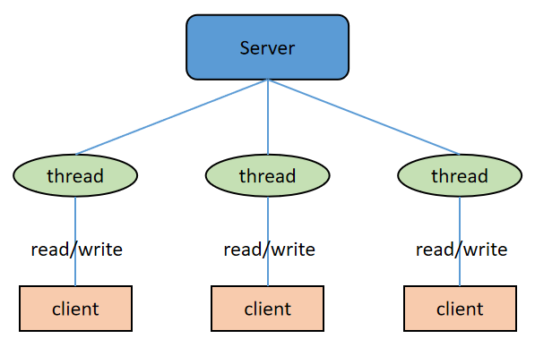
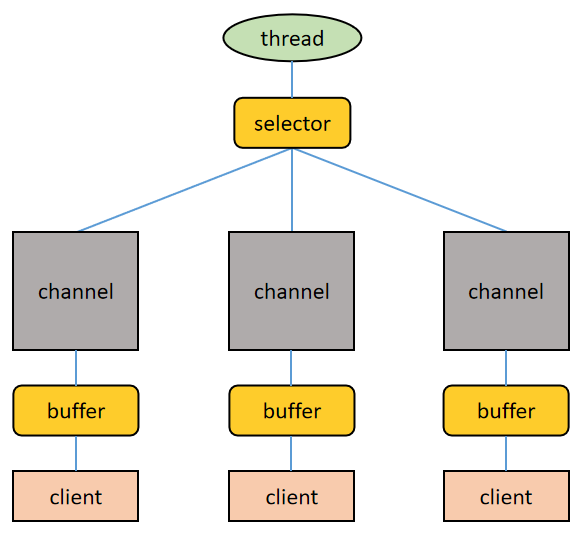
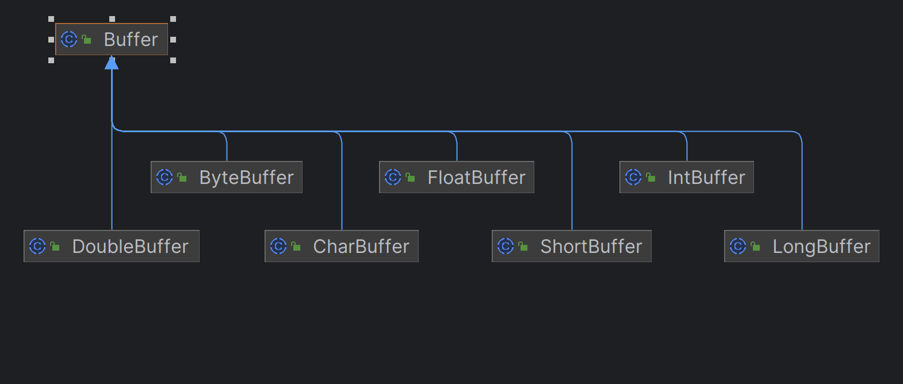

## 同步、异步、阻塞、非阻塞

网路 IO 中阻塞、非阻塞、异步、同步这几个术语的含义和关系：

* 阻塞：如果线程调用 read/write 过程，但 read/write 过程没有就绪或没有完成，则调用 read/write 过程的线程会一直等待，这个过程叫做阻塞式读写。
* 非阻塞：如果线程调用 read/write 过程，但 read/write 过程没有就绪或没有完成，调用 read/write 过程的线程并不会一直等待，而是去处理其他工作，等到 read/write 过程就绪或完成后再回来处理，这个过程叫做非阻塞式读写。
* 异步：read/write 过程托管给操作系统来完成，完成后操作系统会通知（通过回调或者事件）应用网络 IO 程序（其中的线程）来进行后续的处理。
* 同步：read/write 过程由网络 IO 程序（其中的线程）来完成

> 异步是操作系统与IO程序的异步

## Java 中的网络 IO 模型

### BIO

BIO (Blocking I/O), 是同步的、阻塞式的 IO。BIO 以流的方式处理数据， 服务器上一个线程处理一次连接，即客户端每发起一个请求，服务端都要开启一个线程专门处理该请求。

在 BIO 模式下，当一个线程执行IO操作如读写数据时，该线程会被阻塞，即不能做其他事情，需要等待IO操作完成后才能进行下一步操作。这种模型对线程量的耗费极大，且线程利用率低，难以承受请求的高并发。




### NIO

> Netty基于NIO

同步的、非阻塞式 IO，以缓冲区（也被叫做块）的方式处理数据，一个线程处理多个连接，即多个客户端请求都会被注册到多路复用器（后文要讲的 Selector）上，多路复用器会轮询这些连接，轮询到连接上有 IO 活动就进行处理。



关于上图，再进行几点说明：

- 一个 Selector 对应一个处理线程
- 一个 Selector 上可以注册多个 Channel
- 每个 Channel 都会对应一个 Buffer（有时候一个 Channel 可以使用多个 Buffer，这时候程序要进行多个 Buffer 的分散和聚集操作），Buffer 的本质是一个内存块，底层是一个数组
- Selector 会根据不同的事件在各个 Channel 上切换
- Buffer 是双向的，既可以读也可以写，切换读写方向要调用 Buffer 的 flip()方法
- 同样，Channel 也是双向的，数据既可以流入也可以流出


```java
import java.io.IOException;
import java.net.InetSocketAddress;
import java.nio.ByteBuffer;
import java.nio.channels.SelectionKey;
import java.nio.channels.Selector;
import java.nio.channels.ServerSocketChannel;
import java.nio.channels.SocketChannel;
import java.util.Iterator;
import java.util.Set;

public class NioTest {
    public static void main(String[] args) throws IOException {
        ServerSocketChannel serverSocketChannel = ServerSocketChannel.open();
        Selector selector = Selector.open();
        
        // 绑定端口
        serverSocketChannel.socket().bind(new InetSocketAddress(8080));
        
        // 设置非阻塞模式
        serverSocketChannel.configureBlocking(false);
        
        // 注册serverSocketChannel 到 selector 中，关注OP_ACCEPT事件
        serverSocketChannel.register(selector, SelectionKey.OP_ACCEPT);
        
        while (true) {
            // 等待一秒，没有事件发生
            if (selector.select(1000) == 0) {
                continue;
            }
            // 有事件发生， 找到发生事件的Channel对应的selection key集合
            Set<SelectionKey> selectionKeys = selector.selectedKeys();

            Iterator<SelectionKey> iterator = selectionKeys.iterator();
            while (iterator.hasNext()) {
                SelectionKey selectionKey = iterator.next();
                // 处理连接事件
                if (selectionKey.isAcceptable()) {
                    // 接受该通道的套接字连接
                    SocketChannel socketChannel = serverSocketChannel.accept();
                    // 将socketChannel 也注册到selector，关注读事件，并给socketChannel关联buffer
                    socketChannel.register(selector, SelectionKey.OP_READ, ByteBuffer.allocate(1024));
                }
                
                // 发生OP_READ事件，读取客户端数据
                if (selectionKey.isReadable()) {
                    SocketChannel channel = (SocketChannel) selectionKey.channel();
                    ByteBuffer buffer = (ByteBuffer) selectionKey.attachment();
                    channel.read(buffer);
                    System.out.println("msg form client: " + new String(buffer.array()));
                }
                // 防止重复处理事件
                iterator.remove();
            }
        }
    }
}
```

在上面的使用 Java NIO 编写的服务端示例代码中，服务端的工作流程为：

1. 当客户端发起连接时，会通过 ServerSocketChannel 创建对应的 SocketChannel。
2. 调用 SocketChannel 的注册方法将 SocketChannel 注册到 Selector 上，注册方法返回一个 SelectionKey，该 SelectionKey 会被放入 Selector 内部的 SelectionKey 集合中。该 SelectionKey 和 Selector 关联（即通过 SelectionKey 可以找到对应的Selector），也和 SocketChannel 关联（即通过 SelectionKey 可以找到对应的 SocketChannel）。
3. Selector 会调用 select()/select(timeout)/selectNow()方法对内部的 SelectionKey 集合关联的 SocketChannel 集合进行监听，找到有事件发生的 SocketChannel 对应的 SelectionKey。
4. 通过 SelectionKey 找到有事件发生的 SocketChannel，完成数据处理


### AIO

> Netty在 4.X版本以后移除了对AIO的支持

异步非阻塞式 IO，在这种模型中，由操作系统完成与客户端之间的 read/write，之后再由操作系统主动通知服务器线程去处理后面的工作，在这个过程中服务器线程不必同步等待 read/write 完成。由于不同的操作系统对 AIO 的支持程度不同，AIO 目前未得到广泛应用，并且Netty不再支持AIO，因此本文不对AIO过多描述。

## Java NIO API 简单回顾

### 缓冲区（Buffer）

缓冲区（Buffer）本质上是一个可读可写的内存块，可以理解成一个容器对象，Channel 读写文件或者网络都要经由 Buffer。

Buffer 的常用子类：



涵盖了 Java 中除 boolean 之外的所有的基本数据类型。其中 ByteBuffer 支持类型化的数据存取，即可以往 ByteBuffer 中放 byte 类型数据、也可以放 char、int、long、double 等类型的数据，但读取的时候要做好类型匹配处理，否则会抛出 BufferUnderflowException


## 文章参考

[45 张图深度解析 Netty 架构与原理](https://cloud.tencent.com/developer/article/1754078)
