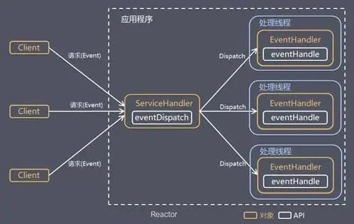
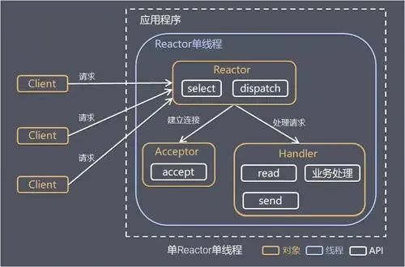
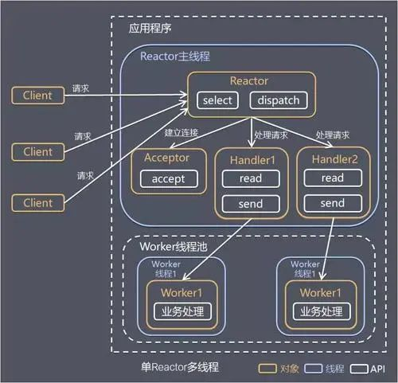
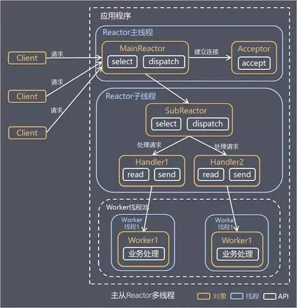

> 本文主要摘自作者`kunge`的《45 张图深度解析 Netty 架构与原理》，加入了一些自己的理解，感谢`kunge`的分享。

## 同步、异步、阻塞、非阻塞

网路 IO 中阻塞、非阻塞、异步、同步这几个术语的含义和关系：

* 阻塞：如果线程调用 read/write 过程，但 read/write 过程没有就绪或没有完成，则调用 read/write 过程的线程会一直等待，这个过程叫做阻塞式读写。
* 非阻塞：如果线程调用 read/write 过程，但 read/write 过程没有就绪或没有完成，调用 read/write 过程的线程并不会一直等待，而是去处理其他工作，等到 read/write 过程就绪或完成后再回来处理，这个过程叫做非阻塞式读写。
* 异步：read/write 过程托管给操作系统来完成，完成后操作系统会通知（通过回调或者事件）应用网络 IO 程序（其中的线程）来进行后续的处理。
* 同步：read/write 过程由网络 IO 程序（其中的线程）来完成

> 异步是操作系统与IO程序的异步

## Java 中的网络 IO 模型

### BIO

BIO (Blocking I/O), 是同步的、阻塞式的 IO。BIO 以流的方式处理数据， 服务器上一个线程处理一次连接，即客户端每发起一个请求，服务端都要开启一个线程专门处理该请求。

在 BIO 模式下，当一个线程执行IO操作如读写数据时，该线程会被阻塞，即不能做其他事情，需要等待IO操作完成后才能进行下一步操作。这种模型对线程量的耗费极大，且线程利用率低，难以承受请求的高并发。


### NIO

> Netty基于NIO

同步的、非阻塞式 IO，以缓冲区（也被叫做块）的方式处理数据，一个线程处理多个连接，即多个客户端请求都会被注册到多路复用器（后文要讲的 Selector）上，多路复用器会轮询这些连接，轮询到连接上有 IO 活动就进行处理。


关于上图，再进行几点说明：

- 一个 Selector 对应一个处理线程
- 一个 Selector 上可以注册多个 Channel
- 每个 Channel 都会对应一个 Buffer（有时候一个 Channel 可以使用多个 Buffer，这时候程序要进行多个 Buffer 的分散和聚集操作），Buffer 的本质是一个内存块，底层是一个数组
- Selector 会根据不同的事件在各个 Channel 上切换
- Buffer 是双向的，既可以读也可以写，切换读写方向要调用 Buffer 的 flip()方法
- 同样，Channel 也是双向的，数据既可以流入也可以流出


```java
import java.io.IOException;
import java.net.InetSocketAddress;
import java.nio.ByteBuffer;
import java.nio.channels.SelectionKey;
import java.nio.channels.Selector;
import java.nio.channels.ServerSocketChannel;
import java.nio.channels.SocketChannel;
import java.util.Iterator;
import java.util.Set;

public class NioTest {
    public static void main(String[] args) throws IOException {
        ServerSocketChannel serverSocketChannel = ServerSocketChannel.open();
        Selector selector = Selector.open();
        
        // 绑定端口
        serverSocketChannel.socket().bind(new InetSocketAddress(8080));
        
        // 设置非阻塞模式
        serverSocketChannel.configureBlocking(false);
        
        // 注册serverSocketChannel 到 selector 中，关注OP_ACCEPT事件
        serverSocketChannel.register(selector, SelectionKey.OP_ACCEPT);
        
        while (true) {
            // 等待一秒，没有事件发生
            if (selector.select(1000) == 0) {
                continue;
            }
            // 有事件发生， 找到发生事件的Channel对应的selection key集合
            Set<SelectionKey> selectionKeys = selector.selectedKeys();

            Iterator<SelectionKey> iterator = selectionKeys.iterator();
            while (iterator.hasNext()) {
                SelectionKey selectionKey = iterator.next();
                // 处理连接事件
                if (selectionKey.isAcceptable()) {
                    // 接受该通道的套接字连接
                    SocketChannel socketChannel = serverSocketChannel.accept();
                    // 将socketChannel 也注册到selector，关注读事件，并给socketChannel关联buffer
                    socketChannel.register(selector, SelectionKey.OP_READ, ByteBuffer.allocate(1024));
                }
                
                // 发生OP_READ事件，读取客户端数据
                if (selectionKey.isReadable()) {
                    SocketChannel channel = (SocketChannel) selectionKey.channel();
                    ByteBuffer buffer = (ByteBuffer) selectionKey.attachment();
                    channel.read(buffer);
                    System.out.println("msg form client: " + new String(buffer.array()));
                }
                // 防止重复处理事件
                iterator.remove();
            }
        }
    }
}
```

在上面的使用 Java NIO 编写的服务端示例代码中，服务端的工作流程为：

1. 当客户端发起连接时，会通过 ServerSocketChannel 创建对应的 SocketChannel。
2. 调用 SocketChannel 的注册方法将 SocketChannel 注册到 Selector 上，注册方法返回一个 SelectionKey，该 SelectionKey 会被放入 Selector 内部的 SelectionKey 集合中。该 SelectionKey 和 Selector 关联（即通过 SelectionKey 可以找到对应的Selector），也和 SocketChannel 关联（即通过 SelectionKey 可以找到对应的 SocketChannel）。
3. Selector 会调用 select()/select(timeout)/selectNow()方法对内部的 SelectionKey 集合关联的 SocketChannel 集合进行监听，找到有事件发生的 SocketChannel 对应的 SelectionKey。
4. 通过 SelectionKey 找到有事件发生的 SocketChannel，完成数据处理


### AIO

> Netty在 4.X版本以后移除了对AIO的支持

异步非阻塞式 IO，在这种模型中，由操作系统完成与客户端之间的 read/write，之后再由操作系统主动通知服务器线程去处理后面的工作，在这个过程中服务器线程不必同步等待 read/write 完成。由于不同的操作系统对 AIO 的支持程度不同，AIO 目前未得到广泛应用，并且Netty不再支持AIO，因此本文不对AIO过多描述。

## Java NIO API 简单回顾

### 缓冲区（Buffer）

缓冲区（Buffer）本质上是一个可读可写的内存块，可以理解成一个容器对象，Channel 读写文件或者网络都要经由 Buffer。

Buffer 的常用子类：


涵盖了 Java 中除 boolean 之外的所有的基本数据类型。其中 ByteBuffer 支持类型化的数据存取，即可以往 ByteBuffer 中放 byte 类型数据、也可以放 char、int、long、double 等类型的数据，但读取的时候要做好类型匹配处理，否则会抛出 BufferUnderflowException

### 通道（Channel）

Channel （通道）： Channel 是一个通道，管道，网络数据通过 Channel 读取和写入， Channel 和流Stream 的不同之处在于 **Channel 是双向的，流只在一个方向上移动** (InputStream/OutputStream ）而 Channel 可以用于读写同时进行，即 **ChanneI 是全双工**的。

它的常用子类有：

- FileChannel：用于文件读写
- DatagramChannel：用于 UDP 数据包收发
- ServerSocketChannel：用于服务端 TCP 数据包收发
- SocketChannel：用于客户端 TCP 数据包收发


### 选择器（Selector）

选择器（Selector）是实现 IO 多路复用的关键，多个 Channel 注册到某个 Selector 上，当 Channel 上有事件发生时，它就会被 Selector 轮询出来，然后通过selectedKeys 可以获取就绪 Channel 的集合，进行后续的|/ 0 操作。也就是说只有当连接上真正有读写等事件发生时，线程才会去进行读写等操作，这就不必为每个连接都创建一个线程，一个线程可以应对多个连接。这就是 IO 多路复用的要义。


## Reactor 线程模式

> 单 Reactor 单线程模式 =》单 Reactor 多线程模式 =》**主从 Reactor 多线程模式**
>
> 每种模式都是对前一种模式的**优化**

### 什么是 Reactor 模式

Reactor 模式（也叫做 Dispatcher 模式，分派模式） 是一种处理并发 I/O 事件的设计模式，主要用于处理大量的并发连接和请求，尤其适用于网络服务器的设计。

Reactor 模式的核心思想是使用一个或多个独立线程（通常称为 reactor 或 dispatcher）来处理所有的 I/O 事件，比如连接请求、数据到达等。这些线程会阻塞地等待这些事件的发生，一旦有事件发生，它们就会将事件分发给相应的事件处理器（handler）进行处理。一个线程可以处理多个连接的业务。

下图反应了 Reactor 模式的基本形态（图片来源于网络）：



Reactor 模式有两个核心组成部分：

- Reactor（图中的 ServiceHandler）：Reactor 在一个单独的线程中运行，负责监听和分发事件，分发给适当的处理线程来对 IO 事件做出反应。
- Handlers（图中的 EventHandler）：处理线程执行处理方法来响应 I/O 事件，处理线程执行的是非阻塞操作。

### 单 Reactor 单线程模式

单 Reactor 单线程模式的基本形态如下（图片来源于网络）：



这种模式的基本工作流程为：

1. Reactor 通过 select 监听客户端请求事件，收到事件之后通过 dispatch 进行分发
2. 如果事件是建立连接的请求事件，则由 Acceptor 通过 accept 处理连接请求，然后创建一个 Handler 对象处理连接建立后的后续业务处理。
3. 如果事件不是建立连接的请求事件，则由 Reactor 对象分发给连接对应的 Handler 处理。
4. Handler 会完成 read-->业务处理-->send 的完整处理流程

#### 思考

因为所有的事情都是在一个线程中完成，如何有个任务数据量很大，业务处理时间长，它一个任务导致后来的很多任务无法执行，最后后面连接的数据就丢失了。

怎么优化呢？任务处理不过来了，那就多加几个线程处理嘛，这时就引入了 **单 Reactor 多线程模式**。

### 单 Reactor 多线程模式

单 Reactor 单线程模式的基本形态如下（图片来源于网络）：



这种模式的基本工作流程为：

1. Reactor 对象通过 select 监听客户端请求事件，收到事件后通过 dispatch 进行分发。
2. 如果事件是建立连接的请求事件，则由 Acceptor 通过 accept 处理连接请求，然后创建一个 Handler 对象处理连接建立后的后续业务处理。
3. 如果事件不是建立连接的请求事件，则由 Reactor 对象分发给连接对应的 Handler 处理。Handler 只负责响应事件，不做具体的业务处理，Handler 通过 read 读取到请求数据后，会分发给后面的 Worker 线程池来处理业务请求。
4. Worker 线程池会分配独立线程来完成真正的业务处理，并将处理结果返回给 Handler。Handler 通过 send 向客户端发送响应数据。

> 职责分明：Reactor 就**建立连接**，然后把连接扔给 Handler，Handler **读写数据**，读取完成后将数据扔给 Woker 线程池，Woker 线程池做**业务处理**

这种模式的优点是可以充分的利用多核 cpu 的处理能力，缺点是多线程数据共享和控制比较复杂，Reactor 处理所有的事件的监听和响应，在单线程中运行，面对高并发场景还是容易出现性能瓶颈。

#### 思考

单 Reactor 多线程解决了业务处理不及时的问题，但是从图中可以发现 Reactor 主线程同时要做建立连接、读写数据两件事，在高并发场景下，它可能就忙不过来了。

怎么优化呢？那就把建立连接和读写数据分开由不同的线程执行，分担一下压力，于是**主从 Reactor 多线程模式**就有了。 

### 主从 Reactor 多线程模式

主从 Reactor 多线程模式的基本形态如下（图片来源于网络）：



这种模式的基本工作流程为：

1. Reactor 主线程 MainReactor 对象通过 select 监听客户端连接事件，收到事件后，通过 Acceptor 处理客户端连接事件。
2. 当 Acceptor 处理完客户端连接事件之后（与客户端建立好 Socket 连接），MainReactor 将连接分配给 SubReactor。（即：MainReactor 只负责监听客户端连接请求，和客户端建立连接之后将连接交由 SubReactor 监听后面的 IO 事件。）
3. SubReactor 将连接加入到自己的连接队列进行监听，并创建 Handler 对各种事件进行处理。
4. 当连接上有新事件发生的时候，SubReactor 就会调用对应的 Handler 处理。
5. Handler 通过 read 从连接上读取请求数据，将请求数据分发给 Worker 线程池进行业务处理。
6. Worker 线程池会分配独立线程来完成真正的业务处理，并将处理结果返回给 Handler。Handler 通过 send 向客户端发送响应数据。
7. 一个 MainReactor 可以对应多个 SubReactor，即一个 MainReactor 线程可以对应多个 SubReactor 线程。

这种模式的优点是：

- MainReactor 线程与 SubReactor 线程的数据交互简单职责明确，**MainReactor 线程只需要接收新连接，SubReactor 线程完成后续的业务处理**。
- MainReactor 线程与 SubReactor 线程的数据交互简单， **MainReactor 线程只需要把新连接传给 SubReactor 线程**，SubReactor 线程无需返回数据。
- 多个 SubReactor 线程能够应对更高的并发请求。

这种模式的缺点是编程复杂度较高。但是由于其优点明显，在许多项目中被广泛使用，包括 Nginx、Memcached、Netty 等。

这种模式也被叫做服务器的 **1+M+N 线程模式**，即使用该模式开发的服务器包含一个（或多个，1 只是表示相对较少）连接建立线程（`Reactor主线程`）+ M 个 IO 线程（`SubReactor`）+N 个业务处理线程（`Worker`）。这是业界成熟的服务器程序设计模式。


## 文章参考

[45 张图深度解析 Netty 架构与原理](https://cloud.tencent.com/developer/article/1754078)

