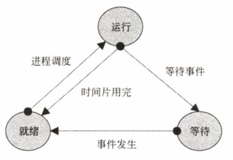
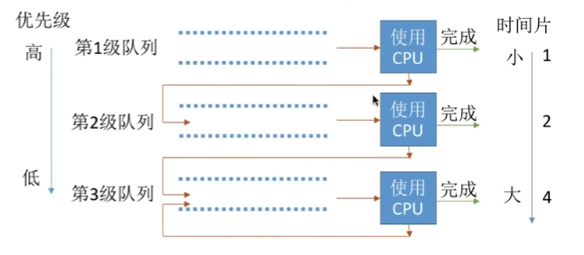

操作系统有哪些进程调度算法？

先简单总结一下：

- 先来先服务算法（ *First Come First Serve，FCFS*）
- 短作业优先算法（*Shortest Job First，SJF*）
- 高响应比优先算法（*Highest Response Ratio Next，HRRN*）
- 时间片轮转算法（*Round-Robin，RR*）
- 优先级调度算法（*Highest Priority First，HPF*）
- 多级反馈队列调度算法（*Multilevel Feedback Queue，MFQ*）

## 进程的三种基本状态及转换

- 就绪（ready）：进程已经分配除CPU以外的所有必要资源，只要在获得CPU就可立刻执行；或者进程已经完成了等待事件，准备好占用CPU并执行
- 执行（running）：进程正在占用CPU并执行
- 阻塞/等待（block/wait）：进程正在等待某个事件（如IO操作完成、信号等）发生才能继续执行

## 先来先服务算法（ *First Come First Serve，FCFS*）

FCFS（*First-Come-First-Serve*）算法是一种简单的**非抢占式**进程调度算法，它根据进程到达的时间顺序来决定哪个进程应该获得CPU的控制权。

当一个进程到达时，它会被放入到就绪队列中。当CPU空闲时，操作系统会从就绪队列中取出第一个到达的进程，并分配给它CPU的控制权。执行完毕后，进程会离开系统，或者回到就绪队列中等待下一次执行。

### 算法思想

主要从“**公平**”的角度考虑（类似于我们生活中排队买东西）

### 举例

食堂排队打饭，先到的人先打饭，依次按顺序打饭。学生到达食堂的时间相当于进程到达系统的时间，窗口排队等待相当于进程在就绪队列中等待执行，窗口的控制权相当于CPU的控制权。

### 优缺点

优点：公平，算法实现简单，适用于短作业

缺点：

1. 等待时间不确定，可能导致一些长作业等待时间过长。
2. 公平性较差，一些短作业可能会一直得到执行机会，而长作业需要等待更长时间。
3. 对于一些需要优先处理紧急任务的场景，FCFS算法无法满足实时性要求。

## 短作业优先算法（*Shortest Job First，SJF*）

短作业优先（*Shortest Job First，SJF*）算法是根据进程的**估计执行时间**来决定哪个进程应该获得CPU的控制权。

### 算法思想

优先执行估计执行时间最短的进程，以便尽早完成这些进程，并减少它们的等待时间。

### 举例

假设你是一个餐厅的厨师，现在你面前有一堆订单，有的订单需要做的菜比较简单，有的订单需要做的菜比较复杂。你只有一个厨师，因此你需要决定先做哪个订单，以便尽早完成订单并提高餐厅的效率。

如果采用短作业优先算法，你可能会优先选择需要做的菜比较简单的订单，因为这些订单需要的烹饪时间比较短，可以更快地完成并交给客人。然后你可以继续做下一个简单的订单，直到所有简单的订单都完成。最后，你可以集中精力去做复杂的订单，以便尽快完成所有订单。

### 优缺点

优点：减少平均等待时间，系统吞吐量高

缺点：不公平；对短作业有利，长作业不利；不保证实时性，无法处理紧急和高优先级的进程

## 高响应比优先算法（*Highest Response Ratio Next，HRRN*）

高响应比优先（*Highest Response Ratio Next，HRRN*）是**非抢占式**的调度算法，它结合了短作业优先和优先级的思想。

核心思想是将进程的**响应比**作为优先级指标，响应比定义为等待时间与服务时间的比例。当一个进程到达时，HRRN算法会计算它的响应比，并根据响应比的高低来决定哪个进程应该获得CPU的控制权。

「响应比优先级」的计算公式：

从上面的公式，可以发现：

- 如果两个进程的「等待时间」相同时，「要求的服务时间」越短，「响应比」就越高，这样短作业的进程容易被选中运行；
- 如果两个进程「要求的服务时间」相同时，「等待时间」越长，「响应比」就越高，这就兼顾到了长作业进程，因为进程的响应比可以随时间等待的增加而提高，当其等待时间足够长时，其响应比便可以升到很高，从而获得运行的机会；

### 算法思想

要综合考虑作业/进程的等待时间和要求服务时间

### 举例

假设你和你女朋友正在餐厅用餐，突然来了一个客人，点了一个很长的菜单，但是他的菜还没有上桌。此时，服务员应该先给哪个客人上菜呢？

如果按照短作业优先算法（SJF），服务员会先给点菜最短的客人上菜，也就是先给你上菜。但是，如果按照高响应比优先算法（HRRN），服务员会先给等待时间最长的客人上菜，也就是先给那个点了长菜单的客人上菜。

**等待时间越长，响应比就越高，从而得到优先服务的可能性就越大**。

### 优缺点

1. 公平性强：HRRN调度算法能够保证每个就绪进程都有机会得到CPU资源，并且长期等待的进程能够得到更多资源，因此具有较好的公平性。
1. 响应速度快：由于HRRN调度算法考虑了等待时间和服务时间的比值，因此能够更快地响应进程请求，减少进程等待时间。
1. 避免饥饿现象：HRRN调度算法能够避免短作业优先算法中的饥饿现象，保证每个就绪进程都有机会得到CPU资源。

## 时间片轮转算法（*Round-Robin，RR*）

时间片轮转算法（Round-Robin，RR）是一种**抢占式**进程调度算法，其基本思想是将CPU的**时间片分配**给就绪队列中的进程，并按照固定的**顺序循环分配**。

常用于分时操作系统，更注重“响应时间”。

如果时间片太大，使得每个进程都可以在一个时间片内就完成,则时间片轮转调度算法退化为先来先服务调度算法,并且会增大进程响应时间。因此**时间片不能太大**。

### 算法思想

公平的，轮流的为各个进程服务，让每个进程在一定时间间隔内都可以得到相应。

### 举例

今天是七夕节，打饭阿姨们都回家过节了，食堂只有一个打饭阿姨上班，因为她老公钓鱼至今未归；

但是食堂开了5个打饭窗口，好心的打饭阿姨为了照顾到每个窗口的学生，就依次为1，2，3，4，5五个窗口（五个进程）轮流打饭，每个窗口打两份饭（两个时间片）就换到下一个窗口；

如果某窗口排队人数不足两人，打完饭就直接切到下一个窗口。

### 优缺点

优点：

1. 公平：时间片轮转算法保证每个进程都有机会得到执行，因此具有公平性。
2. 响应时间短：时间片轮转算法的响应时间相对较短，因为每个进程都会得到一定的执行时间片。
3. 避免饥饿现象：时间片轮转算法可以避免饥饿现象，因为每个进程都会按照固定的顺序得到执行机会。

缺点：

1. 不能区分进程的性质和优先级：时间片轮转算法没有考虑到进程的性质和优先级，因此对于某些紧急的或者重要的进程可能得不到及时的处理。
2. 高频率的进程切换：由于时间片轮转算法需要不断切换进程，因此有一定的开销，会影响系统的效率。
3. 对短进程不利：由于时间片轮转算法按照固定的时间片分配给每个进程，因此对于那些需要执行时间较短的进程可能会等待很长时间片，导致浪费CPU资源。

## 优先级调度算法（*Highest Priority First，HPF*）

在优先级调度算法中，每个进程被赋予一个优先级，操作系统根据优先级的高低来决定哪个进程应该获得CPU的控制权。优先级越高的进程将优先获得CPU的控制权。

进程的优先级可以分为，静态优先级或动态优先级：

- 静态优先级：创建进程时候，就已经确定了优先级了，然后整个运行时间优先级都不会变化；
- 动态优先级：根据进程的动态变化调整优先级，比如如果进程运行时间增加，则降低其优先级，如果进程等待时间（就绪队列的等待时间）增加，则升高其优先级，也就是**随着时间的推移增加等待进程的优先级**。

该算法也有两种处理优先级高的方法，非抢占式和抢占式：

- 非抢占式：当就绪队列中出现优先级高的进程，运行完当前进程，再选择优先级高的进程。
- 抢占式：当就绪队列中出现优先级高的进程，当前进程挂起，调度优先级高的进程运行。

### 算法思想

根据进程的优先级来决定哪个进程应该获得CPU的控制权。

### 举例

小美、小帅、小壮去食堂排队打饭，因为他们都暗恋小美，主动优先让小美先打饭。

排队的人很多，排了一会儿，小帅感觉饿的头昏脑胀的，可是在小美面前不能丢了面子，他还是决定让小美先打饭。（静态优先级）

小壮也饿的不行了，他可顾不着这些，说到：“小美，你让我先打饭吧”，小美欣然答应了。（动态优先级）

过了几分钟，终于轮到小壮打饭了。

打饭阿姨张姨刚把米饭装盘子里，还没打菜呢，这时班主任也来打饭了，张姨一看是班主任，心想先把大壮的饭打完再说，这小子正长身体。（非抢占式）

轮到小帅打饭了，刚装好米饭，校长来打饭了，张姨一看是校长，马上扔下小帅的饭碗，擦了擦手，笑眯眯的去给校长打饭了。（抢占式）

### 优缺点

优点：

1. 高吞吐量：优先级调度算法可以减少平均等待时间，提高系统的吞吐量。
2. 适应性强：优先级调度算法可以根据进程的性质、类型、资源需求和用户需求等来设置不同的优先级，因此可以更好地适应不同的系统环境和进程行为。

缺点：

1. 可能出现饥饿现象：如果优先级设置不合理，可能会导致一些进程长时间得不到执行，即“饥饿”问题。

## 多级反馈队列调度算法（*Multilevel Feedback Queue，MFQ*）

多级反馈队列调度算法是一种结合了优先级调度和时间片轮转的**抢占式**进程调度算法。该算法将进程按照优先级分配到不同的队列中，每个队列具有不同的执行时间片。

优先处理优先级高的进程，同时给予低优先级进程一定的执行机会，以实现更公平的资源分配和系统响应。

### 算法思想

对其他调度算法的折中平衡

### 举例

食堂开设了三个窗口（三个优先级队列），分别为A、B、C，优先级从高到低排列。

A窗口最多可以打1碗饭（1个时间片），B窗口最多可以打2碗饭（2个时间片），C窗口最多可以打4碗饭（4个时间片）。

今天小美、小帅和小壮一起去食堂打饭，小美只吃一碗饭，小帅吃3碗，小壮长身体吃8碗。

他们一起到A窗口打了1晚饭，小美因为只吃一碗，打好饭她就走了；可小帅和小壮不够啊，于是到B窗口继续排队。

在B窗口打好饭以后，小帅一共打了3晚饭，够他吃饱了，所以他也就走了，可是小壮吃不饱啊，于是他到C窗口继续排队。

小壮在C又打了4碗饭，目前一共打了7碗，还是不够他吃，于是继续在C窗口排队，直到他打够能吃饱的8碗饭。

### 优缺点

优点：

1. 结合了优先级调度和时间片轮转的优点，既可以保证高优先级的进程得到及时处理，也可以保证低优先级的进程有一定的执行时间。
2. 通过不同队列的时间片设置，可以平衡系统负载和响应时间。
3. 可以根据不同的需求和系统环境进行灵活的配置和调整。

缺点：

1. 实现相对复杂，需要维护多个队列和时间片信息。
2. 对于优先级的设置和队列的分配需要有一定的经验和技巧。
3. 对于某些具有特殊需求的进程可能无法满足其实时性要求。

## End

我的第一次写作尝试可能存在许多不足之处，但我会努力不断学习和提高自己的写作技巧。

如果您喜欢我的文章，请继续关注我的后续作品，我会努力为您带来更好的阅读体验。

参考资料：

[大厂面试爱问的「调度算法」，20 张图一举拿下](https://zhuanlan.zhihu.com/p/225162322)

[王道计算机考研 操作系统](https://www.bilibili.com/video/BV1YE411D7nH?p=23&vd_source=9673597c3ab5b03cf9994776ea4b5fc2)