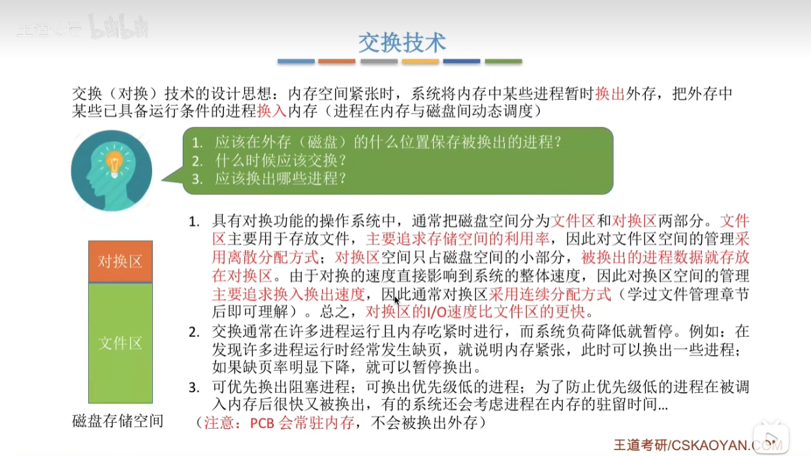
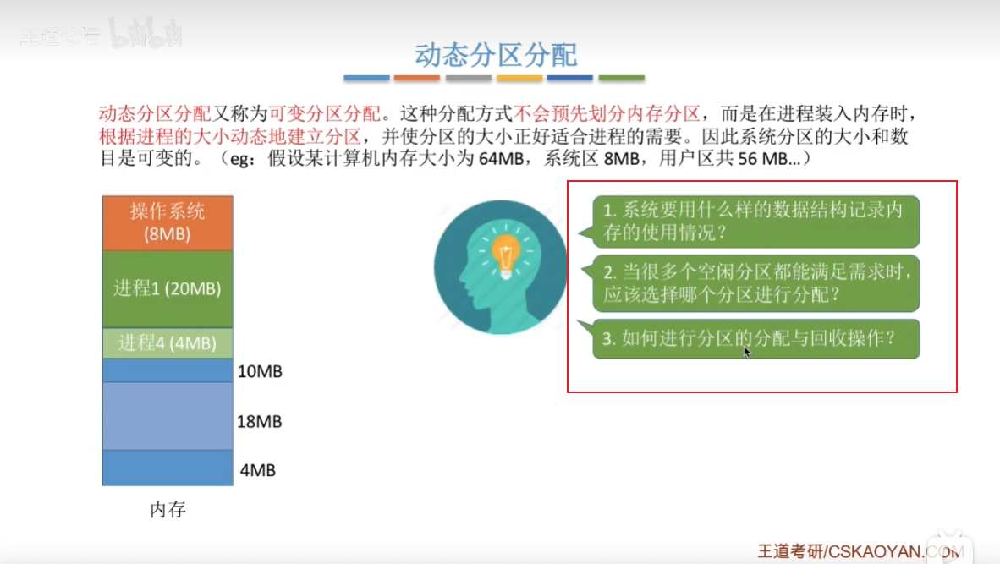
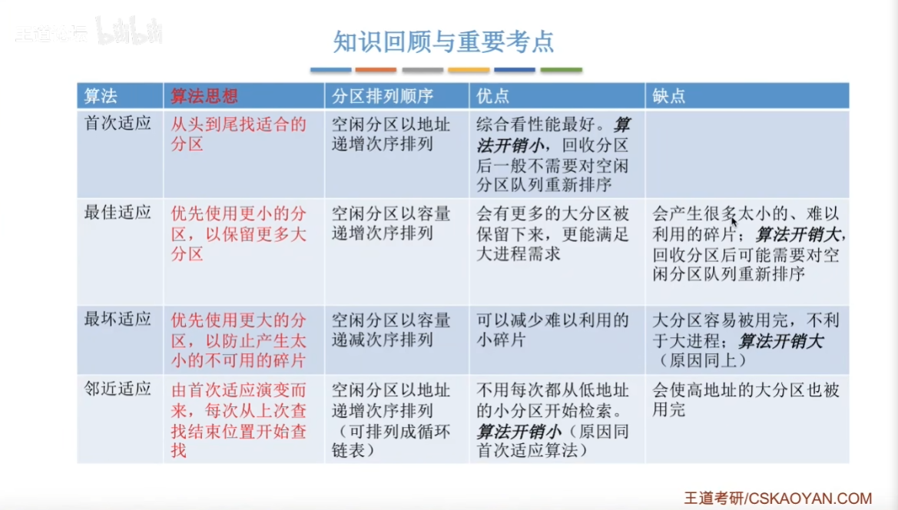

## 3.1.1 内存的基础知识

 

## 3.1.2 内存管理的概念

## 3.1.3 覆盖与交换

PCB常驻内存，因为它需要记录进程放在外存的什么位置

## 3.1.4 连续分配管理方式

内部碎片：比如一个程序占用内存10M，那么只有放入分区6中，分区6有12M，多出来的2M就是内部碎片

外部碎片：是指内存中的某些空闲分区由于太小而难以利用

如果从一块较大的空闲内存中分配一部分给进程，则需要修改空闲分区表

如果经过动态分区分配算法处理以后，分配的空闲内存和进程大小一样，则需要删掉空闲分区表中记录

如果进程结束后，回收区有相邻空间分区，则合并它们，更新空闲分区表

如果回收区相邻位置没有空闲分区，则在空闲分区表新增一条记录

## 3.1.5 动态分区分配算法

 找到就用 

优先找最小的空闲内存分区

优先找最大的空闲内存分区

就近找空闲分区

## 3.1.6 基本分页存储管理的概念

1 Byte = 8 bit, 这里一个内存块至少要20bit,不过计算机分配内存是以字节为单位，所以一个内存块至少需要3个字节

页号只在逻辑上存在，并没有分配物理内存，因为知道页表的起始内存地址和每个块号的大小，页号是顺序排列的，所以页号为i的的内存存放地址是：页表起始地址+ 块内存大小*i

这里主要分清页面和页号，页面是一块空间，页号是这块空间的编号

## 3.1.7 基本地址变换机构

## 3.1.8 具有快表的地址变换机构

## 3.1.9 两级页表

## 3.1.10 基本分段存储管理方式

## 3.1.11 段分页管理方式

## 3.2.1 虛拟内存的基本概念

## 3.2.2_请求分页管理方式

## 3.2.3_页面置换算法

## 3.2.4_页面分配策略、抖动、工作集

## 3.2.5 内存映射文件

