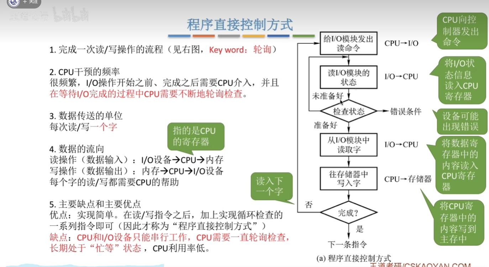
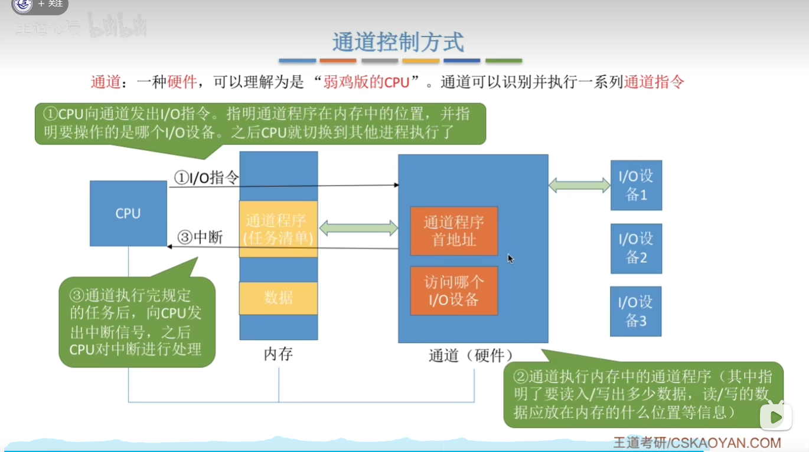
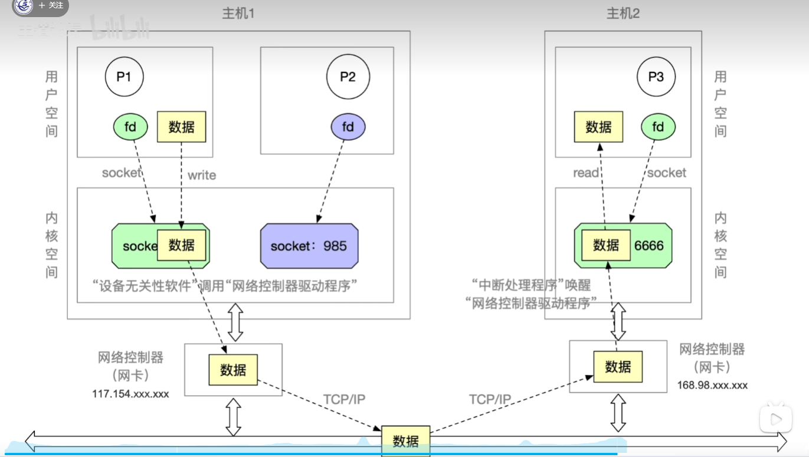
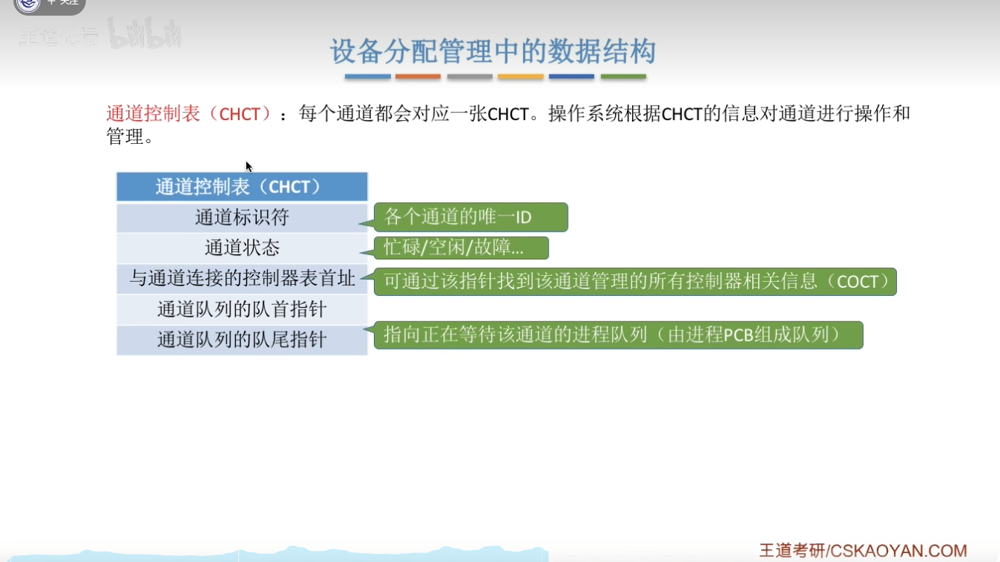

## 5.1.1 I-O设备的概念和分类

## 5.1.2 I-O控制器

控制线：向IO设备发出一个指令

地址线：CPU告诉IO逻辑自己要控制的是哪一个设备，每个设备有一个地址

数据总线：CPU会通过数据总线把数据放到数据寄存器，IO逻辑从数据寄存器取数据

控制寄存器：CPU发出的IO指令可能有参数，参数就放在控制寄存器中，IO逻辑从这里取参数

状态寄存器：IO逻辑会向状态寄存器中写入设备的状态

## 5.1.3 IO控制方式

早期的一种控制方式 ，关键字：轮询

解决了CPU资源大量浪费问题

DMA:数据直接从设备到内存，不再需要经过CPU

解决了DMA方式的缺点，CPU可以一次性给出多条指令让通道依次去执行，CPU干预频率降低，可以将它理解为任务清单

## 5.1.4 IO软件层级结构

## 5.1.5 输入输出应用程序接口和驱动程序接口

用户层的应用程序无法用一个统一的接口完成所有类型设备的IO

## 5.2.1 IO核心子系统

## 5.2.2 假脱机技术

## 5.2.3 设备的分配与回收

## 5.2.4 缓冲区管理

## 5.3.1 磁盘的结构

## 5.3.2 磁盘调度算法

每一种算法都是对上一种算法的优化

## 5.3.3 减少磁盘延迟时间的方法

## 5.3.4 磁盘的管理

## 5.3.5 固态硬盘SSD

固态硬盘读写的基本单位是页，可以把页当作为机械硬盘的扇区

固态硬盘的块对应为机械硬盘的一个磁道

