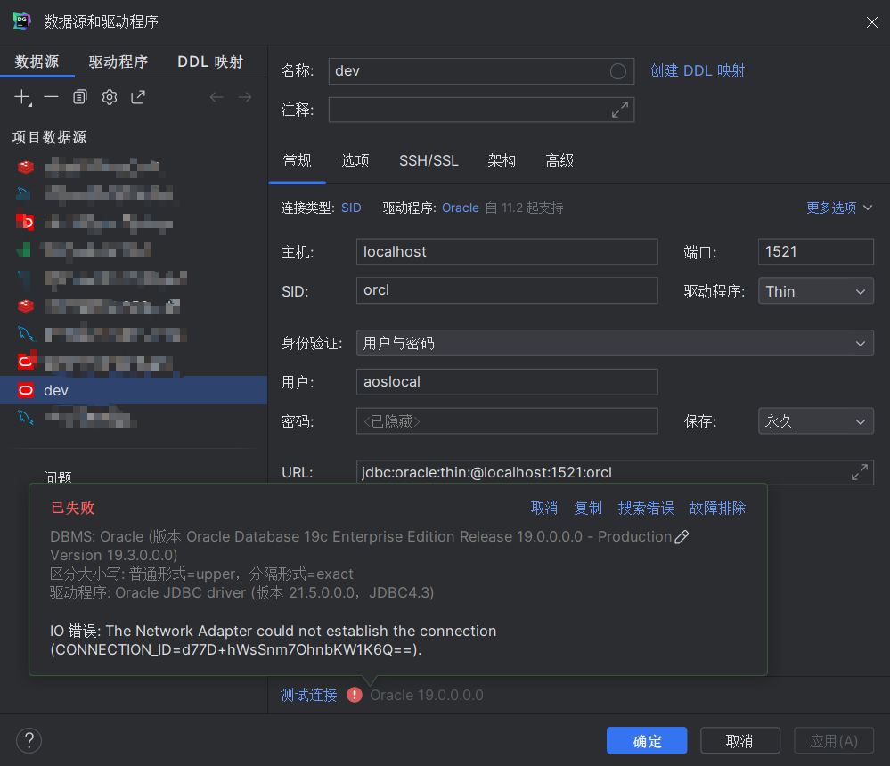
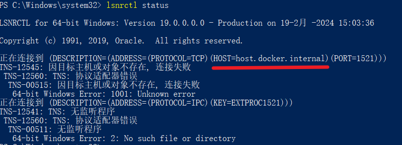
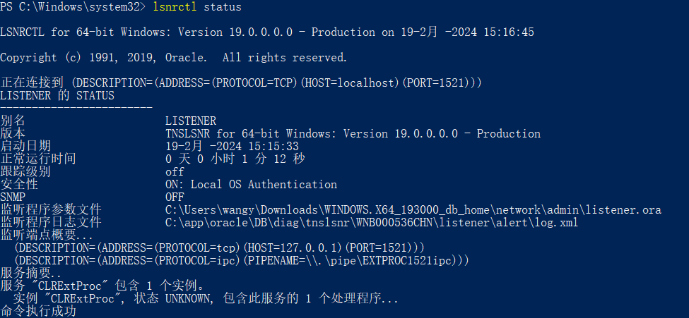
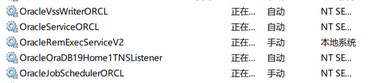
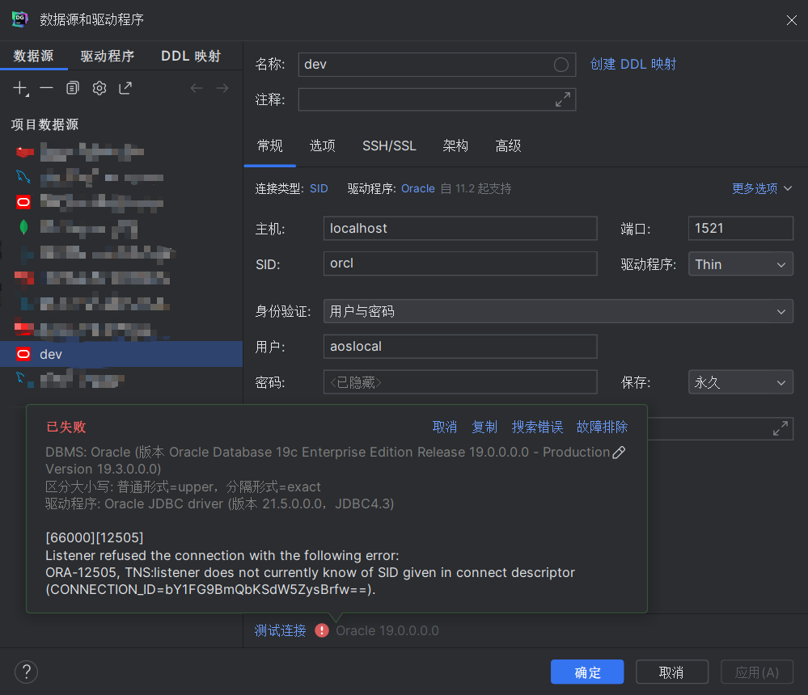
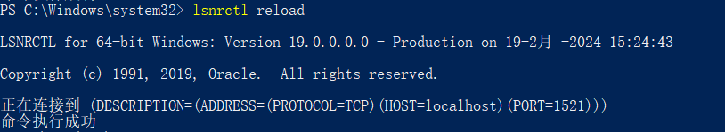
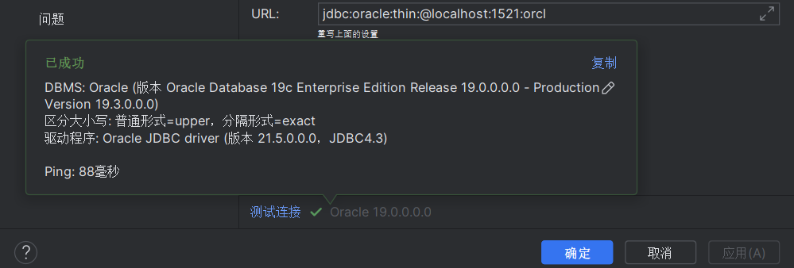

# Windows本地Oracle数据库启动失败

过了个年回来，本地数据库启动不了了，因为安装后就没关过机，所以之前一直运行的很好，过年回家长时间不用于是把电脑关机了，现在完蛋了，数据库挂了。


解决这个问题主要有两点

- 启动windows服务：OracleOraDB19Home1TNSListener
- 配置 listener.ora


下面是具体步骤

## `OracleOraDB19Home1TNSListener`服务未启动

连接数据库提示错误



出现这个错是本地的`TNSListener`服务未启动，于是进入到服务窗口将oracle相关的服务都启动


我本机的Listener服务名是`OracleOraDB19Home1TNSListener` ，手动启动报错了。


打开命令行窗口执行命令 `lsnrctl status` 查看一下监听器的状态




这里我发现这个 `HOST`怎么是 host.docker.internal 呢，调查发现，`HOST` 在 **oracle安装目录\network\admin\listener.ora** 文件中配置。

> 我的完整路径是 C:\Users\wangy\Downloads\WINDOWS.X64_193000_db_home\network\admin\listener.ora


文件中有一个LISTENER配置

```
LISTENER =
  (DESCRIPTION_LIST =
    (DESCRIPTION =
      (ADDRESS = (PROTOCOL = TCP)(HOST = host.docker.internal)(PORT = 1521))
      (ADDRESS = (PROTOCOL = IPC)(KEY = EXTPROC1521))
    )
  )
```

改为

```
LISTENER =
  (DESCRIPTION_LIST =
    (DESCRIPTION =
      (ADDRESS = (PROTOCOL = TCP)(HOST = localhost)(PORT = 1521))
      (ADDRESS = (PROTOCOL = IPC)(KEY = EXTPROC1521))
    )
  )
```


再次执行 `lsnrctl status` 也可以看到正确的结果了。



然后重新启动 `OracleOraDB19Home1TNSListener` 服务就可以启动成功了。




## SID配置缺失

连接数据库，仍然报错



问题原因是在监听器没有配置这个SID


还是打开 `listener.ora`， 我的SID是**orcl**，在 SID_LIST_LISTENER 下 新加一个 SID_DESC，完整配置如下

```
# listener.ora Network Configuration File: C:\Users\wangy\Downloads\WINDOWS.X64_193000_db_home\NETWORK\ADMIN\listener.ora
# Generated by Oracle configuration tools.

SID_LIST_LISTENER =
  (SID_LIST =
    (SID_DESC =
      (SID_NAME = CLRExtProc)
      (ORACLE_HOME = C:\Users\wangy\Downloads\WINDOWS.X64_193000_db_home)
      (PROGRAM = extproc)
      (ENVS = "EXTPROC_DLLS=ONLY:C:\Users\wangy\Downloads\WINDOWS.X64_193000_db_home\bin\oraclr19.dll")
    )
    (SID_DESC =
      (SID_NAME = ORCL)
      (ORACLE_HOME = C:\Users\wangy\Downloads\WINDOWS.X64_193000_db_home)
    )
  )

LISTENER =
  (DESCRIPTION_LIST =
    (DESCRIPTION =
      (ADDRESS = (PROTOCOL = TCP)(HOST = localhost)(PORT = 1521))
      (ADDRESS = (PROTOCOL = IPC)(KEY = EXTPROC1521))
    )
  )

```


配置完成后，使用超级管理员权限打开 powershell 执行 `lsnrctl reload`




再来连接数据库就成功了

