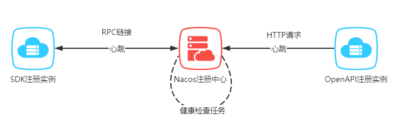

## 前言

Nacos 作为注册中心不应该仅仅提供服务注册和发现功能，还应该保证对服务可用性进行监测，对不健康和过期的服务实例进行标识或剔除，维护实例的生命周期，以保证客户端尽可能的查询到可用的服务列表。

> 官方文档对于临时实例健康检查机制是这样描述的

在 Nacos 中，用户可以通过两种方式进行临时实例的注册，通过 Nacos 的 OpenAPI 进行服务注册或通过 Nacos 提供的 SDK 进行服务注册。

SDK 的注册方式实际是通过 RPC 与注册中心保持连接（Nacos 2.x 版本中，旧版的还是仍然通过 OpenAPI 的方式），客户端会定时的通过 RPC 连接向 Nacos 注册中心发送心跳，保持连接的存活。如果客户端和注册中心的连接断开，那么注册中心会主动剔除该 client 所注册的服务，达到下线的效果。同时 Nacos 注册中心还会在注册中心启动时，注册一个过期客户端清除的定时任务，用于删除那些健康状态超过一段时间的客户端。

Nacos 对于健康检查的特点：由**客户端向注册中心发送心跳，注册中心会在连接断开或是心跳过期后将不健康的实例移除**



本文关注上面三句话的背后用源码是如何实现的：

- 客户端会定时的通过 RPC 连接向 Nacos 注册中心发送心跳，保持连接的存活
- 如果客户端和注册中心的连接断开，那么注册中心会主动剔除该 client 所注册的服务，达到下线的效果
- 同时 Nacos 注册中心还会在注册中心启动时，注册一个过期客户端清除的定时任务，用于删除那些健康状态超过一段时间的客户端

## 开启健康检查任务

> 客户端会定时的通过 RPC 连接向 Nacos 注册中心发送心跳，保持连接的存活

客户端向注册中心注册服务是由`NamingGrpcClientProxy`类完成的，在它的构造函数中会创建一个`RpcClient`对象，并调用对象的`start`方法初始化和启动 Nacos 客户端的 RPC 连接，处理心跳检测、管理连接状态以及恢复连接等。

`start`方法创建了一个调度线程池执行健康检查任务，每 5 秒做一次健康检测，这个间隔时间是由用户配置的 `keepAliveTime`决定的，默认为 5 秒。

重点是`healthCheck()`方法，它会发起 GRPC 请求，告诉注册中心自己还活着。

```java
public final void start() throws NacosException {
    // 状态变更和初始化
    boolean success = rpcClientStatus.compareAndSet(RpcClientStatus.INITIALIZED, RpcClientStatus.STARTING);
    if (!success) {
        return;
    }
    
    // 创建调度线程池
    clientEventExecutor = new ScheduledThreadPoolExecutor(2, r -> {
        Thread t = new Thread(r);
        t.setName("com.alibaba.nacos.client.remote.worker");
        t.setDaemon(true);
        return t;
    });
    
    // 处理连接事件
    clientEventExecutor.submit(() -> {
        while (!clientEventExecutor.isTerminated() && !clientEventExecutor.isShutdown()) {
            ConnectionEvent take;
            try {
                take = eventLinkedBlockingQueue.take();
                if (take.isConnected()) {
                    notifyConnected();
                } else if (take.isDisConnected()) {
                    notifyDisConnected();
                }
            } catch (Throwable e) {
                // Do nothing
            }
        }
    });
    
    // 连接检查与重连逻辑
    clientEventExecutor.submit(() -> {
        while (true) {
            try {
                if (isShutdown()) {
                    break;
                }
              	// 利用阻塞队列机制，每 5 秒检测一次
                ReconnectContext reconnectContext = reconnectionSignal.poll(rpcClientConfig.connectionKeepAlive(), TimeUnit.MILLISECONDS);
                if (reconnectContext == null) {
                    // 检查健康状态
                    if (System.currentTimeMillis() - lastActiveTimeStamp >= rpcClientConfig.connectionKeepAlive()) {
                       // 健康检查
                        boolean isHealthy = healthCheck();
                        if (!isHealthy) {
                            // 处理不健康状态
                        } else {
                            lastActiveTimeStamp = System.currentTimeMillis();
                        }
                    }
                }
                
                // 处理重连逻辑
            } catch (Throwable throwable) {
                // Do nothing
            }
        }
    });
    
    // 连接到服务器
    Connection connectToServer = null;
    rpcClientStatus.set(RpcClientStatus.STARTING);
    
    int startUpRetryTimes = rpcClientConfig.retryTimes();
    while (startUpRetryTimes > 0 && connectToServer == null) {
        try {
            startUpRetryTimes--;
            ServerInfo serverInfo = nextRpcServer();
            connectToServer = connectToServer(serverInfo);
        } catch (Throwable e) {
            // 连接失败处理
        }
    }
    
    // 连接成功处理
    if (connectToServer != null) {
        this.currentConnection = connectToServer;
        rpcClientStatus.set(RpcClientStatus.RUNNING);
        eventLinkedBlockingQueue.offer(new ConnectionEvent(ConnectionEvent.CONNECTED));
    } else {
        switchServerAsync();
    }
    
    // 注册请求处理器
    registerServerRequestHandler(new ConnectResetRequestHandler());
    registerServerRequestHandler(request -> {
        if (request instanceof ClientDetectionRequest) {
            return new ClientDetectionResponse();
        }
        return null;
    });
}
```

```java
private boolean healthCheck() {
   // 构建健康检查请求
    HealthCheckRequest healthCheckRequest = new HealthCheckRequest();
   // 如果连接未建立
    if (this.currentConnection == null) {
        return false;
    }
    int reTryTimes = rpcClientConfig.healthCheckRetryTimes();
    // 重试机制
    while (reTryTimes >= 0) {
        reTryTimes--;
        try {
           // 发起 GRPC 调用
            Response response = this.currentConnection
                    .request(healthCheckRequest, rpcClientConfig.healthCheckTimeOut());
            // not only check server is ok, also check connection is register.
            return response != null && response.isSuccess();
        } catch (NacosException e) {
            // ignore
        }
    }
    return false;
}
```

## 连接断开主动下线服务

> 如果客户端和注册中心的连接断开，那么注册中心会主动剔除该 client 所注册的服务，达到下线的效果

在聊服务下线之前，需要先知道注册中心是如何管理客户端连接的。

当客户端启动，与注册中心建立长连接注册自身，注册中心会把连接信息注册到`ConnectionManager`的 属性`connections`中。

```java
@Service
public class ConnectionManager {
    
    // 客户端连接映射
    Map<String, Connection> connections = new ConcurrentHashMap<>();
    
    // 在运行时监控和处理连接的有效性,剔除连接，重连等
    private RuntimeConnectionEjector runtimeConnectionEjector;
}
```

```java
public synchronized boolean register(String connectionId, Connection connection) {

    if (connection.isConnected()) {
        String clientIp = connection.getMetaInfo().clientIp;
        if (connections.containsKey(connectionId)) {
            return true;
        }
        // 检查连接是否超限
        if (checkLimit(connection)) {
            return false;
        }
        if (traced(clientIp)) {
            connection.setTraced(true);
        }
        // 注册连接
        connections.put(connectionId, connection);
        // 记录客户端连接数
        connectionForClientIp.computeIfAbsent(clientIp, k -> new AtomicInteger(0)).getAndIncrement();
        // 通知所有注册的事件监听器，表明一个新的连接已成功注册
        clientConnectionEventListenerRegistry.notifyClientConnected(connection);
        return true;
    }
    return false;
}
```


在[Nacos源码分析-更新配置时服务端做了什么](https://juejin.cn/post/7441010990911258624#heading-5)一文中提到过，在控制台修改配置以后，注册中心会创建推送任务`RpcPushTask`通知客户端配置变更。

```java
// com.alibaba.nacos.config.server.remote.RpcConfigChangeNotifier.RpcPushTask#run
public void run() {
    tryTimes++;
    TpsCheckRequest tpsCheckRequest = new TpsCheckRequest();

    tpsCheckRequest.setPointName(POINT_CONFIG_PUSH);
    // 检查TPS
    if (!tpsControlManager.check(tpsCheckRequest).isSuccess()) {
        push(this, connectionManager);
    } else {
        // 推送请求并设置回调
        rpcPushService.pushWithCallback(connectionId, notifyRequest,
                new RpcPushCallback(this, tpsControlManager, connectionManager),
                ConfigExecutor.getClientConfigNotifierServiceExecutor());
    }
}
```

如果注册中心与客户端交互期间，连接关闭了，则调用`connectionManager.unregister()`注销服务。

```java
public void pushWithCallback(String connectionId, ServerRequest request, PushCallBack requestCallBack,
        Executor executor) {
    Connection connection = connectionManager.getConnection(connectionId);
    if (connection != null) {
        try {
            // 调用 GRPC 请求并设置回调
        } catch (ConnectionAlreadyClosedException e) {
            // 如果连接断开，将注销这个客户端
            connectionManager.unregister(connectionId);
            requestCallBack.onSuccess();
        } catch (Exception e) {
            requestCallBack.onFail(e);
        }
    } else {
        requestCallBack.onSuccess();
    }
}
```

`unregister`方法会移除这个长连接，然后发布事件通知该实例的订阅者，并且将实例的状态同步给集群其他节点。

```java
public synchronized void unregister(String connectionId) {
    // 移除连接
    Connection remove = this.connections.remove(connectionId);
    if (remove != null) {
        String clientIp = remove.getMetaInfo().clientIp;
        AtomicInteger atomicInteger = connectionForClientIp.get(clientIp);
        if (atomicInteger != null) {
            int count = atomicInteger.decrementAndGet();
            if (count <= 0) {
                connectionForClientIp.remove(clientIp);
            }
        }
        remove.close();
        // 通知订阅者连接已断开，同步给集群其他节点
        clientConnectionEventListenerRegistry.notifyClientDisConnected(remove);
    }
}
```

## 定时删除过期的客户端

> 同时 Nacos 注册中心还会在注册中心启动时，注册一个过期客户端清除的定时任务，用于删除那些健康状态超过一段时间的客户端

`ConnectionManager`类的`start`方法头部加了`@PostConstruct`注解，意味着`ConnectionManager`初始化完成后就会调用。

在`start`方法中启动了一个定时调度器定时删除那些健康状态超过一段时间的客户端，重点关注方法`runtimeConnectionEjector.doEject()`。

```java
// com.alibaba.nacos.core.remote.ConnectionManager#start
/**
 * 启动任务：清除活动时间到期的连接。
 */
@PostConstruct
public void start() {
    // 初始化连接剔除器
    initConnectionEjector();
    // 启动不健康连接排除任务。间隔时间：3 秒
    RpcScheduledExecutor.COMMON_SERVER_EXECUTOR.scheduleWithFixedDelay(() -> {
        // 删除那些健康状态超过一段时间的客户端
        runtimeConnectionEjector.doEject();
        MetricsMonitor.getLongConnectionMonitor().set(connections.size());
    }, 1000L, 3000L, TimeUnit.MILLISECONDS);
}
```

```java
/**
 * eject connections on runtime.
 */
public void doEject() {
    // 删除过时的连接
    ejectOutdatedConnection();
  
    ejectOverLimitConnection();
}
```

调用`ejectOutdatedConnection`方法删除过时的连接：

- 将最近活跃事件超过 20 秒和推送队列阻塞时间超过 300 秒的连接放入过时连接集合
- 检测过时的连接
- 如果检测成功则更细最近活跃时间并将其从过时连接集合中移除
- 如果仍然检测失败则移除这个连接

```java
/**
 * 删除过时的连接
 */
private void ejectOutdatedConnection() {
    try {
        Map<String, Connection> connections = connectionManager.connections;
        // 记录过时连接
        Set<String> outDatedConnections = new HashSet<>();
        long now = System.currentTimeMillis();
        //outdated connections collect.
        for (Map.Entry<String, Connection> entry : connections.entrySet()) {
            Connection client = entry.getValue();
          
            if (now - client.getMetaInfo().getLastActiveTime() >= KEEP_ALIVE_TIME) {
                // 最近活跃时间超过20s
                outDatedConnections.add(client.getMetaInfo().getConnectionId());
            } else if (client.getMetaInfo().pushQueueBlockTimesLastOver(300 * 1000)) {
                // 如果连接的推送队列阻塞时间超过 300 秒，也将其标记为过时
                outDatedConnections.add(client.getMetaInfo().getConnectionId());
            }
        }
        // 检查过时连接集合
        if (CollectionUtils.isNotEmpty(outDatedConnections)) {
            // 存储成功的连接
            Set<String> successConnections = new HashSet<>();
            // 使用 CountDownLatch 来等待所有连接检测完成
            final CountDownLatch latch = new CountDownLatch(outDatedConnections.size());
            for (String outDateConnectionId : outDatedConnections) {
                try {
                    Connection connection = connectionManager.getConnection(outDateConnectionId);
                    if (connection != null) {
                        // 发送客户端检测请求
                        ClientDetectionRequest clientDetectionRequest = new ClientDetectionRequest();
                        connection.asyncRequest(clientDetectionRequest, new RequestCallBack() {
                            @Override
                            public Executor getExecutor() {
                                return null;
                            }
                            
                            @Override
                            public long getTimeout() {
                                return 5000L;
                            }
                            
                            @Override
                            public void onResponse(Response response) {
                                latch.countDown();
                                // 如果检测成功，更新连接的最近活跃时间，并将其从过时连接集合中移除
                                if (response != null && response.isSuccess()) {
                                    connection.freshActiveTime();
                                    successConnections.add(outDateConnectionId);
                                }
                            }
                            
                            @Override
                            public void onException(Throwable e) {
                                latch.countDown();
                            }
                        });
                        
                    } else {
                        latch.countDown();
                    }
                    
                } catch (ConnectionAlreadyClosedException e) {
                    latch.countDown();
                } catch (Exception e) {
                    latch.countDown();
                }
            }
            // 等待所有连接检测完成
            latch.await(5000L, TimeUnit.MILLISECONDS);
            
            for (String outDateConnectionId : outDatedConnections) {
                // 如果连接仍然检测失败，将其注销
                if (!successConnections.contains(outDateConnectionId)) {
                    connectionManager.unregister(outDateConnectionId);
                }
            }
        }
    } catch (Throwable e) {
        Loggers.CONNECTION.error("Error occurs during connection check... ", e);
    }
}
```

最近活跃时间是什么时候更新的呢

客户端定时发送 RPC 心跳请求，注册中心收到 RPC 请求就会更新连接的最近活跃时间

```java
// com.alibaba.nacos.core.remote.grpc.GrpcRequestAcceptor#request
Connection connection = connectionManager.getConnection(GrpcServerConstants.CONTEXT_KEY_CONN_ID.get());
RequestMeta requestMeta = new RequestMeta();
requestMeta.setClientIp(connection.getMetaInfo().getClientIp());
requestMeta.setConnectionId(GrpcServerConstants.CONTEXT_KEY_CONN_ID.get());
requestMeta.setClientVersion(connection.getMetaInfo().getVersion());
requestMeta.setLabels(connection.getMetaInfo().getLabels());
requestMeta.setAbilityTable(connection.getAbilityTable());
// 刷新最近活跃时间
connectionManager.refreshActiveTime(requestMeta.getConnectionId());
```

## 总结

临时实例客户端定时向注册中心发送健康检测请求保持实例健康状态，如果注册中心与客户端交互过程中连接断开，注册中心会注销此客户端，并且通知订阅者和集群节点；注册中心还会定时检测过期的客户端连接并剔除，保证其他服务访问的都是健康有效的服务。

> 您的点赞和关注是我写作的最大动力，感谢支持！