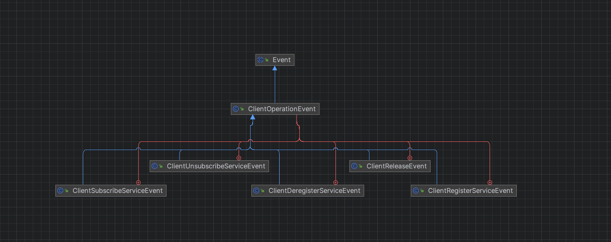
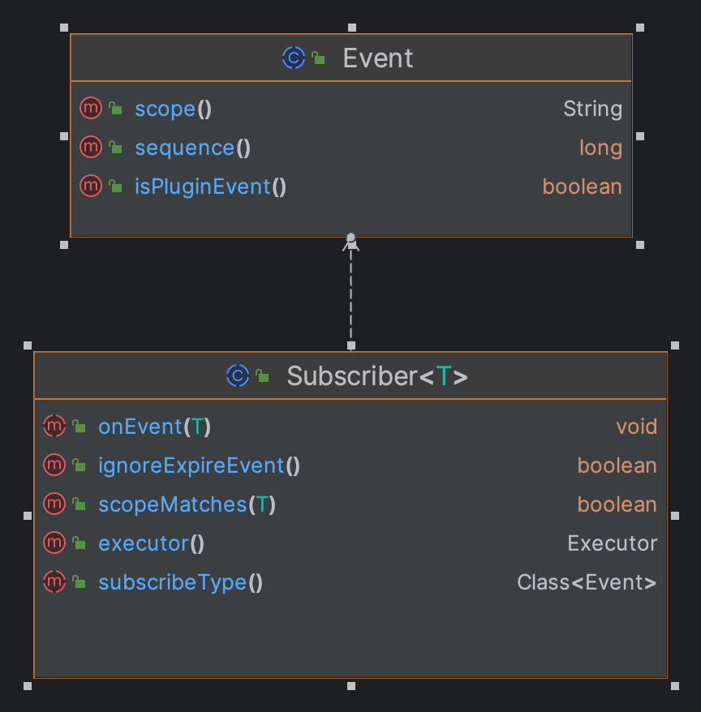
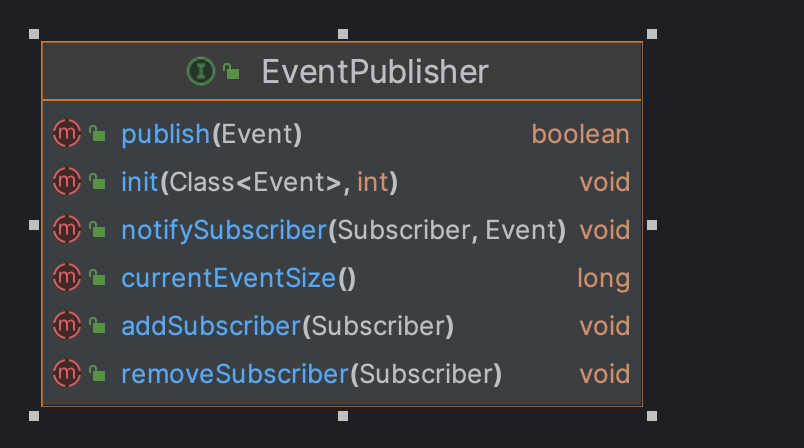
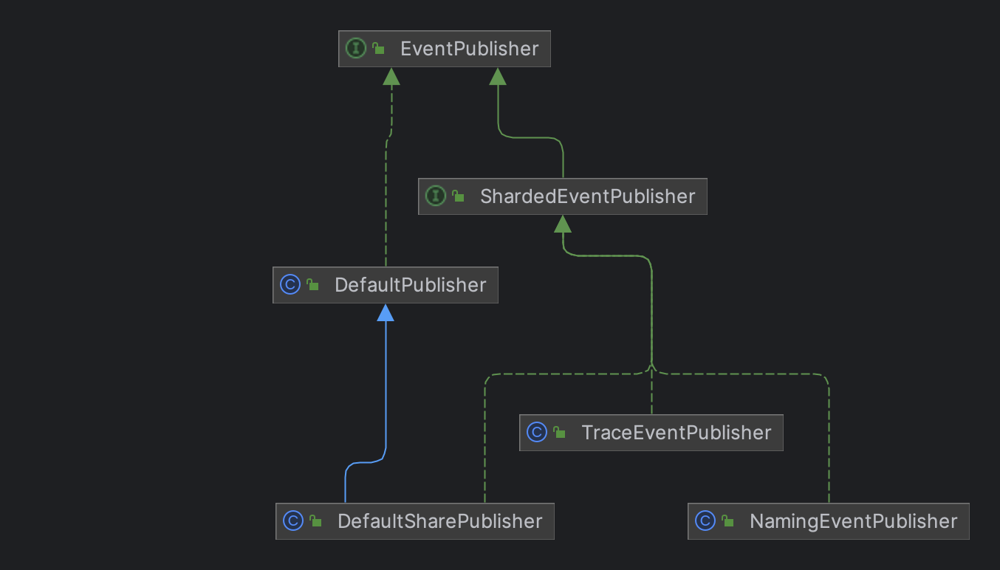
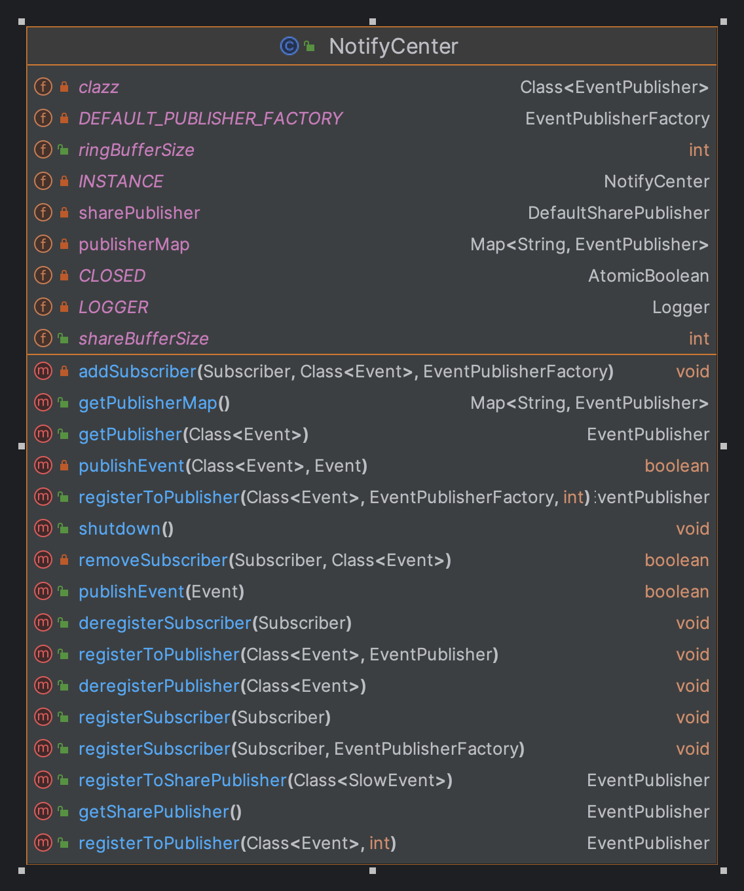

## 1. 引言

### 1.1 本文目的

- Nacos 源码中使用了大量的事件来做异步处理，比如注册服务，配置变更等；所以单独写一篇来认识什么是事件驱动架构
- 分析 Nacos 采用事件驱动架构的原因
- 理解 Nacos 的设计和关键源码分析

### 1.2 事件驱动架构概述

#### 1.2.1 定义和核心概念

🐳**定义**：事件驱动架构（Event-Driven Architecture, EDA）是一种软件架构模式，基于事件的产生、传播和响应来设计系统。它使得系统可以通过事件来解耦组件之间的关系，从而提高系统的灵活性和可扩展性。

🐳**核心概念**

- **事件**: 事件是系统中发生的某个特定动作或状态变化的通知。例如，注册实例，发布配置等都可以视为事件
- **事件源**: 事件源是产生事件的组件或系统
- **事件处理器**: 事件处理器是响应和处理特定事件的组件或服务。它们可以根据接收到的事件执行相应的逻辑
- **事件总线**: 事件总线是一个中介，用于传递事件。在许多事件驱动架构中，事件会首先被发送到事件总线，然后由感兴趣的事件处理器接收和处理

#### 1.2.2 事件驱动架构的特性

- **解耦**: 事件驱动架构使得系统的各个组件之间通过事件进行通信，而不是直接相互调用。这种解耦降低了组件之间的依赖性，提高了系统的灵活性
- **异步处理**: 事件的处理通常是异步的，这意味着事件产生后不需要等待处理完成，可以继续执行其他操作。这种方式可以提高系统的响应性和性能
- **可扩展性**: 通过添加新的事件处理器，可以轻松扩展系统的功能，而不需要对现有组件进行重大更改
- **灵活性**: 新的事件源和事件处理器可以在不影响现有系统的情况下进行添加或修改，从而提高了系统的灵活性

## 2. 为什么 Nacos 选择事件驱动架构

### 2.1 解耦组件之间的关系

- **降低依赖性**: 事件驱动架构使得 Nacos 中的不同组件（如服务注册、服务发现、配置管理等）能够通过事件进行通信，而不是直接调用。

### 2.2 异步处理和高效性

- **非阻塞操作**: 通过事件驱动，Nacos 能够实现非阻塞的操作。例如，服务注册发布`ClientRegisterServiceEvent`事件交给订阅者处理，而无需等待响应。这样可以提高系统的响应速度和处理能力，特别是在高并发的环境中。

### 2.3 可扩展性

- **灵活的扩展与修改**: 事件驱动架构允许开发者在不影响现有系统的情况下添加新的事件源和事件处理器。这使得 Nacos 能够灵活地适应新的需求和功能，而不需要进行重大更改。

### 2.4 复杂业务流程的处理

- **工作流管理**: 事件驱动架构非常适合于处理复杂的业务流程。在 Nacos 中，多个事件可以组合在一起，形成复杂的工作流，从而更好地管理服务的生命周期和配置的状态。例如，配置动态更新使用了多个事件完成刷新配置信息和初始化配置Bean。

### 2.5 监控与故障处理

- **事件记录与监控**: Nacos 可以记录事件的发生和处理过程，便于监控系统的运行状态和性能指标。在源码中`TraceEvent`记录了服务及其健康状态变化的发生和处理过程。

## 3. Nacos 事件驱动架构的核心组件

### 3.1 事件模型

`Event`是所有事件的抽象类父类，图中以服务注册为例，`ClientOperationEvent`继承了事件基类，并定义了服务注册与注销内部类。



### 3.2 事件订阅者Subscriber

`Subscriber`是所有订阅者的父类，订阅者订阅`Event`类型的事件并处理事件，基类定义了以下基本功能：

- `onEvent`: 事件发生时的回调方法
- `subscribeType`: 订阅的事件类型
- `executor`: 订阅者自身实现的任务执行器，如果是异步任务由执行器执行
- `ignoreExpireEvent`:  是否忽略过期事件
- `scopeMatches`: 事件的范围是否与当前订阅者匹配。默认实现是所有范围都匹配



有一个特别的订阅者在服务注册源码中被使用：`SmartSubscriber`。

它定义了新的抽象方法`subscribeTypes`, 为订阅者扩展了订阅多个事件的功能。

```java
/**
 * 可以监听多个事件的订阅者
 */
@SuppressWarnings("PMD.AbstractClassShouldStartWithAbstractNamingRule")
public abstract class SmartSubscriber extends Subscriber<Event> {
    
    /**
     * 订阅者订阅的的事件类型列表
     *
     * @return The interested event types.
     */
    public abstract List<Class<? extends Event>> subscribeTypes();
}
```

### 3.3 事件发布器EventPublisher

`EventPublisher` 接口是 Nacos 中用于事件发布的核心接口，定义了事件发布器的基本功能和行为。



- `publish`: 发布事件。将事件发送到所有注册的订阅者，触发相应的处理逻辑
- `init`: 初始化事件发布器
- `notifySubscriber`: 通知事件的订阅者。直接调用订阅者的处理逻辑，执行事件的具体处理
- `currentEventSize`: 获取当前暂存事件的数量。发布的事件会放入阻塞队列依次处理
- `addSubscriber`: 添加事件订阅者
- `removeSubscriber`: 移除事件订阅者

`EventPublisher` 接口有多个不同类型的发布器实现，以下是对它们的解析：



- `DefaultPublisher`: 默认发布器，主要作用是将事件广播到所有注册的订阅者
- `ShardedEventPublisher`: 分片事件发布器，旨在将事件发布负载分散到多个发布器上，从而提高系统的可扩展性和性能
- `DefaultSharePublisher`: 默认分片发布器，主要用来处理一些耗时的事件, 事件共享同一个发布器
- `NamingEventPublisher`: 是专门用于发布与服务注册、发现、健康检查等相关事件的发布器
- `TraceEventPublisher`: 用于发布追踪事件的发布器。它主要用于记录和发布与服务追踪相关的事件信息

### 3.4 通知中心NotifyCenter

`NotifyCenter` 是 Nacos 中用于事件通知的核心组件，负责管理事件的发布和订阅机制。`NotifyCenter` 在事件驱动架构中充当了事件的“邮递员”，负责将事件从产生方传递到所有感兴趣的接收方。这种设计不仅降低了组件之间的耦合度，还提高了系统的灵活性和响应能力，使得 Nacos 能够高效地管理服务和配置的变化。



以下是一些重要的属性和方法解析：

**属性**

```java
// 事件类型和发布器的映射表
private final Map<String, EventPublisher> publisherMap = new ConcurrentHashMap<>(16);
// 慢事件分片发布器
private DefaultSharePublisher sharePublisher;
```

**方法**

- `publishEvent`: 使用发布器发布一个事件，通知所有注册的订阅者
- `registerSubscriber`: 注册一个事件订阅者，供其接收特定事件的通知
- `registerToPublisher`: 注册事件与发布器到`publisherMap`, 当事件发生时，便于取出事件对应的发布器

## 4. 源码分析


- 4.1 事件处理模块概述
  - 4.1.1 关键类和接口
- 4.2 事件的注册与订阅机制
  - 4.2.1 事件监听器的实现
  - 4.2.2 事件通知的流程
- 4.3 事件的处理逻辑
  - 4.3.1 事件处理的核心类
  - 4.3.2 事件处理的异步与同步机制


## 5. 结论

- 7.1 总结 Nacos 的事件驱动架构


参考链接

- [什么是事件驱动的架构](https://www.ibm.com/cn-zh/topics/event-driven-architecture)
- [nacos2.x的事件驱动架构](https://blog.csdn.net/likang_1167/article/details/143752764)


## 4. 事件驱动[](https://nacos.io/zh-cn/docs/next/v2/ecology/use-nacos-with-spring/#4-事件驱动)

Nacos 事件驱动 基于标准的 Spring Event / Listener 机制。 Spring 的 `ApplicationEvent` 是所有 Nacos Spring 事件的抽象超类：

| Nacos Spring Event                           | Trigger                                                      |
| -------------------------------------------- | ------------------------------------------------------------ |
| `NacosConfigPublishedEvent`                  | After `ConfigService.publishConfig()`                        |
| `NacosConfigReceivedEvent`                   | After`Listener.receiveConfigInfo()`                          |
| `NacosConfigRemovedEvent`                    | After `configService.removeConfig()`                         |
| `NacosConfigTimeoutEvent`                    | `ConfigService.getConfig()` on timeout                       |
| `NacosConfigListenerRegisteredEvent`         | After `ConfigService.addListner()` or `ConfigService.removeListener()` |
| `NacosConfigurationPropertiesBeanBoundEvent` | After `@NacosConfigurationProperties` binding                |
| `NacosConfigMetadataEvent`                   | After Nacos Config operations                                |

