前面分析了在 Nacos 在客户端是如何实现动态更新配置的，本文就来分析一下在 Nacos console 修改了配置以后，服务端底层做了哪些处理。比如：

- 持久化到 Mysql
- 写入磁盘
- 通知客户端

## 服务端接收请求

在控制台页面更新一项配置，看看控制台发送了什么请求给服务端。

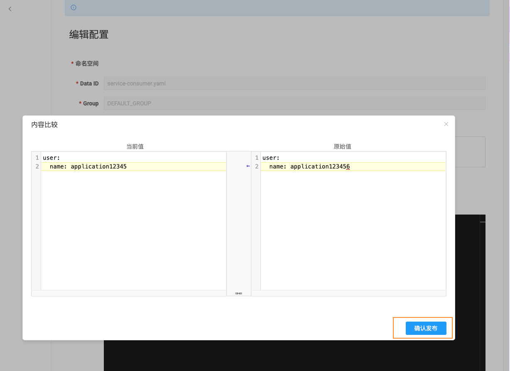

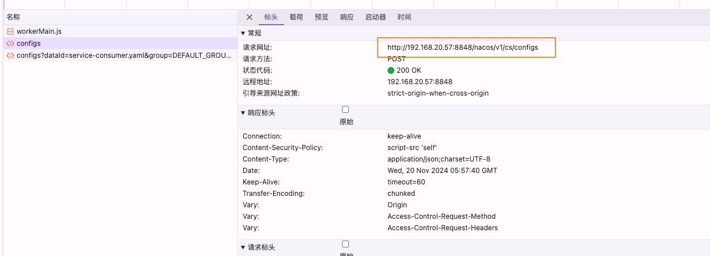

控制台发送了一个 POST 请求：`/nacos/v1/cs/configs`，在[官方 API指南](https://nacos.io/docs/v1/open-api/) 可以找到 API 定义。

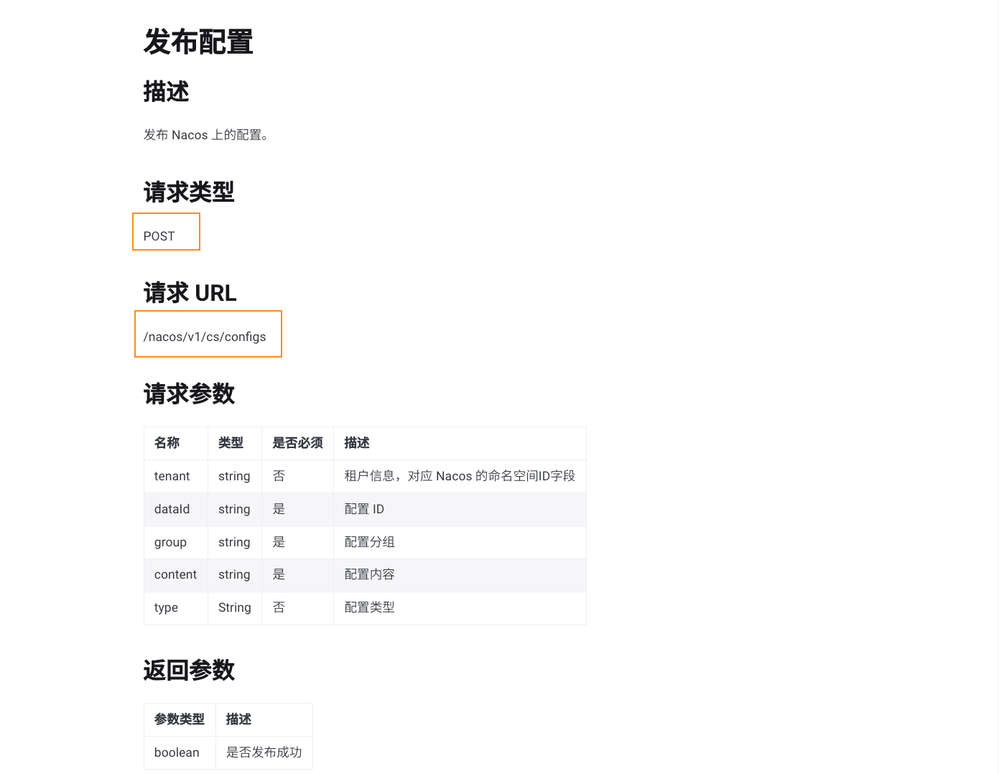

> 我 Nacos 源码是 2.* 版本，但是打开的 console 发布配置请求的 API 还是 1.* 版本。不过官方说，v2 是兼容 v1 的，在 Controller 层面两个版本使用的也是相同的 Service 类处理请求。

请求进入**com.alibaba.nacos.config.server.controller.ConfigController#publishConfig**，封装配置和请求信息调用`com.alibaba.nacos.config.server.service.ConfigOperationService#publishConfig`。

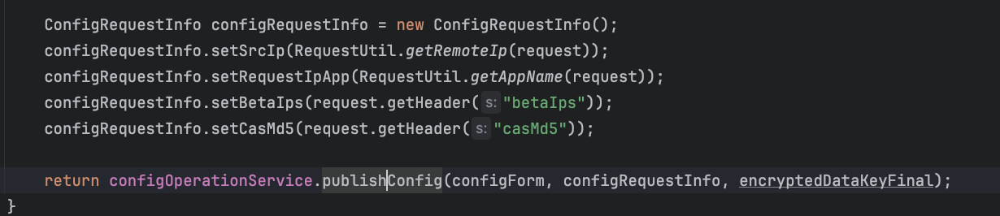

`publishConfig`方法做了两件事：

- 添加或更新配置信息到数据库
- 发布配置数据变更事件`ConfigDataChangeEvent`，这是客户端能感知配置更新的根本原因

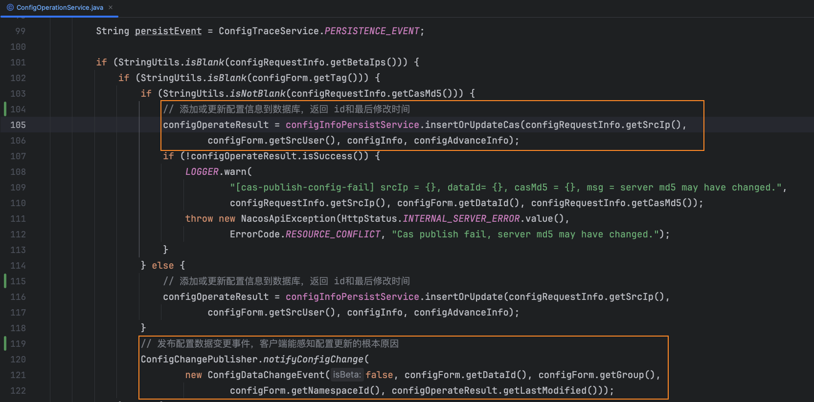

`ConfigDataChangeEvent`被两个类监听：

- `DumpService`: 将配置信息转存到本地磁盘
- `AsyncNotifyService`：通知集群其他节点和订阅配置的客户端配置发生变更

## 转存配置信息到本地磁盘

`DumpService`在构造函数中订阅了`ConfigDataChangeEvent`事件，当监听到事件发生，调用`handleConfigDataChange`方法。

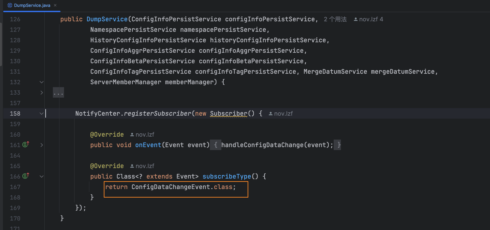

> 我回看了一下前面的文章，一些不重要的方法也有截图，白白的浪费了大家的阅读时间，对于简单的方法后面只会列出方法调用链路

- 👇`handleConfigDataChange(Event event)` 
- 👇`dumpFormal(String dataId, String group, String tenant, long lastModified, String handleIp)`

`dumpFormal`方法作用是转存正式数据到磁盘，向任务管理器`dumpTaskMgr`提交了一个 任务`DumpTask`。

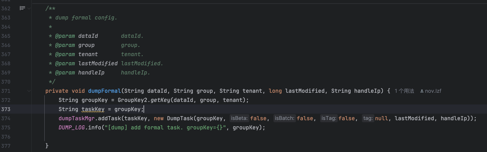

`dumpTaskMgr`是`TaskManager`实例，`DumpService`的构造函数中创建了实例，并且为它指定了`DumpProcessor`作为默认任务处理器

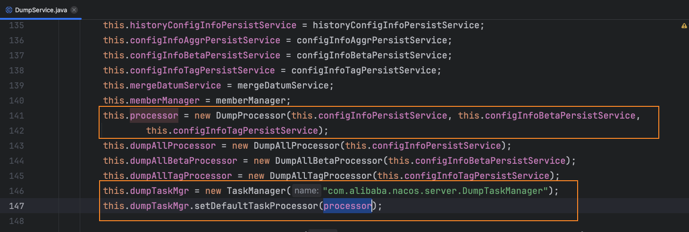

`TaskManager`类本身没有实现执行任务的方法，而是继承自` NacosDelayTaskExecuteEngine`, 来看下他是如何执行任务的。

在构造函数中创建单线程执行器，确保任务都能处理成功，并且每个任务之间间隔 100 毫秒。

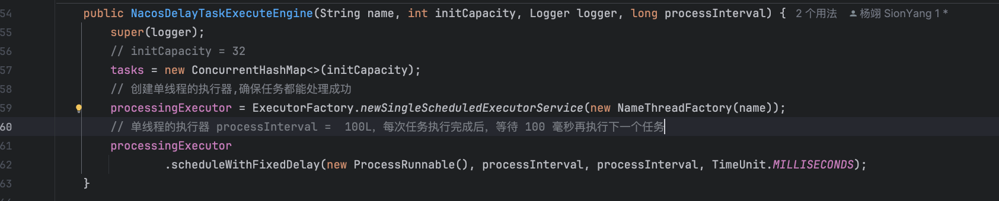

`ProcessRunnable`实现了`Runnable`接口，在`run`方法内调用`processTaks`方法处理任务

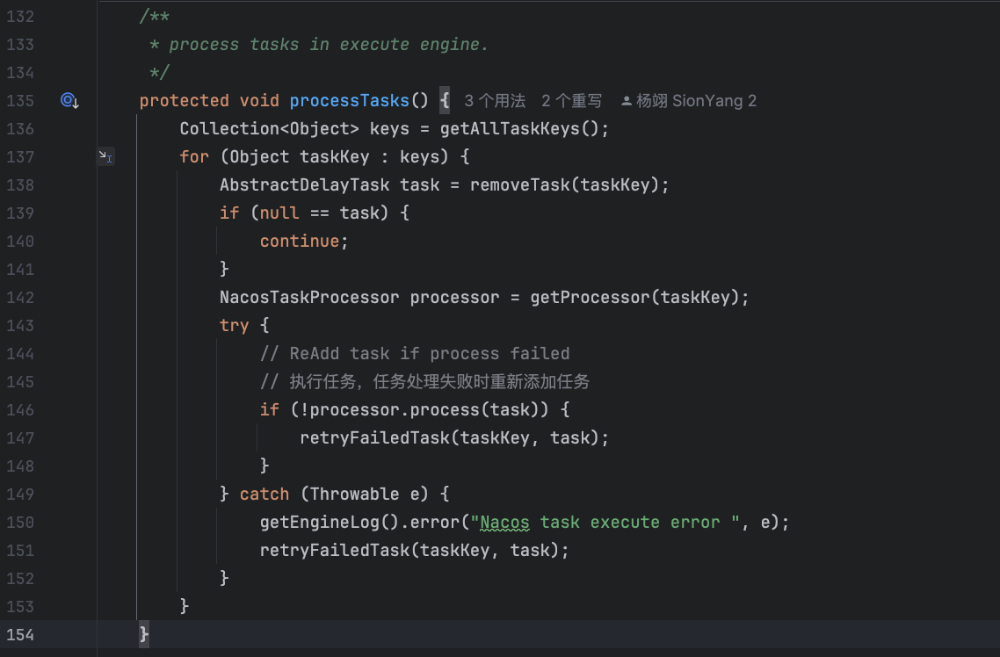

通过 taskKey 获取`NacosTaskProcessor`类型的处理器，调用处理器的`process`方法，并且为任务增加了重试机制。

`NacosTaskProcessor`是一个处理器接口，他有很多实现，分别用来处理不同的任务

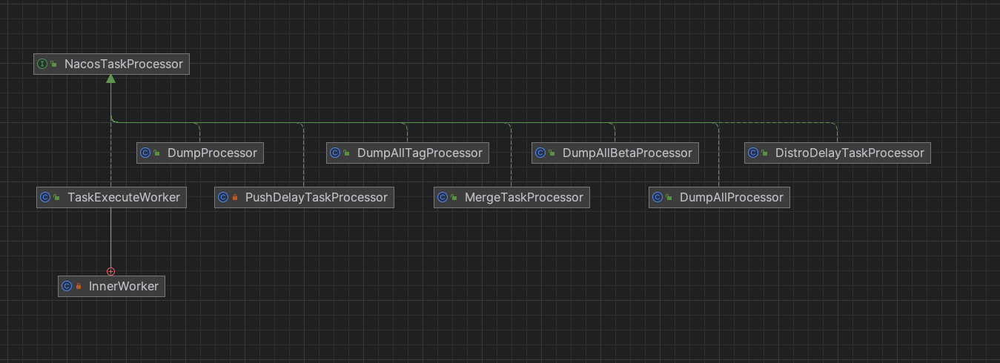

dump 正式数据是由上面指定的默认任务处理器`DumpProcessor`来处理任务，执行处理器的的`process`方法

- 👇process(NacosTask task)
- 👇DumpConfigHandler.configDump(build.build())
- 👇ConfigCacheService.dump(dataId, group, namespaceId, content, lastModified, event.getType(),  event.getEncryptedDataKey())
- 👇dumpWithMd5(dataId, group, tenant, content, null, lastModifiedTs, type, encryptedDataKey)
- 👇ConfigDiskServiceFactory.getInstance().saveToDisk(dataId, group, tenant, content)

调用`saveToDisk`方法保存到磁盘；`updateMd5`方法更新本地缓存的 md5和最后更新时间，并发布`LocalDataChangeEvent`事件。

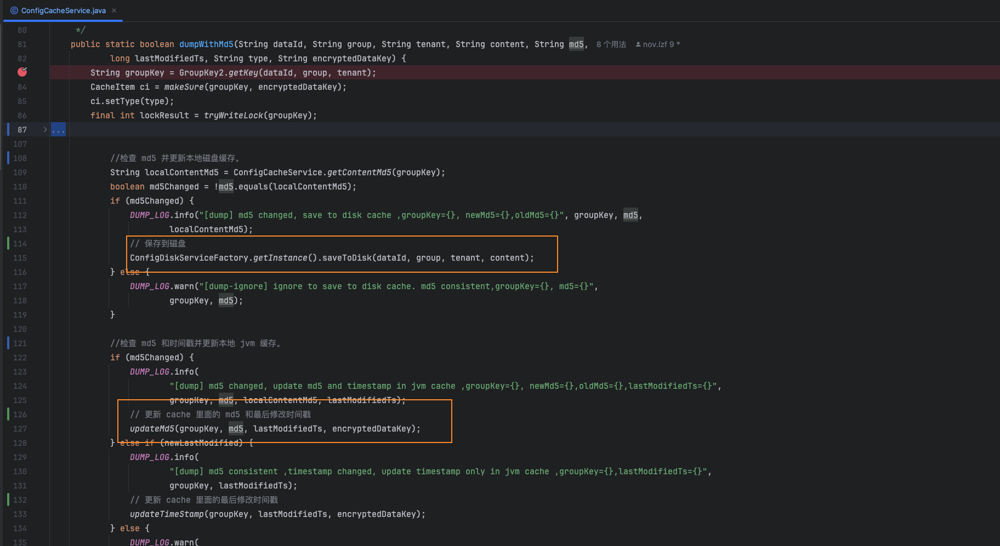

进入`com.alibaba.nacos.config.server.service.dump.disk.ConfigRawDiskService#saveToDisk`, 可以看到`targetFile`就是`nacos.home`下要更新的文件路径，向文件写入新的配置信息。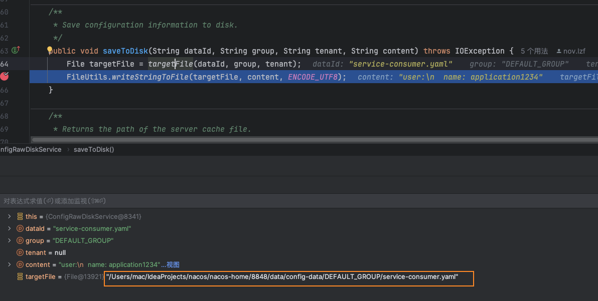

继续看`updateMd5`方法，发布本地数据变更事件，这个事件的目的就是告诉客户端：配置发生了变更

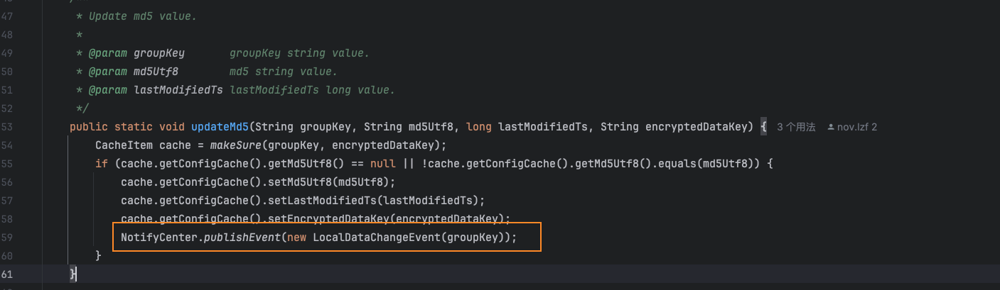

## 通知客户端配置变更

一共有两处监听了本地数据变更事件，先看第一个：`RpcConfigChangeNotifier`

### RpcConfigChangeNotifier

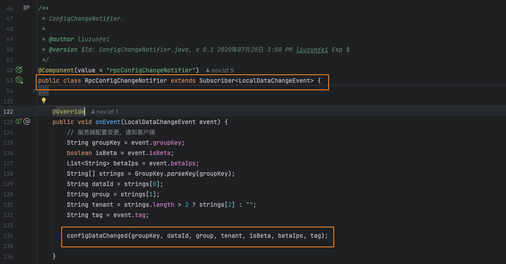