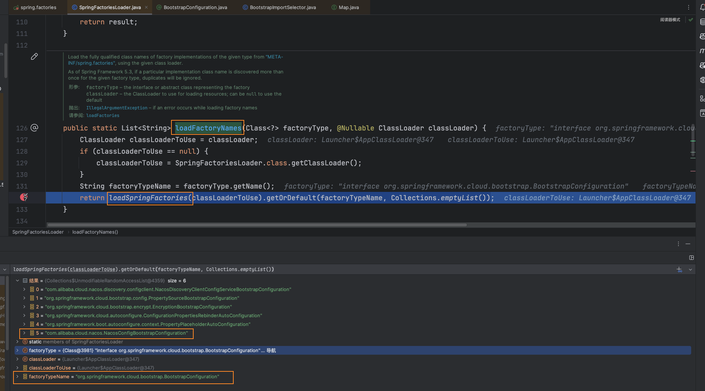

## 启动加载 NacosConfigBootstrapConfiguration

`Springboot`在启动的时候会读取 `spring-cloud-starter-alibaba-nacos-config-2021.0.5.0.jar`下的 `spring.factories`加载`com.alibaba.cloud.nacos.NacosConfigBootstrapConfiguration`

调用`org.springframework.core.io.support.SpringFactoriesLoader#loadFactoryNames`获取工厂类型名为`org.springframework.cloud.bootstrap.BootstrapConfiguration`的 类名列表。`org.springframework.cloud.bootstrap.BootstrapConfiguration`就是上面 `spring.factories`中的 `KEY`值

`loadSpringFactories`是加载 `spring.factories`文件的具体执行方法，返回一个`HashMap`。

## NacosConfigBootstrapConfiguration

`NacosConfigBootstrapConfiguration` 是 Spring Cloud Alibaba 中与 Nacos 配置管理相关的一个配置类。它主要用于在 Spring Boot 应用程序中引导 Nacos 配置的加载和管理。

配置类中一共加载了四个`Bean`，它们的作用如下：

### 1. NacosConfigProperties

`NacosConfigProperties`用于封装与 Nacos 配置相关的属性。它提供了对 Nacos 配置中心的连接和配置管理所需的各种设置。

### 2. NacosConfigManager

### 3. NacosPropertySourceLocator

