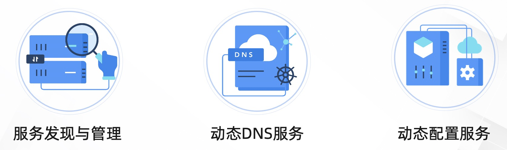

> Nacos server: 2.4.3
>
> JDK: 1.8
>
> spring-cloud-starter-alibaba-nacos-discovery-2021.0.5.0.jar
>
> Maven: 3.8.8

## 一、Nacos简介

Nacos 是一个更易于构建云原生应用的动态服务发现、配置管理和服务管理平台



> 目前主要关注 Nacos 服务注册与发现相关的内容

- 服务提供者在启动时会向Nacos注册中心发送注册请求，包括服务名称、IP地址、端口号等信息。
- Nacos服务端接收到注册请求后，将服务实例信息存储在注册中心的数据库中，并缓存到内存中以便快速查询。
- 注册成功后，服务提供者会定期向Nacos发送心跳请求，以表明服务实例仍在运行中。
- 服务消费者从服务注册中心发现并调用服务。


## 二、服务注册原理

客户端请求原理图：

> Processon 地址：https://www.processon.com/diagraming/672d9c0ca8011b320f4a064c


简单来说就是，项目引入 `spring-cloud-starter-alibaba-nacos-discovery` 以后，利用Spring的自动装配，在它的`spring.facotries`中加载了 `NacosServiceRegistryAutoConfiguration`, `NacosServiceRegistryAutoConfiguration` 中加载了一个叫 `NacosAutoServiceRegistration` 的Bean，

这个Bean的父类实现了 `ApplicationListener` 这个接口，并监听了`WebServerInitializedEvent`类型的事件，在Tomcat启动后会发布`WebServerInitializedEvent`的事件，事件被监听到以后，就会调用 `NacosServiceRegistry`的 `register` 方法向Nacos服务端注册实例。

## 三、源码分析

### 客户端

当我们服务引入`spring-cloud-starter-alibaba-nacos-discovery`,便可以实现自动进行注册，这是因为在`spring.facotries`中自动装配了`NacosServiceRegistryAutoConfiguration`


#### 1. NacosServiceRegistryAutoConfiguration加载Bean


此类中定义了三个 Bean：`NacosServiceRegistry`, `NacosRegistration` , `NacosAutoServiceRegistration`

仔细看会发现，前面两个Bean 都是 `NacosAutoServiceRegistration` 的入参

##### 1.1 NacosServiceRegistry

`NacosServiceRegistry` 的构造函数入参主要是一些注册需要的配置信息，下面的`register` 方法就是实现服务注册的，不过要想在服务启动时自动完成注册，还得靠 `NacosAutoServiceRegistration`


##### 1.2 NacosRegistration

- `registrationCustomizers`：一个 `NacosRegistrationCustomizer` 类型的列表，可能用于自定义注册过程。
- `nacosDiscoveryProperties`：包含 Nacos 服务发现的相关配置。
- `context`：`ApplicationContext` 类型的对象，表示 Spring 应用上下文，可能用于访问 Spring 框架的功能。


##### 1.3 NacosAutoServiceRegistration


> 这里我在查看类图的时候，图中并不显示 `NacosAutoServiceRegistration` ，而是从它的父类开始展示，没找到在哪里可以配置。不过可以按空格添加这个进来，也算是个办法。

从类图中可以看到实现了 `ApplicationListener` 接口，这是实现自动注册的关键。


#### 2. 监听WEB容器事件

`ApplicationListener` 是 Spring 框架中一个接口，它属于 `org.springframework.context` 包。这个接口允许 beans 监听 Spring 事件发布系统发布的事件。


`WebServerInitializedEvent` 是 Spring Boot 中的一个具体事件类，它属于 `org.springframework.boot.web.context` 包，继承自ApplicationEvent。这个事件在嵌入式 web 服务器（如 Tomcat、Jetty 或 Undertow）初始化完成后发布。

当你创建一个 `ApplicationListener` 的实现，并指定 `WebServerInitializedEvent` 作为泛型参数时，Spring 容器会自动调用你的 `onApplicationEvent` 方法，并将 `WebServerInitializedEvent` 的实例作为参数传递给你的 listener。


`SmartLifecycle` 是一个接口，它继承自 `Lifecycle` 接口，允许细粒度的控制Bean的生命周期行为。

`start`方法在`Tomcat`容器启动后，发布事件 `ServletWebServerInitializedEvent`, `ServletWebServerInitializedEvent` 继承自`WebServerInitializedEvent` 


#### 3. 处理容器事件

所以当容器初始化完成后，会调用 `org.springframework.cloud.client.serviceregistry.AbstractAutoServiceRegistration#onApplicationEvent`


```java
// org.springframework.cloud.client.serviceregistry.AbstractAutoServiceRegistration#start
public void start() {
  	// 配置：spring.cloud.nacos.discovery.enabled
    if (!this.isEnabled()) {
        if (logger.isDebugEnabled()) {
            logger.debug("Discovery Lifecycle disabled. Not starting");
        }

    } else {
        // 是否已启动
        if (!this.running.get()) {
          	// 发布预注册事件
            this.context.publishEvent(new InstancePreRegisteredEvent(this, this.getRegistration()));
          	// 开始注册
            this.register();
            if (this.shouldRegisterManagement()) {
                this.registerManagement();
            }
						// 发布注册后事件
            this.context.publishEvent(new InstanceRegisteredEvent(this, this.getConfiguration()));
            // 修改running状态值
            this.running.compareAndSet(false, true);
        }

    }
}
```

#### 4. NacosServiceRegistry 注册服务


这里 `serviceRegistry` 就是 `NacosServiceRegistryAutoConfiguration` 中加载的 `NacosServiceRegistry` Bean

下面核心代码是 `registerInstance`

```java
// com.alibaba.cloud.nacos.registry.NacosServiceRegistry#register
public void register(Registration registration) {
    // ServiceId不能为空，其实就是配置：spring.application.name
    if (StringUtils.isEmpty(registration.getServiceId())) {
        log.warn("No service to register for nacos client...");
    } else {
        NamingService namingService = this.namingService();
        // 应用名称
        String serviceId = registration.getServiceId();
        // 组名
        String group = this.nacosDiscoveryProperties.getGroup();
        // 将服务实例的信息封装为Instance对象
        Instance instance = this.getNacosInstanceFromRegistration(registration);

        try {
            // 注册示例
            namingService.registerInstance(serviceId, group, instance);
            log.info("nacos registry, {} {} {}:{} register finished", new Object[]{group, serviceId, instance.getIp(), instance.getPort()});
        } catch (Exception var7) {
            if (this.nacosDiscoveryProperties.isFailFast()) {
                log.error("nacos registry, {} register failed...{},", new Object[]{serviceId, registration.toString(), var7});
                ReflectionUtils.rethrowRuntimeException(var7);
            } else {
                log.warn("Failfast is false. {} register failed...{},", new Object[]{serviceId, registration.toString(), var7});
            }
        }

    }
}
```

 `registerInstance` 方法作用：

- 检查集群名称和心跳配置是否合法
- 调用 `NamingClientProxyDelegate#registerService` 注册服务


`getExecuteClientProxy` 方法，如果是临时示例使用grpc代理，永久示例则用http代理。

临时实例和永久实例的使用场景可以拿双十一举例，在双十一期间，为了应对流量高峰，需要增加更多的实例，它们就是临时实例，双十一过后，这些实例会被注销，剩下的维持服务平稳运行的实例就是永久实例

##### 4.1 临时实例

临时实例使用 `grpcClientProxy` 注册


`cacheInstanceForRedo`

```java
// 用于缓存需要重做的实例信息。
// 当服务实例需要重新注册时，该方法会将实例信息存储在 registeredInstances 映射中，以便在连接恢复后重新注册这些实例。
public void cacheInstanceForRedo(String serviceName, String groupName, Instance instance) {
  	// groupName + "@@" + serviceName （如DEFAULT_GROUP@@service-provider）
    String key = NamingUtils.getGroupedName(serviceName, groupName);
    // 实例信息，包括组名，服务名，IP，端口等信息
    InstanceRedoData redoData = InstanceRedoData.build(serviceName, groupName, instance);
    synchronized(this.registeredInstances) {
        this.registeredInstances.put(key, redoData);
    }
}
```

将实例信息封装到 `InstanceRequest` ，`requestToServer` 方法就是请求服务端接口注册实例了


##### 4.2 永久实例

永久使用调用 `NamingHttpClientProxy#registerService`注册


> 感谢你看到了这里，我的朋友。
>
> 写累了，刷会儿抖音，哈哈哈哈


### 服务端

#### 注册临时实例

##### 1.注册请求处理器

在服务端有个类 `RequestHandlerRegistry`, 这个类实现了 `ApplicationListener`接口，并且指定了它监听的事件类型为 `ContextRefreshedEvent`。
`ApplicationListener` 是Spring框架中的一个接口，用于定义一个事件监听器，它可以监听Spring应用上下文中发生的事件。
`ContextRefreshedEvent` 是 Spring 框架中的一个事件，表示Spring应用上下文已经初始化完成并且已经刷新，即所有的Bean都已经创建和配置完成


然后看下事件回调方法做了什么

```java
// RequestHandlerRegistry#onApplicationEvent
public void onApplicationEvent(ContextRefreshedEvent event) {
    // 获取RequestHandler的所有实现类
    Map<String, RequestHandler> beansOfType = event.getApplicationContext().getBeansOfType(RequestHandler.class);
    Collection<RequestHandler> values = beansOfType.values();
    for (RequestHandler requestHandler : values) {
      	// ...省略部分代码
        Class<?> clazz = requestHandler.getClass();
        Class tClass = (Class) ((ParameterizedType) clazz.getGenericSuperclass()).getActualTypeArguments()[0];
      	// ...省略部分代码
		// 将处理器放到 registryHandlers
        registryHandlers.putIfAbsent(tClass.getSimpleName(), requestHandler);
    }
}
```

注册所有 `RequestHandler` 的实现类，这里面就包括处理注册实例请求的处理器：`InstanceRequestHandler`

##### 2.请求接收器

上面提到过，临时实例使用 `grpcClientProxy` 注册，rpc请求将由`GrpcRequestAcceptor`接收并处理


可以看到注入了 `RequestHandlerRegistry`, 在下面的 `request`方法中从`RequestHandlerRegistry`取出对应请求类型的hanlder，然后调用`handle`方法。 

```java
@Override
public void request(Payload grpcRequest, StreamObserver<Payload> responseObserver) {
    // 请求类型，比如"InstanceRequest"
    String type = grpcRequest.getMetadata().getType();
    //.. 省略代码
    RequestHandler requestHandler = requestHandlerRegistry.getByRequestType(type);
    //.. 省略代码
    Response response = requestHandler.handleRequest(request, requestMeta);
    //.. 省略代码
}
```

##### 3.实例请求处理器InstanceRequestHandler

`InstanceRequestHandler`有两个作用：

- 注册临时实例
- 注销临时实例

`handle`方法中如果请求类型是 `registerInstance`,则调用 `registerInstance`方法。


从上面图中可以看到，通过构造函数注入了 `EphemeralClientOperationServiceImpl`，然后调用它的`registerInstance`方法继续注册实例


在`registerInstance`方法中发布了客户端注册事件`ClientOperationEvent.ClientRegisterServiceEvent`,监听该事件的Listener将会处理该事件完成服务注册


##### 4.处理客户端注册事件

`ClientRegisterServiceEvent`类图


`ClientRegisterServiceEvent`被`ClientServiceIndexesManager`订阅

事件发生时，进入`onEvent`方法，如果是事件类型是客户端注册服务事件，调用`addPublisherIndexes`


``addPublisherIndexes` 方法的作用是将新的服务实例（由 `clientId` 标识）注册到服务（`service`）的发布者列表中，并发布`ServiceChangedEvent`事件，通知所有监听器服务数据已经发生了变化


##### 5.推送实例信息到其他客户端

`NamingSubscriberServiceV2Impl`类订阅了`ServiceChangedEvent`

当 `ServiceChangedEvent` 事件发生时，`NamingSubscriberServiceV2Impl` 会将服务变更信息封装成 `PushDelayTask`，然后添加到延迟任务执行引擎 `` 中，以便稍后推送给所有订阅了该服务的客户端

`PushDelayTask` 在 Nacos 中是一个用于处理服务推送延迟任务的类。它主要负责在服务注册或变更时，将最新的服务实例列表推送给所有订阅了该服务的客户端


`PushDelayTaskExecuteEngine` 继承了 `NacosDelayTaskExecuteEngine`


`NacosDelayTaskExecuteEngine`的构造函数中初始化了`tasks`任务列表，还定义了一个单线程的延迟任务执行器`processingExecutor`, 定时执行`ProcessRunnable`任务


`ProcessRunnable`实现了`Runnable`接口，调用`processTasks`方法处理实例注册任务


上面的`processor`是 推送延迟任务处理器：`PushDelayTaskProcessor`，调用`process`方法

从task拿到服务信息，封装成 `PushExecuteTask`,调度器调用执行引擎指定推送任务。


核心逻辑在`PushExecuteTask`的`run`方法中，生成包装器，然后向客户端的全部订阅者或者部分客户端推送数据


#### 注册永久实例

##### 1. 注册实例接口

注册永久实例首先需要修改实例的配置信息，然后启动 nacos 集群

```properties
spring.cloud.nacos.discovery.ephemeral=false
```

前面讲过，注册永久实例是通过HTTP调用的方式，我们可以看下官方给出的[`OpenAPI指南`](https://nacos.io/zh-cn/docs/open-api.html)


请求路径为`/nacos/v1/ns/instance`,如果你直接在源码中 ctrl+shif+f 是搜不到的，因为它是由几个常量组成的


注册实例由`InstanceController`的`register`方法实现


`InstanceOperatorClientImpl#registerInstance`方法检查实例参数合法性，封装服务信息，继续调用service注册实例


##### 2. ClientOperationService

`ClientOperationService`接口中定义了注册和注销实例的方法，分别有注册临时实例和永久实例两种实现


因为我们是注册永久实例，所以调用`PersistentClientOperationServiceImpl`的`registerInstance`方法


##### 3.JRaft
