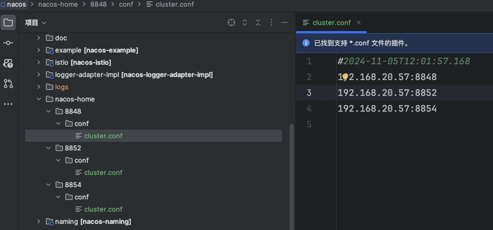
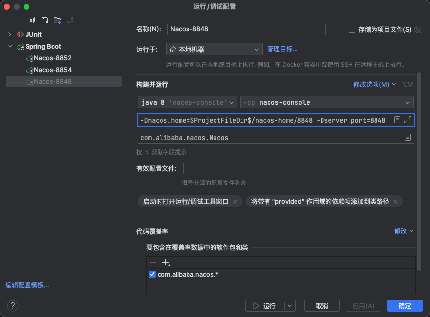
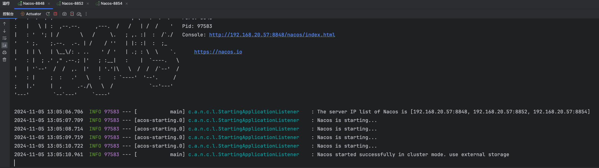

## 拉取Nacos源码

> Github：https://github.com/alibaba/nacos
>
> 码云：https://gitee.com/mirrors/Nacos

获取源码有两种方式：

1. **Fork Nacos仓库**，这样就可以在源码上做任何修改和注释，不影响原始仓库，甚至可以贡献自己的代码给开源社区（推荐）
2. 从 [releases](https://github.com/alibaba/nacos/releases)页面找到你想下载的版本，下载source code文件

我是通过 Fork 的方式拉取源码，阅读的版本是 `2.4.3`，拉取完成以后，默认是develop版本， 基于`2.4.3`新建一个分支：

```bash
git checkout -b 2.4.3-analysis 2.4.3
```


## 编译项目

在 IDEA 中打开 maven 侧边栏，点击根项目生命周期操作的`compile`按钮，开始编译项目


编译成功如下图所示：


## 使用MySQL数据库（推荐）

### 环境准备

> 安装数据库，版本要求：5.6.5+

初始化 Mysql 数据库，数据库初始化文件：`distribution/conf/mysql-schema.sql`

### 修改配置文件

然后修改`console/src/main/resources/application.properties`文件，增加支持MySQL数据源配置，添加MySQL数据源的url、用户名和密码。

```properties
spring.sql.init.platform=mysql

db.num=1
db.url.0=jdbc:mysql://${mysql_host}:${mysql_port}/${nacos_database}?characterEncoding=utf8&connectTimeout=1000&socketTimeout=3000&autoReconnect=true
db.user=${mysql_user}
db.password=${mysql_password}
```


## 使用Derby数据库

Nacos 默认使用内置 Derby 数据库存储。

> 注意：Derby数据库为本地内置数据库，本身不支持集群模式，Nacos通过Raft协议将各个节点的Derby数据库组成逻辑集群，因此使用此模式部署集群模式的Nacos是需要对Raft协议较为熟悉，能够进行问题排查、恢复等，建议使用MySQL数据库进行部署


## 单机启动Nacos

运行`console`模块下的 `Nacos` 启动类


这时候启动会报错，因为 Nacos 默认以**集群模式**启动，所以还需修改为**单机模式**启动


编辑启动类配置，**添加虚拟机选项**：`-Dnacos.standalone=true`


再次启动


## 集群启动Nacos(推荐)

### 端口占用

Nacos在启动时默认会占用四个端口，这些端口及其用途如下：

1. **8848**：这是Nacos服务的主端口，用于客户端、控制台以及OpenAPI的HTTP通信。
2. **9848**：客户端gRPC请求服务端的端口，客户端通过此端口向Nacos服务端发起连接和请求。
3. **9849**：服务端gRPC请求服务端的端口，主要用于服务间的同步等操作。
4. **7848**：Jraft请求服务端的端口，用于处理服务端之间的Raft相关请求。

这些端口是基于Nacos服务端的主端口（默认8848）并通过固定的偏移量计算得出。

**在本地启动多服务时，注意端口指定，不要使用相邻端口，如8847,8848，否则会出现 `Address already in use` 错误。**


### 配置nacos home

配置系统参数 `-Dnacos.home` 指定 Nacos 的根目录，如果对其他参数感兴趣可参考 [Nacos系统参数](https://nacos.io/zh-cn/docs/system-configurations.html)

> 为了方便在公司和家里电脑调试项目，我将 `nacos.home` 设在了项目根目录，通过 Git 管理配置文件，大家也可指定其他目录

在项目根目录创建以下文件：

- nacos-home/8848/conf/cluster.conf
- nacos-home/8852/conf/cluster.conf
- nacos-home/8854/conf/cluster.conf



配置文件 `cluster.conf`，请每行配置成 ip。（请配置3个或3个以上节点）

```
# ip:port
192.168.20.57:8848
192.168.20.57:8852
192.168.20.57:8854
```


### 启动Nacos服务

添加IDEA运行配置，配置虚拟机参数，确保每个配置的端口是正确的。

```
-Dnacos.home=$ProjectFileDir$/nacos-home/8848 -Dserver.port=8848
```

`$ProjectFileDir$` 是IDEA支持的宏，代表项目根目录。



配置完成后，启动集群

