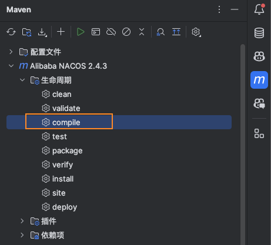
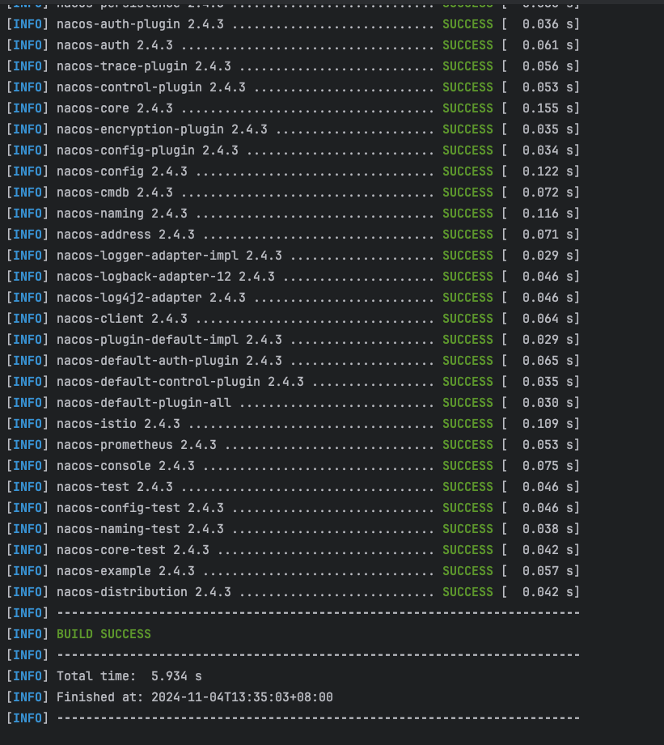
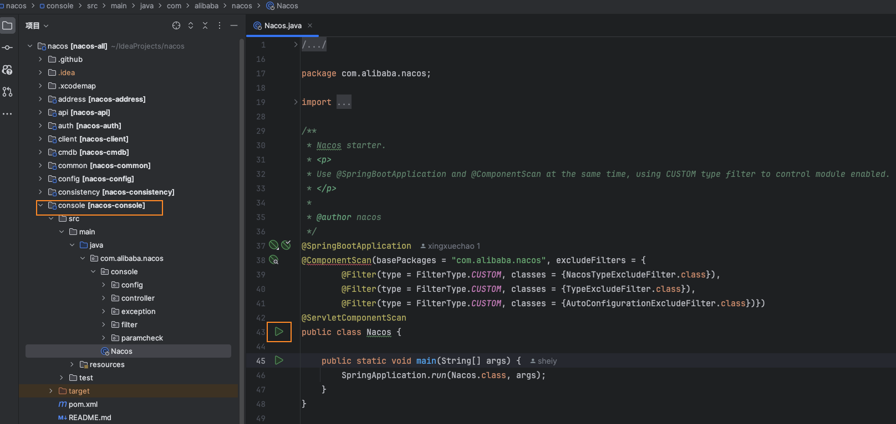
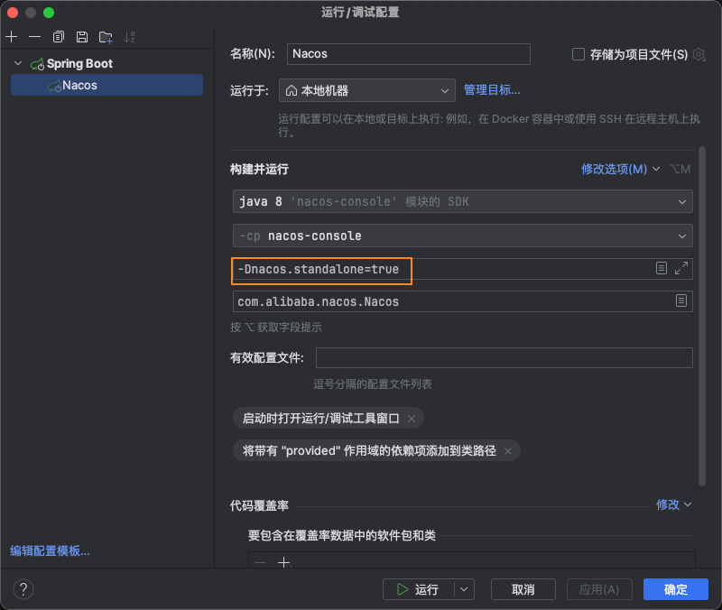
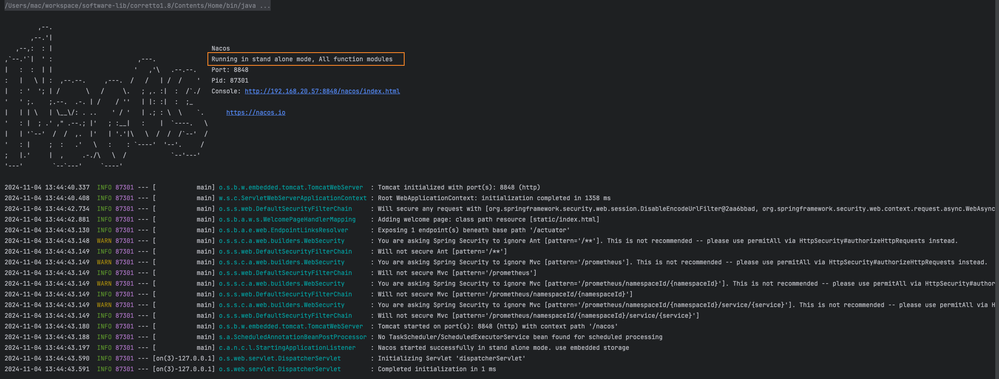

## 拉取Nacos源码

> Github：https://github.com/alibaba/nacos
>
> 码云：https://gitee.com/mirrors/Nacos

获取源码有两种方式：

1. **Fork Nacos仓库**，这样就可以在源码上做任何修改和注释，不影响原始仓库，甚至可以贡献自己的代码给开源社区
2. 从 [releases](https://github.com/alibaba/nacos/releases)页面找到你想下载的版本，下载source code文件

我是通过 Fork 的方式拉取源码，阅读的版本是 `2.4.3`，拉取完成以后，默认是develop版本， 基于`2.4.3`新建一个分支：

```bash
git checkout -b 2.4.3-analysis 2.4.3
```


## 编译项目

在 IDEA 中打开 maven 侧边栏，点击根项目生命周期操作的`compile`按钮，开始编译项目



编译成功如下图所示：




## 启动Nacos

运行`console`模块下的 `Nacos` 启动类



这时候启动会报错，因为 Nacos 默认以**集群模式**启动，所以还需修改为**单机模式**启动


编辑启动类配置，**添加虚拟机选项**：`-Dnacos.standalone=true`



再次启动

