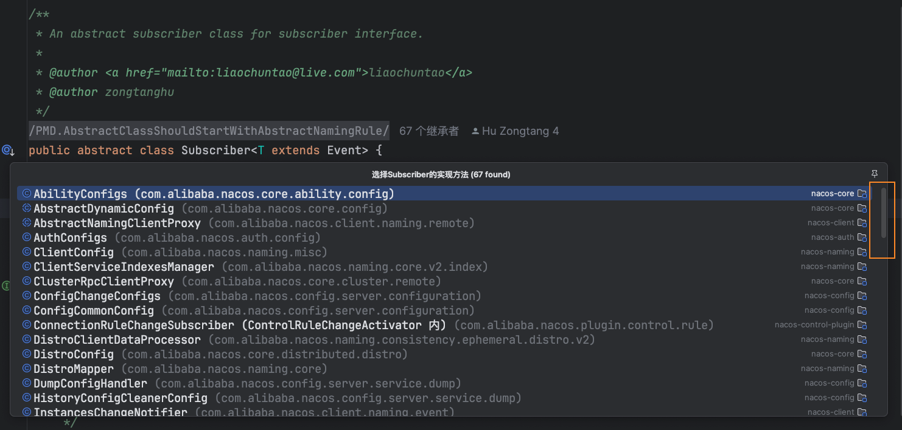
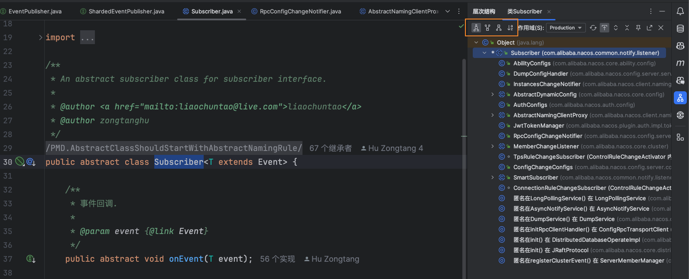
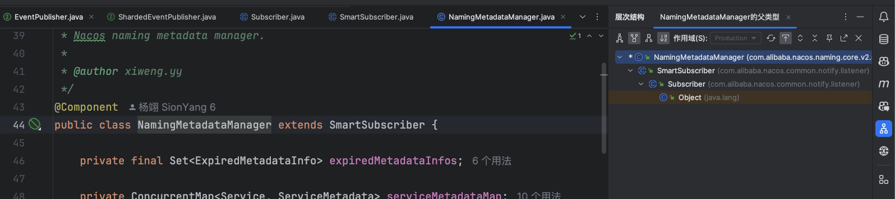
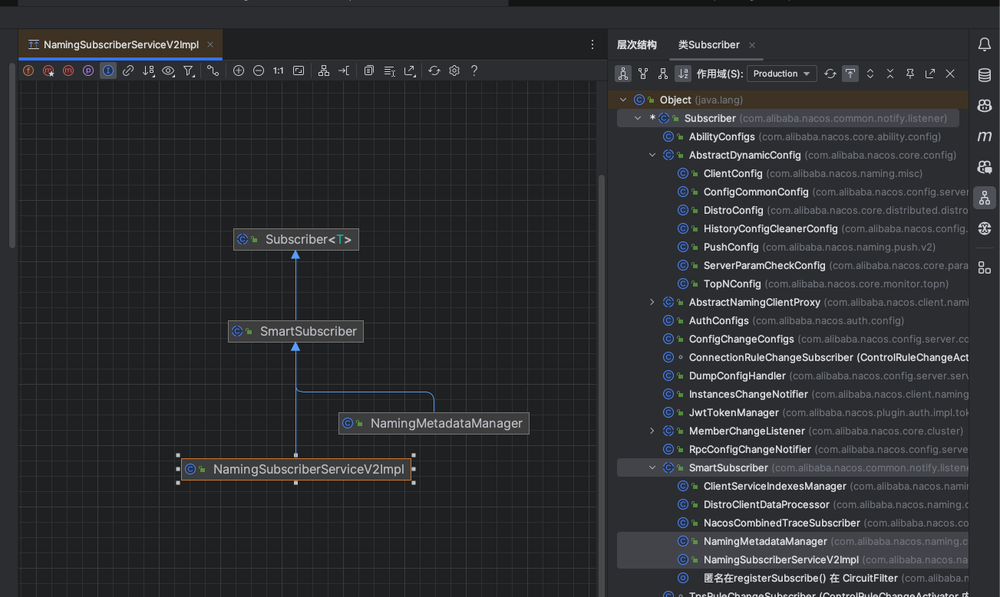
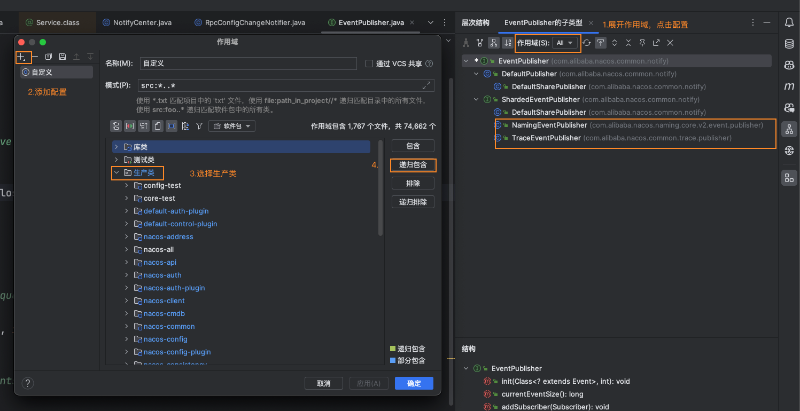
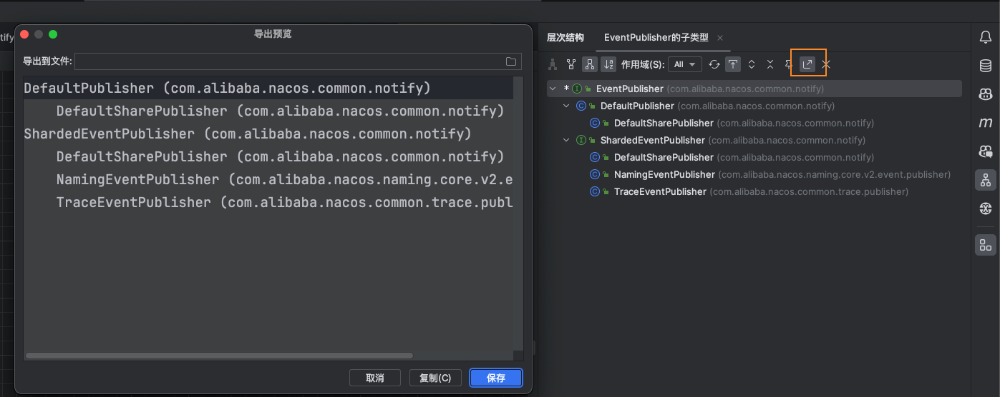
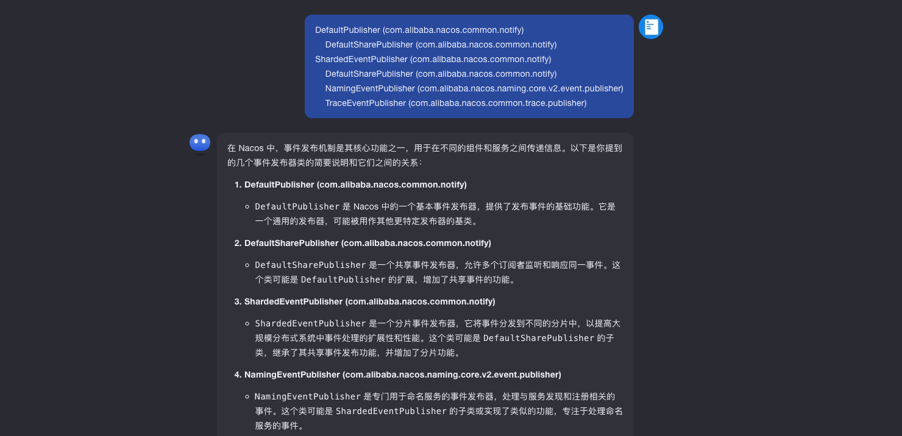

## 探索源码前的准备

### 1. 阅读官方文档

开源项目的开发者是最熟悉源码的人，官方文档一般也是由他们维护，从文档中了解项目总体架构，设计理念，主要功能，有助于我们快速了解项目是干什么的，系统的核心功能模块，我们在阅读源码的时候也能抛开细枝末节，直入主题。

比如我在阅读 nacos 源码前，就看了[nacos 架构与原理](https://nacos.io/docs/ebook/kbyo6n/)电子书的 Nacos 架构部分，虽然还有些概念不懂，但也大致有了个印象，相信在读源码的过程中会一一解惑。

### 2. 实际开发经验

3. 测试用例
4. 设计模式

## 查看类的层次结构

在阅读源码的时候，有时候需要查看一个接口的全部实现类，或抽象类的子类，常规的查看方式是点击类名左边的导航图标，或者快捷键：`Ctrl+Alt+B`。

如果类的子类很多，并且子类还有孙子类，多层级结构，就会是下面这种样子。对于阅读源码来说，寻找子类成本的时间成本增加，而且无法了解子类的层级结构。

我们可以在类文件中按下快捷键 **`^+H`** 快速查看类的层级结构，在上方工具栏可以选择：

- **类层级结构**：展示此类父子类型结构
- **父类型层级结构**：仅展示父类
- **子类型层级结构**：仅展示子类
- **根据类名首字母排序**

类层次结构展示在侧边栏，不会影响我们使用编辑窗口，不会遮挡；还能查看父类的实现类层级结构，也可以方便浏览类的全部父类接口。

## 查看类图

我们可以全选或者部分选中侧边栏中的类，在选中的类上右键依次点击 `图表->显示图`，或者使用快捷键：`⌥⇧⌘U'`, 生成这些类的关系图。

查看这样的类图对于了解某个模块的组织结构方式有很大帮助，也能窥的一点作者的开发思路。

写博客有时也需要这样的类图帮助读者理解

## 自定义类层次结构作用域

我在第一次打开层次结构时，`NamingEventPublisher` 和 `TraceEventPublisher` 并没有展示出来，可能是包没被扫描到，于是我自定义了一个作用域，将`com.alibaba.nacos.naming`包加进来，排除测试类的包，最后在作用域下拉选项那里选择自定义的作用域，`EventPublisher`的子类就全部展示了。

> 如果你也遇到了同样的问题，可以试试这个方法

## 问问 AI 这些类的作用

一个接口的多种实现，它们都有各自的功能，解决不同场景的问题，现在 AI 已经发展为一个强大的生产力工具，我们可以复制某个接口的全部实现类的类名，让 AI 分析它们的作用，给我们提供参考。

点击工具栏的导出按钮，就可以复制全部类名

甩给 AI 分析

## 在源码上添加注释

## 画图