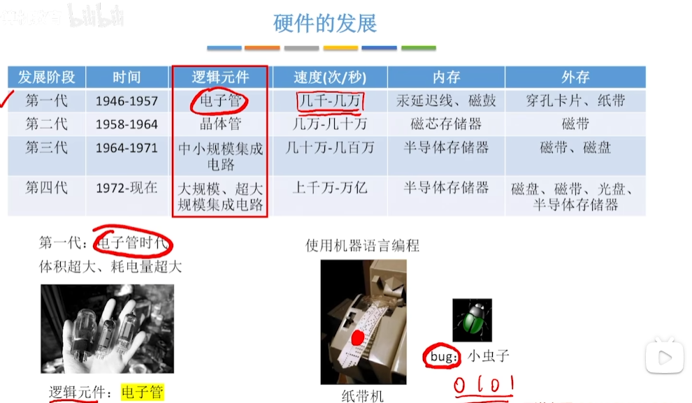
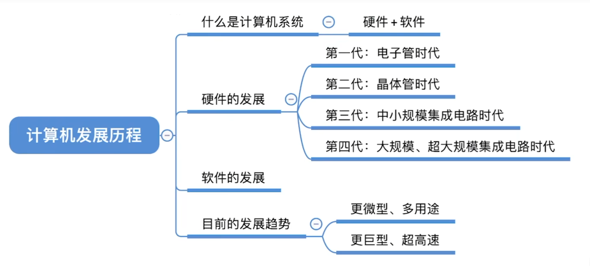

# 你好，我是计算机组成原理

计算机硬件唯一能识别的数据：二进制 0/1,用低/高电平分别表示0/1.。

计算机内部通过电信号传递数据

# 计算机的发展

## 1 什么是计算机系统

> 计算机系统 = 硬件 + 软件

硬件：计算机的实体，如主机，外设等看得见摸得着的东西

软件：由具有各类特殊功能的程序组成，如windows操作系统，idea等等；软件分为**系统软件**和**应用软件**，系统软件用来管理整个计算机系统，应用软件是按照任务需求编制成的各种程序。

计算机性能的好坏取决于“软”、“硬”件功能的总和

## 2 硬件的发展

​		

> 在纸带机编程时代，一个小虫子可能会影响整个程序，所以出现bug这个说法

- 1947年，贝尔实验室，发明了“晶体管”
- 1955年，肖克利在硅谷创建 肖克利实验室股份有限公司
- 1957年，八叛徒(traitorous eight)创立(仙童半导体公司）
- 1959年，仙童半导体公司发明“集成电路”
- 1968年，摩尔等人离开仙童，创立 **Intel**
- 1969年，仙童销售部负责人桑德斯离开仙童，创立 **AMD** 

## 3 摩尔定律

摩尔定律揭示了信息技术进步的速度，集成电路上可容纳的**晶体管数目**，约每隔**18个月**便会增加**一倍**，整体**性能**也将**提升一倍**。

## 4 软件的发展

以下仅作为举例

​		应用软件：机器语言->汇编语言->FORTRAN->PASCAL->C++->Java

​		系统软件：DOS->Windows->安卓->IOS

## 5 目前的发展趋势

​		两极分化：1. 更微型，多用途 ，如手机	2. 更巨型，超高速，如超级计算机

# 总结

