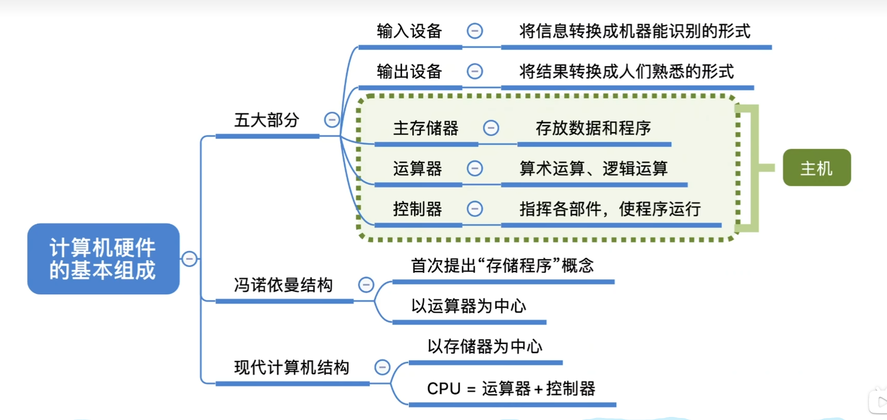

# 1 计算机硬件的基本组成

最早期计算机通过手动接线来控制计算，效率很低，冯.诺依曼提出了**存储程序**的概念来优化计算方式。

存储程序：是指**将指令以二进制代码的形式事先输入计算机的主存储器**，然后按其在存储器（可以理解为内存）中首地址执行程序的第一条指令，以后就按该程序的规定顺序执行其他指令，知道程序运行结束。

## 1.1 早期冯诺依曼机

冯诺依曼计算机的特点：

1. 计算机由五大部件组成
   - 输入设备
   - 存储器
   - 运算器
   - 控制器
   - 输出设备
2. 指令和数据以同等地位存于存储器，可按地址寻访
3. 指令和数据用二进制表示
4. 指令由操作码和地址码组成，操作码可理解为加减乘除的操作，地址码是操作的数据存放在内存中地址
5. 存储程序，计算机的计算步骤提前存在了存储器中
6. **以运算器为核心**：输入/输出设备与存储器之间的数据传送通过运算器完成

## 1.2 现代计算机

现代计算机**以存储器为中心**

现代计算机结构：

## 1.3 知识回顾

# 2 各个硬件的工作原理

## 2.1 主存储器的基本组成

主存储器由 存储体，MAR，MDR 组成。

> MAR：Memory address register （存储地址寄存器）
>
> MDR：Memory data register（存储数据寄存器）

读数据：CPU告诉MAR它想要的数据，MAR去存储体中找到数据信息，然后存到MDR中，CPU从MDR取走数据。

写数据：CPU告诉主存储器，它本次是执行写操作，将要存储的数据放入MDR，数据存放的地址放入MAR

存储体中有多个存储单元，每个单位对应一个地址，地址是从0开始的。 

存储单元：每个存储单元存放一串二进制代码

存储字（word）：存储单位中二进制代码的组合

存储字长：存储单位中二进制代码的位数，通常每个单位可存放的二进制数是8bit的整数倍，如16bit,32bit

存储元：即存储二进制的电子元件，每个存储元可存1bit

**MAR的bit位数反应存储单位的个数**

**MDR的bit位数=存储字长**

例：

MAR=4位 -> 总共有2⁴个存储单元

MDR=16位 -> 每个存储单元可存放16bit，一个**字（word）**=16bit，MDR也有可能是32位，64位，这个取决于硬件的设计

有几个**易混淆**的点要注意：

1个**字节（Byte）**= 8bit， 1B = 一个字节，1b = 一个bit

注意字母b，大写代表Byte，小写代表bit，日常生活中我们办宽带的时候，套餐上写的100Mbps，当你下载东西的时候却是10MB/s，

就是因为这个原因，实际网速应该是 100Mb/8b 每秒

## 2.2 运算器的基本组成

运算器：用于实现算术运算（如：加减乘除）、逻辑运算（如：与或非）

基本组成：

- ACC（Accumulator）：累加器，用于存放操作数，或运算结果
- MQ（Multiple-Quotient Register）：乘商寄存器，在乘除运算时，用于存放操作数或者运算结果
- X：通用的操作数寄存器，用于存放操作数
- **ALU（Arithmetic and Logic Unit）**：算术逻辑单元，通过内部复杂的电路实现算数运算、逻辑运算，它是**运算器的核心**

## 2.3 控制器的基本组成

基本组成：

- **CU（Control Unit）**：控制单元，分析指令，给其他部件发出控制信号
- IR（Instruction Register）：指令寄存器，存放当前执行的指令
- PC（Program Counter）：程序计数器，存放下一条指令地址，有自动加1功能

CU是控制器的核心部件，控制器相当于公司的总裁，CU就是总裁的老婆，控制器都要听CU的。

完成一条指令的步骤：

1. 取指令       PC
2. 分析指令   IR
3. 执行指令   CU

> 根据**PC**中记录的指令地址，拿到下一条要执行的指令，取出的指令要被放到**IR**中，**CU**接着就去分析这条指令是做什么的，然后控制其他部件完成指令的执行
>
> PC 和 IR两个步骤可以统称为取址

## 2.4 计算机的工作过程

在高级语言中定义了下面一段代码，在计算机底层是如何工作的呢？

~~~java
int a = 2, b = 3, c = 1, y = 0;
void main() {
    y = a * b + c;
}
~~~

这个小章节初次学习是难以理解的，所以我仅在下面写了一个取数指令的步骤，建议观察视频中完整的计算步骤。

[视频链接](https://www.bilibili.com/video/BV1ps4y1d73V/?p=5&vd_source=9673597c3ab5b03cf9994776ea4b5fc2)，开始时间16：00

初：（PC）=0，指向第一条指令的存储地址

> 为什么要把PC用（）包起来，因为这里（）表示结果值是PC里面的值，就是PC取出指令地址是0

#1：（PC）-> MAR，导致（MAR）=0

> 回顾上面的知识，MAR是存储地址的寄存器；（MAR）=0那么就会去取主存中主存地址为0的数据

#3：M（MAR）->MDR，导致（MDR）=000001 0000000101

> M表示主存，M（MAR）->MDR的意思是主存中MAR中的地址所指明的存储单元里面的数据放到MDR中

#4：（MDR）->IR，导致（IR）=**000001** **0000000101**

#5：OP（IR）->CU，指令的操作码（000001）从到CU，CU分析后得知，这是“取数指令”

> OP（IR）：取操作码

#6：Ad（IR）->MAR，指令的地址码送到MAR，导致（MAR）=5，然后就去主存中地址为5的值存入MDR

> AD（IR）：取地址码

#8：M（MAR）->MDR，导致（MDR）=0000000000000010=2

#9：（MDR）->ACC，导致（ACC）=0000000000000010=2

到此一个取数指令就完成了。

## 知识回顾

冯诺依曼计算机的特点：

- 计算机由五大部件组成
- 指令和数据以同等地位存于存储器，可按地址寻访
- 指令和数据用二进制表示
- 指令由操作码和地址码组成
- 存储程序
- 以运算器为中心（现在一般以存储器为中心）
