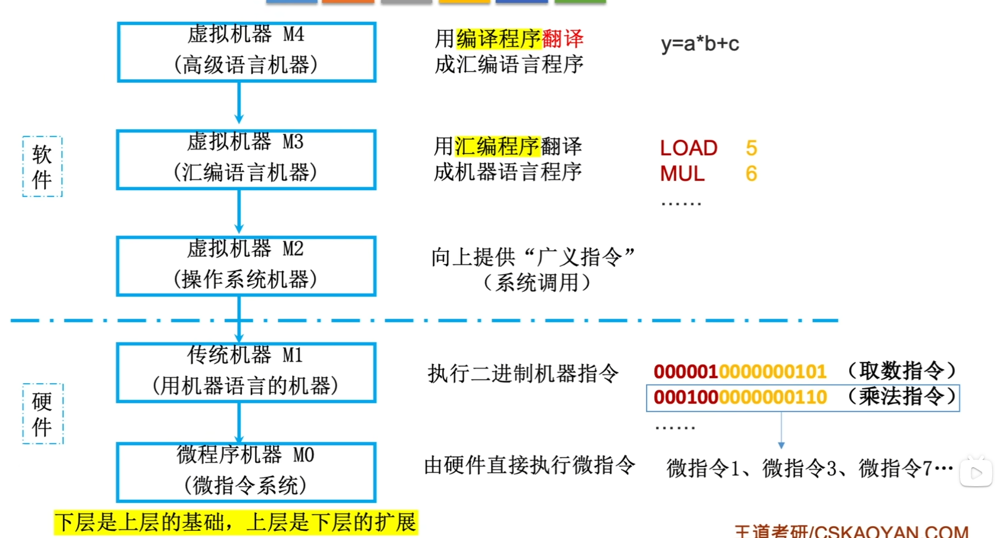
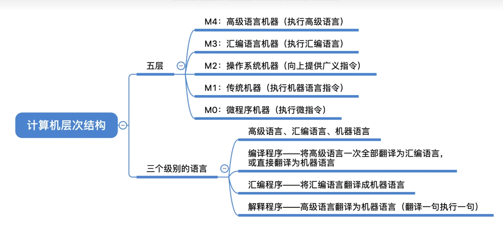

# 1 计算机系统的层次结构

微指令系统 =》用机器语言的机器=》操作系统机器=》汇编语言机器=》高级语言机器

前面章节使用的取数指令也是由多个微指令组成的

任何高级语言都无法直接被计算机执行，需要经过编译程序编译后才能让机器执行

下层是上层的基础，上层是下层的扩展。

汇编语言和机器指令是一一对应的

## 2 三种级别的语言

- 机器语言：二进制代码
- 汇编语言：助记符
- 高级语言：C/C++, Java

编译程序：将高级语言编写的源程序全部语句一次全部翻译成机器语言程序,而后再执行机器语言程序(只需翻译一次)

解释程序：将源程序的一条语句翻译成对应于机器语言的语句,并立即执行。紧接着再翻译下一句(每次执行都要翻译)

# 知识回顾

